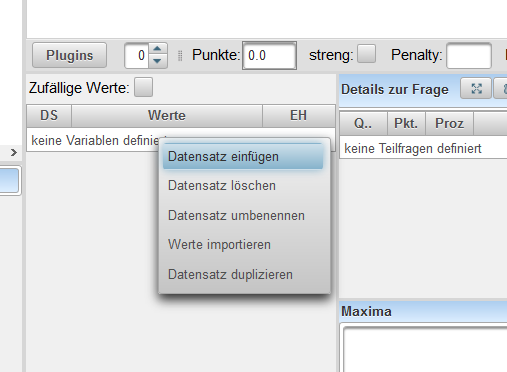
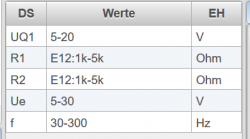
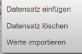
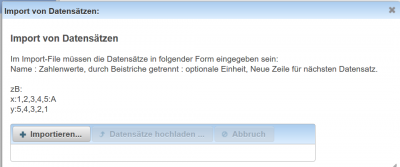

# Datensätze definieren
Siehe auch [Einführung zu Datensätzen](../Datensätze/index.md), [Editor für den Angabetext#datensätze-und-variable-](../EditorfürdenAngabetext/index.md#datensätze-und-variable-)

Jede Variable, die im Angabetext in geschwungenen Klammern eingesetzt werden kann, wird über einen Datensatz definiert.

### Erstellung aus dem [Editor](../EditorfürdenAngabetext/index.md)
Wenn im Text der Frage in geschwungenen Klammern eine Variablenbezeichnung verwendet wird, dann ist die Variable mit Klick der rechten Maustaste --&gt; **Datensatz einfügen**
 
vom Benutzer anzulegen.

**TIPP:** 
Drücken Sie im Fragentext unmittelbar nach dem Variablennamen die **F2**-Taste. Es wird die Variable in geschwungenen Klammern gesetzt und der Datensatz in der Datensatzliste angelegt. Aus der Variabel x wird {x}.

Drücken Sie im Fragentext unmittelbar nach dem Variablennamen die **F3**-Taste wird die Variable ebenfalls in geschwungenen Klammern gesetzt und der Datensatz in der Datensatzliste angelegt. Der Fragentext wird um die Mathematikmodusdarstellung von LaTeX ergänzt. Aus der Variabel x wird $x={x}$.

Aus dem Variablennamen wird laut SI-Einheitensystem die entsprechende SI-Einheit zugeordnet.
Die Wertebereiche und die Einheiten können aber in jeder [Kategorie](../Ordnerverwaltung/index.md) eigens definiert und überschrieben werden.

### Erstellung / Änderung über den Datensatz-Bereich
 
 
Die Tabelle zur Definition der Datensätze enthält drei Spalten:
* DS: Name der Variable
* Werte: Definition des Wertebereiches und des Types der Variable
* EH: Einheit der Variable

Über das Kontext-Menüs (rechte Maustaste) dieser Datensatz-Tabelle können auch neue Variablen hinzugefügt und bestehende gelöscht werden. Weiters können auch Datensätze mit vordefinierten Werten aus einer Datei importiert werden.
 

### Name der Variablen (Datensatz-Name)

Folgende Namenskonventionen sind für die Variablenbezeichnung einzuhalten:
* Der Namen muss mit einem Buchstaben beginnen.
* Datensätze dürfen keine Sonderzeichen enthalten!
* Erlaubt sind Zeichen, Ziffern und der Unterstrich _

### Definition der Werte

Es gibt zwei Varianten einen Wertebereich zu definieren:

* Nur durch die Angabe eines gültigen Bereiches:  zB.:1-10,E12:1k-10k
* Durch einen Typbezeichner gefolgt von einem gültigen Bereich:   zB.: C:1-10

Folgende Typbezeichner sind möglich:

| Bezeichner                                          | Beschreibung                                                                                                                                                                                                              | Beispiel                |
|-----------------------------------------------------|---------------------------------------------------------------------------------------------------------------------------------------------------------------------------------------------------------------------------|-------------------------|
| I:                                                  | Ganzzahl                                                                                                                                                                                                                  | I:10-20                 |
| V[Dimension](Dimension):                            | Vektor                                                                                                                                                                                                                    | V3:1-10                 |
| M[Zeilen](Zeilen)x[Spalten](Spalten):               | Matrix der Dimension [Zeilen](Zeilen)x[Spalten](Spalten)                                                                                                                                                                  | M3x3:1-10               |
| M[Dimension](Dimension):                            | Matrix der Dimension [Dimension](Dimension)x[Dimension](Dimension) mit einer Determinante ungleich Null                                                                                                                   | M3:1-10                 |
| P[Grad](Grad):                                      | Polynom der Ordnung [Grad](Grad) in der Variablen s **Noch nicht realisiert**                                                                                                                                             | P3:1-10                 |
| B[Zählergrad](Zählergrad),[Nennergrad](Nennergrad): | Polynombruch in der Variablen s mit definiertem Zählergrad und Nennergrad **Noch nicht realisiert**                                                                                                                       | B2,3:1-20               |
| C:                                                  | komplexe Zahl mit zufälligem Winkel zwischen 0° und 360°                                                                                                                                                                  | C:1-10                  |
|                                                     | komplexe Zahl mit Betrag und Winkel in Grad                                                                                                                                                                               | C:1-10arg10-90          |
|                                                     | komplexe Zahl mit Realteil und Imaginärteil (j als imaginäre Einheit)                                                                                                                                                     | C:1-10j1-10             |
|                                                     | komplexe Zahl mit Realteil und Imaginärteil 	    (i als imaginäre Einheit)                                                                                                                                                | C:1-10i1-10             |
| F[ziffern](ziffern):                                | Gleitkommazahl mit einer definierten Anzahl gültiger Ziffern                                                                                                                                                              | F3:5-9                  |
| [ziffern](ziffern):                                 | Gleitkommazahl aus einem Bereich mit einer definierten Anzahl von äquidistanten Werten                                                                                                                                    | 5:2-9                   |
| S:                                                  | Zeichenketten durch Beistrich getrennt. Ein Beistrich muss mit einem Backslash verblockt werden!                                                                                                                          | S:rot,grün,blau         |
| R:                                                  | Regulärer Ausdruck: Erzeugt einen String auf den der reguläre Ausdruck trifft.                                                                                                                                            | R:[a-m](a-m)x?[^B](^B)+ |
| R[stellen](stellen):                                | Regulärer Ausdruck erzeugt einen String mit "stellen" Zeichen                                                                                                                                                             | R5:.+                   |
| R[minstellen](minstellen)-[maxstellen](maxstellen): | Regulärer Ausdruck mit einen Stellenanzahl von "minstellen" bist "maxstellen"                                                                                                                                             | R5-8:[a-z](a-z)+\d+     |
| sI:wert,wert,wert                                   | erzeugt Ganzzahl-Datensätze aus den angegebenen Werten, wobei die Reihenfolge der Werte wie angegeben beibehalten wird! (Zahlenbereiche sind hier nicht erlaubt!!)                                                        | sI:5,78,2,-5,4          |
| sF:wert,wert,wert                                   | erzeugt Gleitkomma-Datensätze aus den angegebenen Werten, wobei die Reihenfolge der Werte wie angegeben beibehalten wird! (Zahlenbereiche sind hier nicht erlaubt!!)                                                      | sF:34.5,3.4,6,5,-43.4   |
| sS:wert,wert,wert                                   | erzeugt String-Datensätze aus den angegebenen Werten, wobei die Reihenfolge der Werte wie angegeben beibehalten wird! (Zahlenbereiche sind hier nicht erlaubt!!) Ein Beistrich muss mit einem Backslash verblockt werden! | sS:Hut,Kappe,Hose       |
| Startwert:Schrittweite:Endwert                      | erzeugt Werte zwischen Startwert und Endwert mit einem Abstand von Schrittweite zwischen den Werten                                                                                                                       | 2:0.1:5                 |

	
#### Bereichsdefinitionen
Folgende Bereichsdefinitionen sind möglich:
	

| Beschreibung                                             | Beispiel     |                                         |
|----------------------------------------------------------|--------------|-----------------------------------------|
| Zahl                                                     | 45           |                                         |
| Zahl mit Einheitenvielfachen                             | 15k          |                                         |
| mehrere Zahlen, durch Beistrich getrennt                 | 34,15k,24.4m |                                         |
| Zahlenbereich mittels Bindestrich                        | 3-15         |                                         |
| Ganzzahl-Bereiche                                        | I3-15        |                                         |
| Eine bestimmte Anzahl von Werten aus einem Zahlenbereich | 13:45-130    |                                         |
| Werte einer arithmetischen Folge                         | 2:3:15       | 2,5,8,11,14                             |
| Werte einer geometrischen Folge                          | 3*2:100      | 3,6,12,24,48,96                         |
| Normreihe                                                | E12:10k-80k  | 10k,12k,15k,22k,27k,33k,39k,47k,56k,68k |
| Dezimale Reihe                                           | D2:10-600    | 10,50,100,500                           |

Mögliche Normreihen mit logarithmisch verteilten Werten pro Dekade: E3,E6,E12,E24,E48

Mögliche dezimale Reihen mit gleicheverteilten Werten pro Dekade: D2, D5, D10, D20, D40

Mögliche Einheitenvielfache: m,u,n,p,f,a,k,M,G,T

### Einheiten

* Als [Einheit](../Einheit/index.md) kann jede gültige SI Einheit angegeben werden
* Beginnt die Einheit mit einem Gleichheitszeichen, so wird die Einheit bei der Darstellung der Variable in der angegebenen Form und mit dem angegebenen Prefix erzwungen.
* Als Sondereinheiten sind zulässig

| dB  | Dezibel           |
|-----|-------------------|
| %   | Prozent           |
| ppm | parts per million |
| °   | Grad              |
| €   | Euro              |
| $   | Dollar            |

* Bei komplexen Zahlen kann durch Beistrich getrennt die Darstellung der komplexen Zahl definiert werden. Folgende Darstellungsvarianten sind zulässig:
