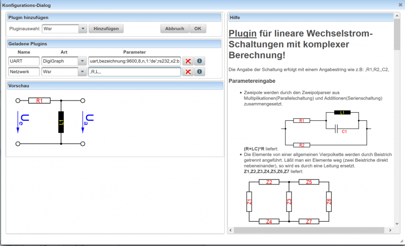
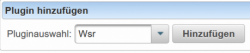
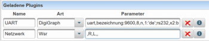

# Definition von Plugins
Siehe auch [Hilfe zu Plugins](../Plugins/index.md)
 

Mit dem Dialog zur Definition von Plugins können Sie für die Frage [Plugins](../Plugins/index.md) vorbereiten. 
Mit der Auswahlbox zur Pluginauswahl 
 
können Sie das gewünschte Plugin selektieren und mit dem Button **Hinzufügen** zur Liste der **Geladenen Plugins** hinzufügen.
 

In der tabellarischen Übersicht der **Geladenen Plugins** können Sie den Namen und die Paramter für das Plugin definieren. Wenn der Cursor auf einer Zeile der geladenen Plugins steht, wird im rechten Bereich des Dialogs die zum Plugin gehörende Hilfe eingeblendet, die die Parameterdefinition erleichtern soll.

Wenn die Paramter gültig sind und das Plugin aus diesen Paramtern eine Grafik erzeugen kann, wird diese im Vorschau-Bereich angezeigt.

Mit dem -Button können Sie ein Plugin wieder löschen.
Mit dem -Button bekommen Sie die vollständige Hilfe zum Plugin angezeigt.

Kategorie:Dialoge [Plugins](../Plugins/index.md)

