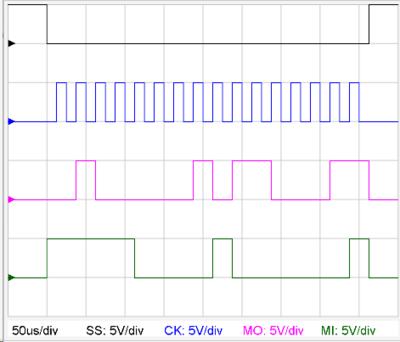

# DigiGraph
##  Digigraph 
Mit dem Digigraph-[Plugin](../Plugins/index.md) können Zeitverläufe von Digitalsignalen in einem, einem Oszilloskop nachgebildeten, Graphen dargestellt werden.

Folgende Signalarten sind darstellbar:
* allgemeine Signalverläufe
* UART
* RS232
* SPI
* I²C

##  Signaldefinition 
###  allgemeine Signalverläufe 
Übertragung von Bits erfolgt LSB-First
####  Syntax 
<pre>
bit,Name:Bitdauer:daten
</pre>
* Name : Signalname
* Bitdauer : Dauer von einem Bit
* daten: Die Daten können als Zeichen, String, Ganzzahl, Hexadezimalzahl oder Binärzahl angegeben werden. Zeichen und Strings werden im 8-Bit-ASCii-Code codiert.
#### Beispiele
<pre>
bit,x:1us:0b1001001;bit,y:2us,8:0b0100100011
</pre>
 

###  UART 
####  Syntax 
<pre>
uart,Name:Baudrate,Bit,Parität,Stopbits:daten,daten,daten
</pre>
* Name: Signalname
* Baudrate: Die Baudrate in baud ohne Angabe der Einheit.
* Bit: Bitanzahl für die Datenübertragung.
* Parität: Angabe der Paritätsbits (e,o,n).
* Stopbits: 1 oder 2 Stopbits.
* daten: Die Daten können als Zeichen, String, Ganzzahl, Hexadezimalzahl oder Binärzahl angegeben werden. Zeichen und Strings werden im 8-Bit-ASCii-Code codiert.
#### Beispiele
<pre>
uart,G:9600,8,n,1:0b1010101;uart,P:7200,8,n,1:0x7e
</pre>
 
<pre>
uart,G:9600,8,o,1:0b1011101,0b01010001
</pre>
 

###  RS232 
####  Syntax 
<pre>
rs232,Name:Baudrate,Bit,Parität,Stopbits:daten,daten,daten
</pre>
* Name: Signalname
* Baudrate: Die Baudrate in baud ohne Angabe der Einheit.
* Bit: Bitanzahl für die Datenübertragung.
* Parität: Angabe der Paritätsbits (e,o,n).
* Stopbits: 1 oder 2 Stopbits.
* daten: Die Daten können als Zeichen, String, Ganzzahl, Hexadezimalzahl oder Binärzahl angegeben werden. Zeichen und Strings werden im 8-Bit-ASCii-Code codiert.
#### Beispiele
<pre>
rs232,G:9600,8,n,1:0b1010101;rs232,P:7200,8,n,1:0x7e
</pre>
 

### SPI
####  Syntax 
<pre>
spi,Name:Clockfrequenz,Mode:daten,daten,daten
</pre>
* Name: Signalname, kann auch weggelassen werden
* Mode: Definition wie in [Wikipedia](https://de.wikipedia.org/wiki/Serial_Peripheral_Interface) beschrieben zusammen gesetzt aus CPHA (Clock-Phase) und CPOL (Clock-Polarity)
* Clockfrequenz: Die Grundfrequenz der SCL-Leitung
* daten: Die Daten können als Zeichen, String, Ganzzahl, Hexadezimalzahl oder Binärzahl angegeben werden. Zeichen und Strings werden im 8-Bit-ASCii-Code codiert.
#### Beispiele
<pre>
spi:40000Hz,1:'Ac':0xf0,0x81
</pre>
 
<pre>
spi:40000Hz,mode:0x81:0x42
</pre>

| Mode  | 0                                                                           | 1                                                                           | 2                                                                           | 3                                                                           |
|-------|-----------------------------------------------------------------------------|-----------------------------------------------------------------------------|-----------------------------------------------------------------------------|-----------------------------------------------------------------------------|
| CPOL  | 0                                                                           | 0                                                                           | 1                                                                           | 1                                                                           |
| CPHA  | 0                                                                           | 1                                                                           | 0                                                                           | 1                                                                           |
| Graph |   |   |   |   |

### I²C-Bus
####  Syntax 
<pre>
i2c,Name:Clockfrequenz:daten,daten,daten
</pre>
* Name: Signalname, kann auch weggelassen werden
* Clockfrequenz: Die Grundfrequenz der SCL-Leitung
* daten: Die Daten können als Zeichen, String, Ganzzahl, Hexadezimalzahl oder Binärzahl angegeben werden. Zeichen und Strings werden im 8-Bit-ASCii-Code codiert.
#### Beispiele
<pre>
i2c:10000Hz:0x101,0x080,0x100,0x200
</pre>
 
<pre>
i2c,x:40000Hz:0x181
</pre>
 

= PIG Parameter = 
Beim PIG-Tag können Parameter zur [Konfiguration des Oszilloskopes](../KonfigurationdesOszilloskopes/index.md) angegeben werden.

Beispiele:
<pre>
ch1:div=5V,null=3,color=#008800 ; time:div=3us,trigger=0
</pre>

#### Zeichenelemente des Plot-Plugins
Durch Strichpunkt getrennt können auch die [Zeichenelemente#vordefinierte-graphische-funktionen-](../Plot#vordefinierte-graphische-funktionen-/index.md#vordefinierte-graphische-funktionen-) des Plot-Plugins eingefügt werden.

Das Koordinatensystem des Bildschirmfensters hat den Nullpunkt links unten.

Die positive horizontale Achse reicht von 0 bis 100 von links nach rechtes.

Die postitive vertikale Achse reicht unten nach oben und beginnt unten bei 0. Der maximale Wert ist abhängig vom Seitenverhältnis des Fensters.

[Plugins](../Plugins/index.md)

