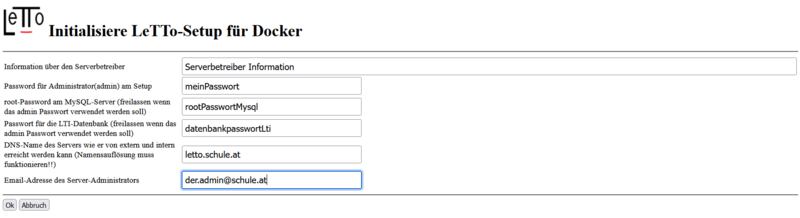

# Dockerinstallation Erstkonfiguration
Nach der [Installation](../Installation/index.md) des Setup-Services mit dem Script letto-install-ubuntu-docker.sh muss einmalig eine globale Information des Servers angegeben, welche für die Lizenzierung und die Datenbankinitialisierung verwendet wird.

* Information über den Serverbetreiber : Diese Information dient dem Lizenzserver als Information über den Server-Betreiber
* Password für Administrator(admin) am Setup: Das Passwort für den Benutzer "admin" am Setup-Service.
* root-Passwort am MySQL-Server: Passwort des Benutzers root am MySQL-Server im Docker-Container "letto-mysql". Wird hier kein Passwort gesetzt wird das oberhalb angegebene Passwort des Setup admin verwendet.
* Passwort für die LTI-Datenbank: Passwort am MySQL-Server für die Datenbank des LTI-Services. Wird hier kein Passwort gesetzt wird das oberhalb angegebene Passwort des Setup admin verwendet.
* DNS-Name des Servers: Über diesen DNS-Namen sollte der Server vom Internet aus erreichbar sein, damit das Let's Encrypt Zertifikat korrekt erzeugt werden kann. Weiters wird der DNS-Name auch in der Lizenz eingetragen, sollte also später nicht mehr geändert werden.
* EMail-Adresse des Server-Administrators: Email des Administrators des Setup-Services

####  siehe auch 
* [Administration](../Administration/index.md)
* [Installation](../Installation/index.md)
* [Anforderungen](../Anforderungen/index.md)

[Administration](../Administration/index.md)

