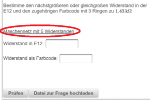
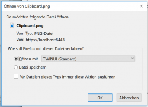

# Dokumente in der Frage bereitstellen
Über eine Testfrage können auch Dokumente oder andere Dateien bereitgestellt werden:

Über den [Toolbar](../Toolbar/index.md) und den -Button können alle [Dateien, die an die Frage angeschlossen sind](../DateienzurFrageverwalten/index.md), anzeigt und verwaltet werden.

 
Folgende Vorgehensweise wird zum Bereitstellen von Dateien innerhalb einer Frage empfohlen:
* Öffnen Sie den Dialog
* Hinzufügen von Dateien zur Frage: Über den Button **Importieren** können Sie jede beliebige Datei an die Frage anschliessen: Einfach die gewünschte Datei auswählen und mit OK importieren.

* Einfügen eines Links in den Fragetext

### Einfügen eines Links in den Fragetext
Über die Syntax '''[LINK0 Bezeichnung des Links](LINK0 Bezeichnung des Links)''' können Sie an beliebiger Stelle einen Link  einfügen, mit dem dann die entsprechende Datei zur Laufzeit heruntergeladen werden kann.
Die Ziffer hinter LINK bezeichnet den Index der Datei im File-Dialog. Achtung: Der Index beginnt bei 0 zu laufen.

Beispiel: [LINK0 Maschennetz mit 5 Widerständen](LINK0 Maschennetz mit 5 Widerständen) verweist auf die erste Datei im File-Dialog und der Link in der Frage hat dann die Bezeichnung 'Maschennetz mit 5 Widerständen'.

### Herunterladen von Dokumenten zur Testlaufzeit
In die Testfragen werden die entsprechenden Links eingebaut:
 

Mit dem Klick auf diesen Link können Sie dann die Datei herunterladen.
 

