# Dsr
## Plugin DSR

Zeichnet Schaltungen der Drehstromtechnik.

### Definition der Schaltung
Die Schaltung wird im Plugindialog über einen String(Zeichenkette) definiert, der Drehstromelemente durch Beistrich getrennt beinhaltet. 
#### Drehstrom-Schaltungselemente
Folgende Drehstrom-Schaltungselemente können verwendet werden, wobei als Parameter alle Zweipol-Schaltelemente zulässig sind, welche in der danach folgenden Tabelle angegeben sind.

| Name                       | Bedeutung                           | Symbol                                                                      |
|----------------------------|-------------------------------------|-----------------------------------------------------------------------------|
| DSU() DSU(U1,U2,U3)     | Drehstromnetz aus Einzelspannungen  |  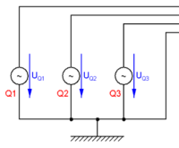 |
| DSU() DSU(U,U,U,U)      | Drehstromnetz aus Einzelspannungen  |  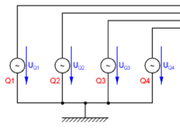 |
| N() N4() N4(U,U,U,U) | Drehstrom Vierleiternetz            |  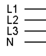 |
| N3()  N3(U1,U2,U3)      | Drehstrom Dreileiternetz            |   |
| DS(R,L,C)                  | Drehstrom Sternschaltung Dreileiter |  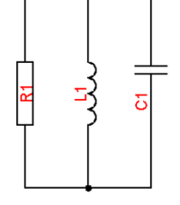 |
| DSE(R,R,R)                 | Drehstrom Sternschaltung Dreileiter |  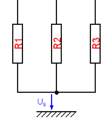 |
| DSN(R,L,C)                 | Drehstrom Sternschaltung Vierleiter |  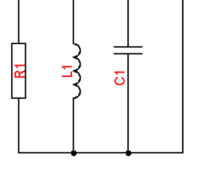 |
| DSNE(R,R,R)                | Drehstrom Sternschaltung Vierleiter |  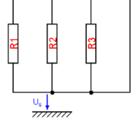 |
| DSN(R,L,C,R)               | Drehstrom Sternschaltung Vierleiter |  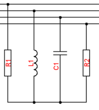 |
| DD(R,L,C)                  | Drehstrom Dreieckschaltung          |  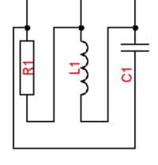 |

#### Zweipol Schaltungselemente
Die Schaltung wird im Plugindialog über einen String(Zeichenkette) definiert, wobei folgende Zeichen definiert sind:

| Name              | Bedeutung                                                    | Symbol                                                          |
|-------------------|--------------------------------------------------------------|-----------------------------------------------------------------|
| R                 | Widerstand                                                   |  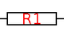 |
| Z                 | komplexe Impedanz von der Frequenz unabhängig                |   |
| C                 | Kondensator                                                  |  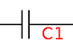 |
| L                 | Induktivität                                                 |  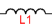 |
| LL                | Leerlauf oder Unterbrechung                                  |  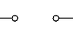 |
| KS                | Drahtbrücke oder Kurzschluss                                 |  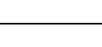 |
| DB                | Drahtbrücke ohne besondere Funktion                          |   |
| U                 | Spannungsquelle                                              |   |
| A                 | Amperemeter                                                  |   |
| AR                | Amperemeter in Rückwärtsrichtung                             |  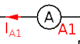 |
| V                 | Voltmeter                                                    |  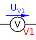 |
| VR                | Voltmeter in Rückwärtsrichtung                               |  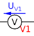 |
| Lamp              | Glühbirne                                                    |  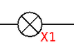 |
| X                 | Glühbirne                                                    |   |
| S                 | Schalter als Schließer                                       |  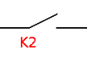 |
| O                 | Schalter als Öffner                                          |  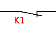 |
| Par(R,R)          | Parallelschaltung von zwei Widerständen                      |   |
| Ser(R,R)          | Serienschaltung von zwei Widerständen                        |   |
| B(R1,R2,R3,R4,R5) | Brückenschaltung von 5 Bauelementen                          |  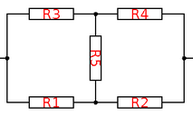 |
| B(R)              | Brückenschaltung von 5 Widerständen mit verschiedenen Werten |   |

Die Verschaltung der Bauelement erfolgt über die folgenden Operatoren:

| Operator | Priorität | Bedeutung                                                                                                                                                      |
|----------|-----------|----------------------------------------------------------------------------------------------------------------------------------------------------------------|
| *        | 15        | Parallelschaltung                                                                                                                                              |
| +        | 10        | Serienschaltung                                                                                                                                                |
| ?        |           | Wird nach einem Bauteil ein Fragezeichen gesetzt, so wird der Bauteil in der Angabe nicht angegeben und der Bauteilwert wird in der Schaltung nicht gezeichnet |

#### Zusammenschaltung von Zweipolen

| Schaltung                               | Bedeutung                                                | Beispiel | Bild                                                            |
|-----------------------------------------|----------------------------------------------------------|----------|-----------------------------------------------------------------|
| einzelner Zweipol als Serienschaltung   | Wird horizontal dargestellt und ohne Beistrich definiert | R+C      |  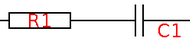 |
| einzelner Zweipol als Parallelschaltung | Wird horizontal dargestellt und ohne Beistrich definiert | R*C      |   |

#### angezeigte Spannungen und Ströme
* Die angezeigten Ströme und Spannung können nach der Schaltungsdefinition durch einen Strichpunkt getrennt erfolgen. 
* Sie werden einfach durch Beistrich getrennt angegeben
Folgenden Definitionen sind hierbei möglich:

| Operator      | Beispiel | Bedeutung                                                                                                                                                          |
|---------------|----------|--------------------------------------------------------------------------------------------------------------------------------------------------------------------|
| ohne Operator | UR1      | der Spannungspfeil für R1 wird gezeichnet                                                                                                                          |
| u             |          | alle Spannungs- und Strompfeile werden unterstrichen                                                                                                               |
| _             | UC1_     | Das Größensymbol wird in der Schaltung unterstrichen                                                                                                               |
| -             | Ue-      | Der Pfeil wird in der Schaltung nicht mehr gezeichnet                                                                                                              |
| !             | IC1!     | Der Absolutbetrag des berechneten Wertes wird zum Pfeil dazugeschrieben                                                                                            |
| ?             | UR1?     | Der Pfeil wird ohne Namen gezeichnet                                                                                                                               |
| &gt;          | UR1&gt;x | Der Indizes der Größe wird in Schaltung und Zeigerdiagramm ausgetauscht. In diesem Beispiel wird Ux statt UR1 geschrieben. In Maxima bleibt der Index unverändert. |
| :             | R1:Rx    | Ein Bauteilname kann umbenannt werden. Hier R1 auf Rx.                                                                                                             |

Die Operatoren _-!? können auch nach einer Änderung mit &gt; zusätzlich verwendet werden wie zB: UR4&gt;x!_ 
 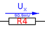

* Nach dem ersten Drehstrom-Schaltungselement kann durch die Angabe von **"I"** Strompfeile eingezeichnet werden und durch die Angabe von **"U"** Spannungspfeile eingezeichnet werden.
* Nach den weiteren Drehstrom-Schaltungselementen können ebenfalls mit Ia,Ib,Ua,Ub,etc. Strom und Spannungspfeile eingezeichnet werden.

#### Beispiele

| Definition                            | Schaltung                                                                   |
|---------------------------------------|-----------------------------------------------------------------------------|
| N3(),DD(R,R,R),DS(R,R,R);I,U,Ia,Ua,Ib |  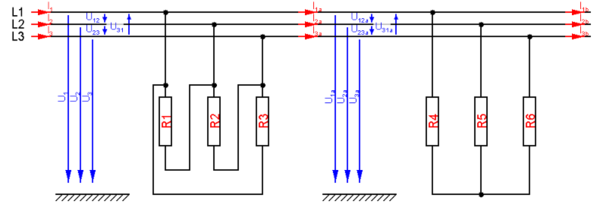 |
| N4(),DSN(R,L,C);I,UR1                 |  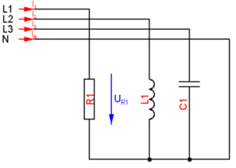 |

### Datensätze
* Das Plugin erstellt automatisch beim Beenden des Plugin-Editors die benötigten Datensätze
* Für alle Bauteilwert darf aktuell nur ein reeller und kein komplexer Wert verwendet werden
* Für Bauteile kann man den zugehörigen Datensatz löschen und durch eine Berechnung in Maxima überschreiben (Der Datensatz wird aber dann aktuell jedesmal wenn man in den Plugin-Dialog wechselt neu angelegt -&gt; Bug)

### Verwendung des Plugins in der Frage
#### Einfügen von Angabewerten
Im Frageeditor kann man mit der rechten Maustaste und Plugin-Angabe die Angabe für alle generierten Datensätze in den Fragetext einfügen lassen.
 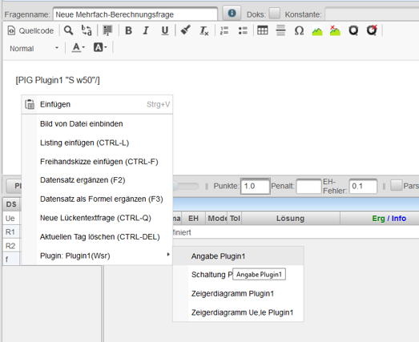
Wird später das Plugin verändert wird dieser Test **nicht automatisch** nachgeführt. Er muss dann entweder gelöscht und neu eingefügt, oder händisch angepasst werden.

#### Einfügen von Graphiken
Eine Graphik kann durch das Plugin-Tag 
<pre>
&#91;PIG pluginname &quot;typ parameter&quot;/&#93;
</pre>
im Fragetext eingefügt werden. Dies erfolgt entweder direkt über die Eingabe des Textes oder über die rechte Maustaste im Fragetext-Editor.

Folgende Parameter können angegeben werden:

| Graphiktyp     | typ parameter   | Beschreibung                                                                                                                                                                                                                                                                                                                                                                                                                                                                                                                                                                                                                                                                                                            | Beispiel                          |
|----------------|-----------------|-------------------------------------------------------------------------------------------------------------------------------------------------------------------------------------------------------------------------------------------------------------------------------------------------------------------------------------------------------------------------------------------------------------------------------------------------------------------------------------------------------------------------------------------------------------------------------------------------------------------------------------------------------------------------------------------------------------------------|-----------------------------------|
| Schaltung      | keine Parameter |                                                                                                                                                                                                                                                                                                                                                                                                                                                                                                                                                                                                                                                                                                                         | &#91;plugin1&#93;                |
| Schaltung      | S W,w20         | W,werte..Werte der Bauteile drucken  w20..Breite in Prozent des Bildschirms                                                                                                                                                                                                                                                                                                                                                                                                                                                                                                                                                                                                                                       | &#91;PIG plugin1 "S W,w60"&#93;   |
| Zeigerdiagramm | ZD w40          | Parameter durch Komma getrennt  U Zeigerdiagramm der Spannungen  I Zeigerdiagramm der Ströme  UI Zeigerdiagramm der Ströme und Spannungen  UR1 erzwingt das Zeichnen der Spannung UR1  IC1 erzwingt das Zeichnen des Stromes IC1  u unterstreicht alle Ströme und Spannungen  UR1? zeichnet den Zeiger ohne Beschriftung  UR1/ die Beschriftung erfolgt auf der anderen Seite des Zeigers  UR2- Die Spannung wird nicht gezeichnet  P(UR1,UR2,IC1) nur die angegebenen Spannungen und Ströme werden gezeichnet  w50 Breite in Prozent des Bildschirms   noscale keine Angabe über die Größe der Spannungen und Ströme  nolegend keine Beschriftung der Spannungen und Ströme  | &#91;PIG plugin1 "zd UI,w50"&#93; |

#### Zeichenelemente des Plot-Plugins
Durch Strichpunkt getrennt können auch die [Zeichenelemente#vordefinierte-graphische-funktionen-](../Plot#vordefinierte-graphische-funktionen-/index.md#vordefinierte-graphische-funktionen-) des Plot-Plugins eingefügt werden.

Das Koordinatensystem des Bildschirmfensters hat den Nullpunkt links unten.

Die positive horizontale Achse geht von links nach rechts von 0 bis 100 und bei Schaltungen von 0 bis zur Schaltungsbreite wobei ein Widerstand eine Länge von 3 hat.

Die postitive vertikale Achse reicht unten nach oben und beginnt unten bei 0. Der maximale Wert ist abhängig vom Seitenverhältnis des Fensters.

#### Maximafeld
Im Maximafeld kann ein Satz von Berechnungsformeln für das Plugin über den Tag

<pre>
&#91;PIM pluginname/&#93;
</pre>

automatische eingefügt werden. Dieses Tag kann auch über die rechte Maustaste im Maximafeld eingefügt werden. D
Das PIM-Tag wird vor der Maxima-Berechnung automatisch durch die Formeln des Plugins ersetzt.

**WICHTIG!** Die Berechnung sollte mit dem **internen Parser**  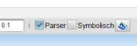 erfolgen, da Maxima mit komplexen Zahlen symbolisch nur eingeschränkt umgehen kann!

Folgende Variablen werden im Maxima-Feld definiert und können für das Ergebnis 
verwendet werden:

| Variable | Beschreibung                                                                                                      | Ergebnistyp               |
|----------|-------------------------------------------------------------------------------------------------------------------|---------------------------|
| UR1      | Spannung am Widerstand R1                                                                                         | Polynombruch im s-Bereich |
| IC1      | Strom im Kondensator C1                                                                                           | Polynombruch im s-Bereich |
| cUS1     | Spannung an der Serienschaltung S1 als komplexe Zahl                                                              | komplexe Zahl             |
| absUS1   | Absolutbetrag der komplexen Spannung US1                                                                          | double                    |
| argUP1   | Winkel der komplexen Spannung UP1 im Radiantenmaß                                                                 | double                    |
| reUR1    | Realteil der komplexen Spannung UR1                                                                               | double                    |
| imUC1    | Imaginärteil der komplexen Spannung UC1                                                                           | double                    |
| cSR1     | komplexe Scheinleistung am Bauteil R1                                                                             | komplexe Zahl             |
| SR1      | Absolutbetrag der Scheinleistung am Bauteil R1                                                                    | double                    |
| argS1    | Winkel der Scheinleistung am Bauteil R1                                                                           | double                    |
| PR1      | Wirkleistung am Bauteil R1                                                                                        | double                    |
| QR1      | Blindleistung am Bauteil R1                                                                                       | double                    |
| cU1      | komplexe Spannung von L1 gegen das Bezugspotential nach dem ersten Drehstromschaltelement                         | komplex                   |
| cUS      | komplexe Spannung vom Sternpunkt einer Sternschaltung gegen das Bezugspotential im zweiten Drehstromschaltelement | komplex                   |
| cUSa     | komplexe Spannung vom Sternpunkt einer Sternschaltung gegen das Bezugspotential im dritten Drehstromschaltelement | komplex                   |
| absU2a   | Betrag der Spannung von L2 gegen das Bezugspotential nach dem zweiten Drehstromschaltelement                      | double                    |
| cS       | Gesamtscheinleistung nach dem ersten Drehstrom-Schaltelement                                                      | komplex                   |
| Sa       | Betrag der Gesamtscheinleistung nach dem zweiten Drehstrom-Schaltelement                                          | double                    |
| P        | Gesamtwirkleistung nach dem ersten Drehstrom-Schaltelement                                                        | double                    |
| Qb       | Gesamtblindleistung nach dem dritten Drehstrom-Schaltelement                                                      | double                    |

[Plugins](../Plugins/index.md)

