# Editor für den Angabetext
Der Editor basiert auf dem [CKEditor](https://ckeditor.com/ckeditor-4/) und dient zum Erstellen des Fragetextes.
Die Angabe für die Frage kann im Editor vernünftig formatiert werden, es können Bilder zur Frage gekoppelt werden sowie die [Plugins](../Plugins/index.md) eingebunden werden. Die Einbindung von Variablen und Datensätzen erfolgt ebenfalls im Angabetext. Für schön formatierte mathematische Formeln kann eine TEX-Syntag in der Angabestellung verwendet werden.
### Toolbar des Editors für den Angabetext

Über den Toolbar des Editors können Sie mit den Icons 
* 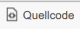: Umschalten zwichen HTML-Ansicht und der Vorschau
* : Im Fragetext nach Wörten suchen bzw. Inhalte ersetzten
* : Zeichen Fett, Kursiv oder Unterstrichen formatieren
* 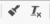: Formatierung kopieren und entfernen
* : Numerierte Listen und Listen erstellen
* : Tabelle einfügen und formatieren
* : Horizontale Trennlinie einfügen
* : Sonderzeichen einfügen
* : Bild in den Fragetext einfügen
* : Bild löschen, wenn der Cursor auf einem Image-Tag [IMG...](IMG...) steht.
* : Neue Teilfrage in einer [Mehrfachberechnungsfrage](../BeispielsammlungEditieren/index.md#mehrfachberechnungsfrage) einfügen
* : Teilfrage löschen, wenn der Cursor auf einem Teilfrage-Tag [Q...](Q...) steht.
* : Absatzformate definieren, Textfarbe und Hintergrundfarbe auswählen

### Kontext-Menü des Editors
 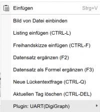

##### Einfügen:
Einfügen des Inhalts der Zwischenablage. Wenn in der Zwischenablage ein Bild gespeichert ist, dann wird das Bild in der Frage gespeichert und der entsprechende zugordnete IMG-Tag an der Cursor-Position eingefügt.

##### Bild von Datei einbinden:
Es wird ein Diolog zur Datei-Auswahl geöffnet und nach Auswahl des Bildes dieses zur Frage hinzugefügt und der IMG-Tag an der Cursor-Position eingefügt.

Alle Dateien, die in der Frage verwendet werden können, können auch über den Dialog [Dateien zur Frage verwalten](../DateienzurFrageverwalten/index.md) verwaltet werden. 
Auch das manuelle Eintippen von &#91;IMG...]-tags ist möglich, wenn Sie die den Tag des Bildes aus obigem Dialog ermittelt haben.

##### Listing einfügen (STRG-P)
Einfügen eines Listings, siehe auch [Listings](#Listings).

##### Freihandskizze einfügen (STRG-F)
Öffnen einer Möglichkeit zum Erstellen von einfachen Freihand-Skizzen, die dann als Image zur Frage gebunden werden können.
 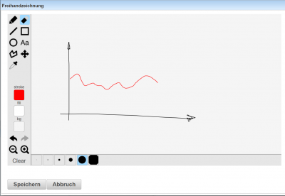

##### Datensatz ergänzen (F2)
Anlegen eines Datensatzes, die Variablenbezeichnung wird aus dem Wort der akt. Cursorposition abgeleitet. Die Variable wird in geschwungene Klammern gesetzt. Bp.: An der Cursorposition (vor dem Cursor) steht "U2". Es wird ein Datensatz (Variable) mit dem Namen U2 mit der Einheit Volt erzeugt und an der Cursorposition wird U2 durch {U2} ersetzt.

##### Datensatz als Formel ergänzen (F3)
Anlegen eines Datensatz wie oben, die Variable wird mit einer Zuweisung in einer Formel gesetzt. 
Bp.: aus "U1 &lt;F3&gt;" wird $U_1 = {U1}$

##### Neue Teilfrage (STRG-Q)
Verwendung bei [Mehrfachberechnungsfragen](../BeispielsammlungEditieren/index.md#mehrfachberechnungsfrage): Im Angabetext wird ein TAG für neue Teilfrage an der Cursorposition  gesetzt und eine neue Teilfrage wird erzeugt und im Detailbereich der Mehrfachberechnungsfrage angezeigt. Der &#91;Q...]-Tag liefert dann in der fertigen Frage ein Eingabefeld zur Lösungseingabe. Die Ergebnisse der Teilfge sind im Detailbereich der Frage zu definieren.

##### Aktuellen Tag löschen (STRG-DEL)
Wenn der Cursor auf oder hinter einem TAG steht, dann wird der TAG und die zugehörige Information gelöscht:
zB: &#91;IMG...]-Tag: Der Tag verschwindet und das Bild wird aus der Datenbank gelöscht.
&#91;Q...]-Tag: Die zugehörige Teilfrage wird gelöscht.

##### Plugin
Wenn in der Frage [Plugins](../Plugins/index.md) definiert sind, dann können auch über das Kontext-Menü pluginspezifische Teile eingefügt werden. Pro definiertem Plugin wird eine Zeile im Kontext-Menü hinzugefügt. Die Menü-Einträge enthalten Namen und Art des Plugins. Je nach gewähltem Plugin unterscheiden sich die Untermenüs stark.

### Formeln
Formeln werden innerhalb von **Dollarzeichen** gesetzt und können dann wie eine Formel in LaTeX gesetzt werden:
zB. liefert **$k = &#92;sum_{i=1}^{n} (i+2)$** die Formel im Browser: 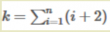

Tutorial zum Erstellen von Tex-Formeln: https://de.wikipedia.org/wiki/Hilfe:TeX

### HTML-Tags
Im Fragetext können nur die folgenden HTML-Tags verwendet werden, alle anderen Tags werden automatisch entfernt und sollten deshalb nicht verwendet werden.

zulässige HTML-Tags:

| **name**                                                       | **Funktion**                                        |
|----------------------------------------------------------------|-----------------------------------------------------|
| [html](https://www.w3schools.com/tags/tag_html.asp)            | HTML-Seite                                          |
| [head](https://www.w3schools.com/tags/tag_head.asp)            | HTML-Seitenkopf                                     |
| [body](https://www.w3schools.com/tags/tag_body.asp)            | HTML-Seitenrumpf                                    |
| [a](https://www.w3schools.com/tags/tag_a.asp)                  | Link                                                |
| [hr](https://www.w3schools.com/tags/tag_hr.asp)                | horizontale Linie                                   |
| [br](https://www.w3schools.com/tags/tag_br.asp)                | neue Zeile                                          |
| [p](https://www.w3schools.com/tags/tag_p.asp)                  | Absatz                                              |
| [span](https://www.w3schools.com/tags/tag_span.asp)            | Tag zum Gruppieren und Formatieren mit CSS          |
| [table](https://www.w3schools.com/tags/tag_table.asp)          | Tabelle                                             |
| [tbody](https://www.w3schools.com/tags/tag_tbody.asp)          | Hauptbereich einer Tabelle                          |
| [thead](https://www.w3schools.com/tags/tag_thead.asp)          | Kopfbereich einer Tabelle                           |
| [tfoot](https://www.w3schools.com/tags/tag_tfoot.asp)          | Fußbereich einer Tabelle                            |
| [tr](https://www.w3schools.com/tags/tag_tr.asp)                | Tabellenzeile                                       |
| [td](https://www.w3schools.com/tags/tag_td.asp)                | Tabellenzelle                                       |
| [th](https://www.w3schools.com/tags/tag_th.asp)                | Tabellen-Kopf-Zelle                                 |
| [img](https://www.w3schools.com/tags/tag_img.asp)              | Bild                                                |
| [area](https://www.w3schools.com/tags/tag_area.asp)            | Bereich in einem Bild                               |
| [ul](https://www.w3schools.com/tags/tag_ul.asp)                | unsortierte Liste                                   |
| [ol](https://www.w3schools.com/tags/tag_ol.asp)                | sortierte Liste                                     |
| [li](https://www.w3schools.com/tags/tag_li.asp)                | Listenelement                                       |
| [div](https://www.w3schools.com/tags/tag_div.asp)              | Bereich eines Dokuments                             |
| [pre](https://www.w3schools.com/tags/tag_pre.asp)              | vorformatierter Text mit fixer Schrift              |
| [b](https://www.w3schools.com/tags/tag_b.asp)                  | Fettschrift                                         |
| [i](https://www.w3schools.com/tags/tag_i.asp)                  | Kursivschrift                                       |
| [u](https://www.w3schools.com/tags/tag_u.asp)                  | Unterstrichen                                       |
| [s](https://www.w3schools.com/tags/tag_s.asp)                  | Text ist nicht mehr länger gültig (durchgestrichen) |
| [strong](https://www.w3schools.com/tags/tag_strong.asp)        | Wichtiger Text (Fett)                               |
| [em](https://www.w3schools.com/tags/tag_em.asp)                | Hervorgehoben (kursiv)                              |
| [h1,h2,h3,h4,h5,h6](https://www.w3schools.com/tags/tag_hn.asp) | Überschriften                                       |
| [abbr](https://www.w3schools.com/tags/default.asp)             | Acronym                                             |
| [audio](https://www.w3schools.com/tags/tag_audio.asp)          | Audio-Datei                                         |

### Spezielle TAGs im Fragentext

| Tagbezeichnung   | Beschreibung                                                                                                                                                                                                                                                                                                                       |
|------------------|------------------------------------------------------------------------------------------------------------------------------------------------------------------------------------------------------------------------------------------------------------------------------------------------------------------------------------|
| &#91;listing]    | Tag zum Einfügen von Programm-Listings in den Angabetext einer Frage. Zwischen dem Start mit &#91;listing&#93;  und dem Ende mit &#91;/listing&#93; befindet sich dann der Programmcode, der speziell formatiert wird. Dies erreicht man am besten über die rechte Maustaste "Listing einfügen" oder mit STRG-P                   |
| &#91;IMG0]       | Platzhaltersymbol für eine Grafik: Alle Grafiken werden als Dateien an die Frage angeschlossen und mit dem IMG-Tag zur Anzeige gebracht. Die Dateien, die in der Frage verwendet werden können, können über den Dialog [Dateien zur Frage verwalten](../DateienzurFrageverwalten/index.md) verwaltet werden. Details: Siehe Bilder |
| &#91;LINK0 TEXT] | Link auf eine Datei aus der Dateiliste der Frage. Der Text wird als Link-Text angezeigt.                                                                                                                                                                                                                                           |
| &#91;Q0]         | Referenz auf eine Teilfrage einer [Mehrfachberechnungsfrage](../BeispielsammlungEditieren/index.md#mehrfachberechnungsfrage). Der &#91;Q...]-Tag liefert dann in der fertigen Frage ein Eingabefeld zur Lösungseingabe für diese Teilfrage                                                                                         |
| &#91;PIG]        | Tag zum Einbinden einer Grafik, die von einem [Plugin](../Plugins/index.md) zur Laufzeit erzeugt wird.                                                                                                                                                                                                                             |

### Bilder
Bilder werden im Editor durch ein Image-Tag &#91;IMG0], &#91;IMG1], etc. als Platzhalter angezeigt. Grafiken werden als Dateien an die Frage angeschlossen und mit dem IMG-Tag zur Anzeige gebracht. 
Die Vorschau des Bildes wird im linken unteren Vorschaufenster angezeigt, wenn der Image-Tag angeklickt wird.

**Einfügen von neuen Bildern: ** 
* Images aus der Zwischenablage können über _STRG-V_ eingefügt werden. Das Bild wird als Datei an die Frage angehängt und der entsprechende &#91;IMG]-Tag wird eingefügt.
* Über den Toolbar des Editors mit dem Button : Ein Dialog zum Auswählen einer Grafik wird angezeigt, 
  nach erfolgter Auswahl wird der &#91;IMG]-Tag und die Datei eingefügt.

### Schnelleingabe / Tastatur-Shortcuts
* F2: Tippt man nach der Eingabe eines Variablennamens die Funktionstaste F2, so wird ein Datensatz angelegt und die Variable wird in geschwungene Klammern gesetzt zB.: aus "U2 &lt;F2&gt;" wird {U2}
* F3: Tippt man nach der Eingabe eines Variablennamens die Funktionstaste F3, so wird ein Datensatz angelegt und die Variable mit einer Zuweisung in einer Formel gesetzt zB. aus "U1 &lt;F3&gt;" wird $U_1 = {U1}$
* F8: Nur bei Lückentextfragen: Mit F8 kann das aktuelle Wort, bei dem der Cursor steht, als Textlücke definiert werden.
* STRG-P: Einfügen eines Textbereichs für Programm-Listings
* STRG-F: Einfügen einer Freihandskizze
* STRG-Q: Einfügen einer neuen Teilfrage bei [Mehrfachberechnungsfragen](../BeispielsammlungEditieren/index.md#mehrfachberechnungsfrage)
* STRG-DEL: Aktuellen Tag löschen, wenn der Cursor auf einem Tag mit eckigen Klammern steht.

Wird eine [Variable](../Datensätze/index.md) direkt in geschwungene Klammern gesetzt, so wird nach dem Verlassen des Editors geprüft, ob die Variable schon vorhanden ist und diese wird gegebenenfalls neu angelegt.

Die Grafiken von [Plugins](../Plugins/index.md) werden im Editor ebenfalls durch Plugin-Tags mit Platzhaltern angezeigt.

### Listings
Sourcecode Listings müssen innerhalb von Listings-Tags gesetzt werden. Dies erreicht man am Besten über die rechte Maustaste "Listing einfügen" oder mit STRG-P.

Im HTML-Sourcecode wird das Listing dann innerhalb von HTML-Tag <pre>...</pre> dargestellt.

Fügt man das Listing nicht über Strg-P oder "Listing einfügen" ein sondern tippt man es direkt in den Editor, so wird das Listing nicht innerhalb von pre-Tags formatiert 
und die Zeilenumbrüche werden somit nicht korrekt gemacht (siehe Beispiele 3 und 4). Natürlich kann man in der Quellcode-Ansicht des Editors zuerst die
pre-Tags einfügen und dann den Quellcode mit dem &#91;listing]-Tag dazwischen setzen - damit erhält man das gleiche Ergebnis wie mit Strg-P.

Im Start-Tag des Listings kann auch mit dem **Parameter lang="C"** eine gewünschte **Programmiersprache** angegeben werden. 
Diese Angabe wird dann **beim Druck an das LaTeX Listings-Packet** geschickt, im **Browser** wird die Sprache **automatisch** erkannt und somit die **lang-Angabe ignoriert**. 
Die verfügbaren Sprachen sind vom LaTeX-Packet abhängig, die Standard-Programmiersprachen sind C, C++, Java, Python, Pascal, HTML, XML, SQL, PHP und JavaScript.

Innerhalb von Listings können natürlich auch Variable verwendet werden, die dann wie im Rest des Textes ersetzt werden.

Beginnt der Text des Listings direkt nach dem Start-Tag des Listings, so wird am Beginn des Listings keine Leerzeile eingefügt (siehe erstes Beispiel).

##### Beispiele in denen die Datensätze a und b verwendet werden:

| Beispiele für Listings-Tag | Ergebnis                | im HTML-Source            |
|----------------------------|-------------------------|---------------------------|
| 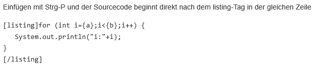    | 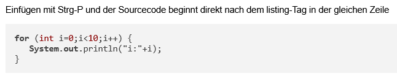 | 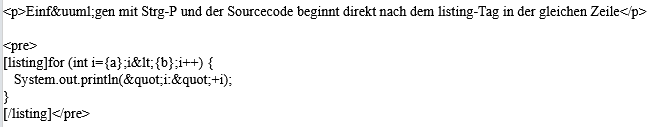   |
| 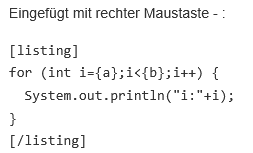        | 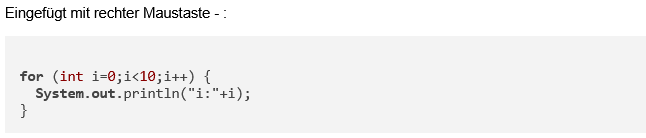 | 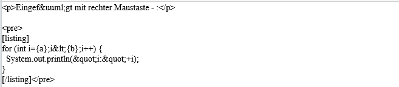   |
| 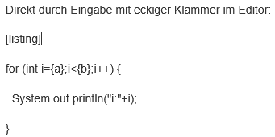    | 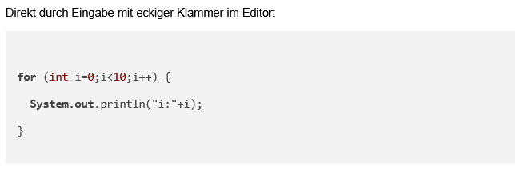 | 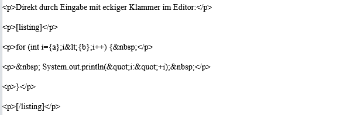 |
| 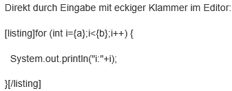    | 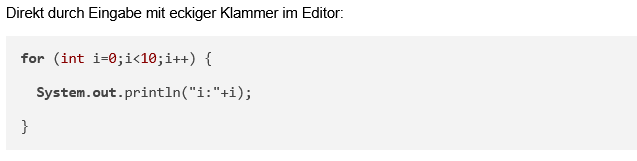 | 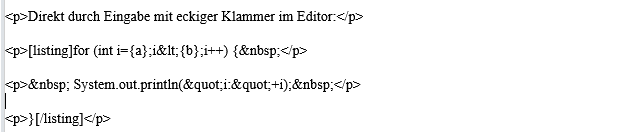 |

###  Sonderzeichen 
* Bis auf einige Ausnahmen können im Fragetext alle Zeichen des UTF-8-Zeichensatzes verwendet werden.
* Spezielle Sonderzeichen des CK-Editors können mit dem Button   eingefügt werden
* Folgende Zeichen haben im Fragetext eine Sonderstellung und müssen deshalb teilweise gesondert behandelt werden:

| Zeichen | Bezeichnung          | Funktion                                         | Verwendung im Fragetext                                                                                                                   |
|---------|----------------------|--------------------------------------------------|-------------------------------------------------------------------------------------------------------------------------------------------|
| $       | Dollar               | Start und Ende einer Formelumgebung im Fragetext | &#92;$                                                                                                                                    |
| {       | geschwungene Klammer | Variablen und Berechnungsfeld                    | wird nur als Variablenklammer interpretiert wenn dazu eine gültige Variable gefunden wird, ggf. nach der Klammer ein Leerzeichen einfügen |
| &lt;    | kleiner Zeichen      | HTML-Tag-Begrenzer                               | wird durch den CK-Editor automatisch in die Entity &amp;lt; gewandelt und ist deshalb normal verwendbar                                   |
| &gt;    | kleiner Zeichen      | HTML-Tag-Begrenzer                               | wird durch den CK-Editor automatisch in die Entity &amp;gt; gewandelt und ist deshalb normal verwendbar                                   |
| [       | eckige Klammer       | Frage, Bild, Link Begrenzer                      | Kann normal verwendet werden wird nur bei einem gültigen Tag IMG,LINK,Q,... ausgewertet                                                   |

###  Sonderzeichen in einer Formelumgebung im Fragetext 
* Eine Formelumgebung beginnt im Fragetext mit Dollar und endet mit Dollar. Dazwischen wird der Text als Formel wie in LaTeX gesetzt. 
* Sonderzeichen werden dabei wie folgt angegeben:

| Zeichen | Verwendung in der Formelumgebung | 
|---------|----------------------------------|
| $       | &#92;$                           |
| {       | &#92;{                           |
| }       | &#92;}                           |
| _       | &#92;_                           |
| ^       | &#92;^                           |
| #       | &#92;#                           |
| ~       | &#92;sim                         |
| &#92;   | &#92;backslash                   |
| x²      | x^2                              |
| x³      | x^3                              |
| %       | &#92;%                           |

### Datensätze und Variable
Die Verwendung von Datensätzen oder Ergebnissen von Berechnungen erfolgt immer über geschwungene Klammern!

Datensatz erstellen: siehe [Datensätze definieren](../Datensätzedefinieren/index.md), [Eingabe im Editor](../Datensätzedefinieren/index.md#erstellung-aus-dem-editor)

Alle  Datensätze, die bei der Frage definiert wurden sowie alle Ergebnisse der Maxima-Berechnung können im Fragetext innerhalb oder außerhalb von Tex-Formeln verwendet werden.

| Bezeichnung                                                  | Syntax                       | Beispiel   | Beschreibung                                                                                                                                                                        |
|--------------------------------------------------------------|------------------------------|------------|-------------------------------------------------------------------------------------------------------------------------------------------------------------------------------------|
| Variable, die in einem Datensatz definiert wurde             | {name}                       | {x}        | x wird duch den Wert des Datensatzes ersetzt                                                                                                                                        |
| Variable mit Einheit                                         | {name,einheit}               | {I1,A}     | I1 wird mit der Einheit A mit gültigen Einheitenvielfachen von A ausgegeben                                                                                                         |
| Variable mit erzwungener Einheit                             | {name,=einheit}              | {I1,=mA}   | I1 wird mit mA ausgegeben, es wird nicht nach besseren Einheitenvielfachen gesucht                                                                                                  |
| Variable mit definierter Genauigkeit                         | {name,ziffern}               | {I1,2}     | I1 wird auf 2 gültige Ziffern gerundet und ausgegeben                                                                                                                               |
| Variable mit definierter Genauigkeit und erzwungener Einheit | {name,=einheit,ziffern}      | {U1,=mV,3} | U1 wird auf 3 gültige Ziffern gerundet und in mV ausgegeben. ( siehe [Einheit](../Einheit/index.md), [Zahlendarstellung](../Zahlendarstellung/index.md) )                           |
| konstanter Wert                                              | name={wert,einheit}          | U_2={5,V}  | der konstante Wert von U2 ist 5V, und kann in Maxima und für alle Ergebnisse verwendet werden                                                                                       |
| symbolischer Wert, der in Maxima berechnet wurde             | {=name}                      | {=y}       | setzt in die Variable y, die in Maxima berechnet wurde, die Datensätze ein und gibt das Ergebnis aus, wobei nur numerische Optimierungen vorgenommen werden                         |
| symbolischer Ausdruck                                        | {=ausdruck}                  | {=x+y}     | berechnet den Ausdruck x+y und setzt alle Ergebnisse aus den Maxima-Berechnungen und alle Datensätze in den Ausdruck ein                                                            |
| symbolischer Ausdruck mit Auswertung                         | {=ev(ausdruck)}              | {=ev(x+y)} | setzt alle Maxima-Ergebnisse in den Ausdruck ein, und setzt danach noch alle Datensätze ein                                                                                         |
| symbolischer Wert/Ausdruck ohne Vereinfachung                | {=:name}                     | {=:y}      | gibt die Variable y, welche in Maxima berechnet wurde, exakt so, wie sie berechnet wurde aus. Soll in Maxima nichts berechnet werden, so ist dort die Funktion noopt() zu verwenden |
| symbolischer Wert mit voller Optimierung                     | {=opt:name}                  | {=opt:y}   | setzt in den Ausdruck y, welcher in Maxima berechnet wurde, alle Datensätze ein und optimiert das Ergebnis so stark wie möglich                                                     |
| symbolscher Wert mit Einheit und Genauigkeit                 | {=ausdruck;=einheit,ziffern} | {=y;=mV,3} | setzt in den Ausdruck y, welcher in Maxima berechnet wurde, alle Datensätze ein und gibt in mV mit 3 gültigen Ziffern aus.                                                          |
| Datensatz - Vektor                                           | {name}                       | {v}        | Vektoren werden normal als Spaltenvektor dargestellt                                                                                                                                |
| Zeilenvektor                                                 | {name;line}                  | {v,line}   | Vektor als Zeilenvektor: (1/2/3)                                                                                                                                                    |
| Vektor in Eingabedarstellung                                 | {name;input}                 | {v,input}  | Vektor wird so dargestellt, wie er eingegeben werden kann: &#91;1,2,3]                                                                                                              |
| Matrix                                                       | {name}                       | {M}        | Darstellungsmodi von Matrizen sind gleich wie bei Vektoren                                                                                                                          |

### Beispiele

Nachfolgende Beispiele basieren auf zwei Datensätze a und b:

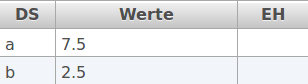

