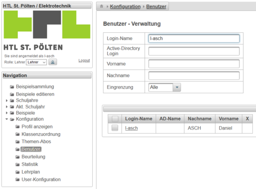
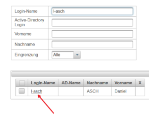
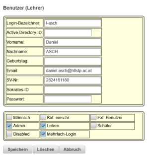

# Eigenes Lehrerpasswort ändern
Um das eigene Lehrerpasswort zu ändern klicken Sie auf der linken Seite unter Konfiguration auf Benutzer - siehe Abbildung.

 

Nutzen Sie wie in der Abbildung oberhalb dargestellt die Möglichkeit des Filterns mittels Filtermaske.
 
Klicken Sie auf das Filterergebnis - wie in der Graphik dargestellt direkt auf den Benutzernamen (roter Pfeil im Beispiel).
 
Sie können den Benutzer editieren und auch das Passwort setzen. 
**WICHTIG**: Schließen Sie den Vorgang mit dem Speichern durch Klicken auf den Speicherbutton ab.

