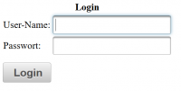
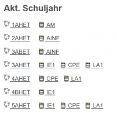
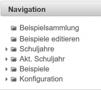

# Einführung
### Login
 

Zum Anmelden am LeTTo-Server geben Sie bitte Ihren Loginnamen und Ihr Passwort ein.

Haben Sie als Lehrer ihr Passwort vergessen, wenden Sie sich bitte an einen Systemadministrator.
Haben Schüler ihr Passwort vergessen, dann können Sie als Lehrer die [Schülerpasswörter zurücksetzen](../Schülerpasswortzurücksetzen/index.md).

### Hauptansicht
Nach dem Login erscheint für Lehrer eine Ansicht, in der im Hauptfenster die Daten des [aktuellen Schuljahres](../Schuljahr/index.md) eingeblendet sind.
 
: Auf der linken Seite sind Links zum jeweiligen [Klassenzimmer](../Klassenzimmer/index.md) angelegt. In dieser Ansicht können Tests im Schülermodus ausgeführt werden, Lehrer können unterschiedliche Aktivitäten in Ordnern sortieren, Tests probehalber ausprobieren, Testergebnisse eingesehen werden, ...
 

Rechts davon sind Links angeordnet, die zu den [Katalogen](../Katalog/index.md) der jeweiligen Gegenständen der links angeführten Klasse führen. Im System ist die Lehrfächerverteilung hinterlegt und jeder Lehrer sieht seine Gegenstände.

### Navigation
Siehe auch [LeTTo-Hauptansicht](/notimplemented/index.md)
 
**Tipp zur Navigation:** Verwenden Sie bitte zum raschen Navigieren durch die Ordnerstruktur die **kleinen Dreiecke**  auf der linken Seite jedes Ordners! Damit werden Order auf- und zugeklappt, ohne dass auf die Datenbank zugegriffen werden muss, was die Reaktionszeiten verkürzt.
Wenn Sie den Inhalt auswählen, dann wird die entsprechende Ansicht geladen und angezeigt.

### Beispiele erstellen
Zum Erstellen von Beispielen wählen Sie in der Navigation bitte den Link mit [Beispiele editieren](../BeispielsammlungEditieren/index.md).

### Online-Test erstellen
[https://doc.letto.at/wiki/Testanlegen/](https://doc.letto.at/wiki/Testanlegen/)

### Online-Test mit Schülern durchführen

### Ergebnisse

### Katalogführung
Siehe [Katalog](../Katalog/index.md)

