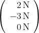
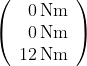

# Eingabe von Resultaten in LeTTo
###  Allgemeine Hinweise 

* Das Dezimaltrennzeichen ist der Punkt (&lt;code&gt;.&lt;/code&gt;), nicht der Beistrich 
* Zwischen Zahlenwert und Einheit kann ein Leerzeichen eingefügt werden (muss aber nicht)
* Nach einem Minuszeichen &lt;code&gt;-&lt;/code&gt; bei der Eingabe einer negativen Größe darf nie ein Leerzeichen auftreten
* Nach einem &lt;code&gt;e&lt;/code&gt; oder &lt;code&gt;E&lt;/code&gt; bei der Eingabe einer Gleitkommazahl darf ebenfalls nie ein Leerzeichen auftreten

###  Reelle physikalische Größen 

Reelle Einheiten bestehen immer aus einem Zahlenwert und einer [Einheit](../Einheit/index.md). Nachfolgend werden exemplarisch die wichtigsten physikalischen Größen zusammengefasst. LeTTo-Eingaben sind in &lt;code&gt;Schreibmaschinenschrift&lt;/code&gt; angegeben. Die Groß- und Kleinschreibung von Einheiten muss genau eingehalten werden. 

Als <b>einfache Regel</b> gilt, dass alle Einheiten unter einfache Hochkomma gesetzt werden. Das funktioniert immer. Das einfache Hochkomma ' findet man mit &lt;code&gt;SHIFT + #&lt;/code&gt;. Für einfache Einheiten, die ohne die Operatoren &lt;code&gt;*&lt;/code&gt;, &lt;code&gt;/&lt;/code&gt; und &lt;code&gt;^&lt;/code&gt; auskommen, dürfen die beiden Hochkomma auch weggelassen werden.

* &lt;code&gt;250V&lt;/code&gt; für eine Spannung von 250 V
* &lt;code&gt;220kOhm&lt;/code&gt; oder &lt;code&gt;220E3Ohm&lt;/code&gt; oder &lt;code&gt;220e3Ohm&lt;/code&gt; für einen Widerstand von 220&amp;nbsp;k&amp;Omega; = 220&amp;middot;10&lt;sup&gt;3&lt;/sup&gt;&amp;nbsp;&amp;Omega;
* &lt;code&gt;4.7MOhm&lt;/code&gt; oder &lt;code&gt;4.7E6Ohm&lt;/code&gt; für einen Widerstand von 4,7&amp;nbsp;M&amp;Omega; = 4,7&amp;middot;10&lt;sup&gt;6&lt;/sup&gt;&amp;nbsp;&amp;Omega;
* &lt;code&gt;2.5mA&lt;/code&gt; oder &lt;code&gt;2.5E-3A&lt;/code&gt; für einen Strom von 2,5&amp;nbsp;mA = 2,5&amp;middot;10&lt;sup&gt;-3&lt;/sup&gt;&amp;nbsp;A
* &lt;code&gt;2.2uF&lt;/code&gt; oder &lt;code&gt;2.2E-6F&lt;/code&gt; für eine Kapazität von 2,2&amp;nbsp;&amp;mu;F = 2,2&amp;middot;10&lt;sup&gt;-6&lt;/sup&gt;&amp;nbsp;F
* &lt;code&gt;4.7nF&lt;/code&gt; oder &lt;code&gt;4.7E-9F&lt;/code&gt; für eine Kapazität von 4,7&amp;nbsp;nF = 4,7&amp;middot;10&lt;sup&gt;-9&lt;/sup&gt;&amp;nbsp;F
* &lt;code&gt;6.8pF&lt;/code&gt; oder &lt;code&gt;6.8E-12F&lt;/code&gt; für eine Kapazität von 6,8&amp;nbsp;pF = 6,8&amp;middot;10&lt;sup&gt;-12&lt;/sup&gt;&amp;nbsp;F
* &lt;code&gt;50mH&lt;/code&gt; oder &lt;code&gt;50E-3H&lt;/code&gt; für eine Induktivität von 50&amp;nbsp;mH = 50&amp;middot;10&lt;sup&gt;-3&lt;/sup&gt;&amp;nbsp;H
* &lt;code&gt;45Ah&lt;/code&gt; für eine Ladung von 45&amp;nbsp;Ah
* &lt;code&gt;500var&lt;/code&gt; für eine Blindleistung von 500&amp;nbsp;var
* &lt;code&gt;250MVA&lt;/code&gt; für eine Scheinleistung von 250&amp;nbsp;MVA
* &lt;code&gt;4.8kW&lt;/code&gt; für eine Leistung bzw. Wirkleistung von 4,8&amp;nbsp;kW
* &lt;code&gt;1kWh&lt;/code&gt; eine Einergie von 1&amp;nbsp;kWh = 3,6&amp;middot;10&lt;sup&gt;6&lt;/sup&gt;&amp;nbsp;J
* &lt;code&gt;8.1mm2&lt;/code&gt; oder &lt;code&gt;8.1mm^2&lt;/code&gt; für eine Fläche von 8.1&amp;nbsp;mm&lt;sup&gt;2&lt;/sup&gt;
* &lt;code&gt;27cm3&lt;/code&gt; oder &lt;code&gt;27cm^3&lt;/code&gt; für ein Volumen von 27&amp;nbsp;cm&lt;sup&gt;3&lt;/sup&gt;
* &lt;code&gt;3.9A/mm2&lt;/code&gt; oder &lt;code&gt;3.9A/mm^2&lt;/code&gt; für eine Stromdichte von 3,9&amp;nbsp;A/mm&lt;sup&gt;2&lt;/sup&gt;
* &lt;code&gt;290kA/m&lt;/code&gt; oder &lt;code&gt;290A/mm&lt;/code&gt; für eine magnetische Feldstärke von 290&amp;nbsp;kA/m
* &lt;code&gt;0.97T&lt;/code&gt; oder &lt;code&gt;0.97Vs/m2&lt;/code&gt; oder &lt;code&gt;0.97Vs/m^2&lt;/code&gt; für eine magnetische Flussdichte von 0,97&amp;nbsp;T = 0,97&amp;nbsp;Vs/m&lt;sup&gt;2&lt;/sup&gt;
* &lt;code&gt;628.32uVs/Am&lt;/code&gt; oder &lt;code&gt;628.32E-6H/m&lt;/code&gt; für eine Permeabilität von 628,32&amp;nbsp;&amp;mu;Vs/Am = 628,32&amp;middot;10&lt;sup&gt;-6&lt;/sup&gt;&amp;nbsp;H/m
* &lt;code&gt;80km/h&lt;/code&gt; für eine Geschwindigkeit von 80&amp;nbsp;km/h
* &lt;code&gt;12.2°&lt;/code&gt; für einen Winkel von 12,2&lt;sup&gt;&amp;omicron;&lt;/sup&gt; (Grad)
* &lt;code&gt;3.14159&lt;/code&gt; für eine Winkel von 3,14159 rad (Radiant). **Wichtig:** die Einheit rad ist keine gültige Einheit in LeTTo und darf daher nicht angegeben werden; Winkel in Radiant werden ohne Einheit eingegeben
* &lt;code&gt;3000Upm&lt;/code&gt; oder &lt;code&gt;3000min-1&lt;/code&gt; oder &lt;code&gt;3000'1/min'&lt;/code&gt; für eine Drehzahl von 3000&amp;nbsp;Upm = 50&amp;nbsp;s&lt;sup&gt;-1&lt;/sup&gt; 
* &lt;code&gt;190.2s-1 oder 190.2'1/s'&lt;/code&gt; für eine Winkelgeschwindigkeit von 190,2&amp;nbsp;rad/s
* &lt;code&gt;-2.82Nm&lt;/code&gt; für ein Drehmoment von -2,82&amp;nbsp;Nm
* &lt;code&gt;0.12kgm2&lt;/code&gt; oder &lt;code&gt;0.12kg1m2&lt;/code&gt; oder &lt;code&gt;0.12kg*m^2&lt;/code&gt;für ein Massenträgheitsmoment von 0,12&amp;nbsp;kg&amp;middot;m&lt;sup&gt;2&lt;/sup&gt;
* &lt;code&gt;2h-1&lt;/code&gt; oder &lt;code&gt;2'1/h'&lt;/code&gt; für den Kehrwert in Stunden von 2&amp;nbsp;h&lt;sup&gt;-1&lt;/sup&gt;

###  Komplexe physikalische Größen 

* &lt;code&gt;20.2V arg-12.2°&lt;/code&gt; oder &lt;code&gt;20.2 arg-12.2°V&lt;/code&gt; für die komplexe Spannung von 20,2&amp;nbsp;V&amp;ang;-12.2&lt;sup&gt;&amp;omicron;&lt;/sup&gt;
* &lt;code&gt;1.1Ohm arg-30.2°&lt;/code&gt; oder &lt;code&gt;1.1 arg-30.2°Ohm&lt;/code&gt; für die komplexe Impedanz von 1,1&amp;nbsp;Ohm&amp;ang;-30.2&lt;sup&gt;&amp;omicron;&lt;/sup&gt;
* &lt;code&gt;12.2A-j*8.6A&lt;/code&gt; oder &lt;code&gt;12.2A-8.6A*j&lt;/code&gt; oder &lt;code&gt;12.2-j*8.6A&lt;/code&gt; für den komplexen Strom von 12,2&amp;nbsp;A-j&amp;middot;8,6&amp;nbsp;A

###  Vektoren 

* &lt;code&gt;[2, -3, 0](2, -3, 0)N&lt;/code&gt; oder &lt;code&gt;[2N, -3N, 0N](2N, -3N, 0N)&lt;/code&gt; für den dreidimensionalen Vektor 
* &lt;code&gt;[0, 0, 12](0, 0, 12)Nm&lt;/code&gt; oder &lt;code&gt;[0Nm, 0Nm, 12Nm](0Nm, 0Nm, 12Nm)&lt;/code&gt; für den dreidimensionalen Vektor 
* &lt;code&gt;[2, 0, 0](2, 0, 0)mm/s2&lt;/code&gt; oder &lt;code&gt;[2mm/s2, 0mm/s2, 0m/s^2](2mm/s2, 0mm/s2, 0m/s^2)&lt;/code&gt; oder &lt;code&gt;[2E-3, 0, 0](2E-3, 0, 0)m/s-2&lt;/code&gt; für den dreidimensionalen Vektor 

###  Symbolische Resultate 

* Bei symbolischen Resultaten müssen die Einheiten – falls erforderlich – in einfache Hochkomma gesetzt werden, z. B. &lt;code&gt;s=x*2.5'm/s'+22'm'&lt;/code&gt;
* &lt;code&gt;x^y&lt;/code&gt; für 
* &lt;code&gt;sqrt(2)&lt;/code&gt; für 
* &lt;code&gt;root(x^2,3)&lt;/code&gt; oder &lt;code&gt;x^(2/3)&lt;/code&gt; für 
* &lt;code&gt;exp(-x)&lt;/code&gt; für 
* &lt;code&gt;cos(x)&lt;/code&gt; für 
* &lt;code&gt;atan(1)&lt;/code&gt; für den Arkustangens von 1
* &lt;code&gt;%pi&lt;/code&gt; für die Kreiszahl &amp;pi; = 3,14159...

###  Siehe auch 

* [Einheit](../Einheit/index.md)

