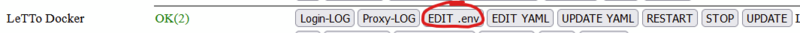
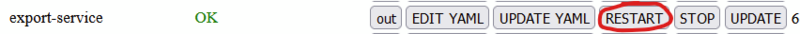

# Export-Service
Das Export-Service wird für folgende Aufgaben bei einem LeTTo-Server verwendet:

* Export von .lto-Dateien
* Import von .lto-Dateien
* Import von Moodle-XML-Dateien
* Druck von PDF-Dateien
* Export von Fragen in ein eigenständiges Question-Service

###  siehe auch 
* [Docker_compose_files](../Dockercomposefiles/index.md)
* [LeTTo_Environment](../LeTToEnvironment/index.md)

###  Erhöhen des RAM-Speichers 
Für den Export und Import von großen Datenmengen kann eine Erhöhung des RAM-Speichers sinnvoll sein.

Vorgangsweise:
* editiere die .env-Datei von LeTTo (/opt/letto/docker/compose/letto/.env)  
  * setze bei der Variablen JAVA_OPTS_EXPORT den Xmx-Wert auf einen größeren Wert (zB.: 2.5GB). Fehlt die Variable füge sie hinzu. <pre>JAVA_OPTS_EXPORT=-Xms50m -Xmx2500m </pre>
  * setze bei der Variablen EXPORT_MEMORY_LIMIT einen um mindestens 300MB größeren Wert als den zuvor gesetzten Xmx-Wert (zB.: 3GB). Fehlt die Variable füge sie hinzu. <pre>EXPORT_MEMORY_LIMIT=3GB</pre>
* restarte (stop und start) das Export Services   

