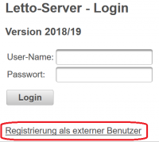
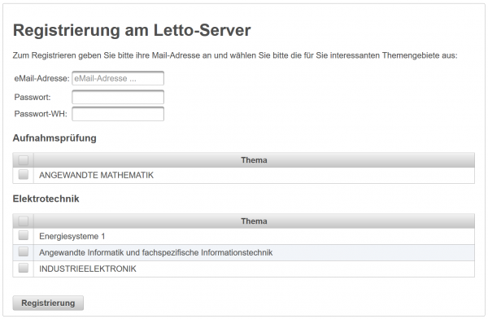
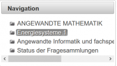
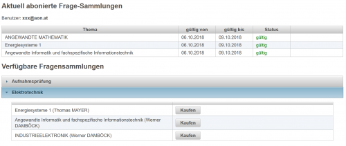

# Externe Benutzer
Für eine Schule am Letto-Server kann die Benutzung der [allgemeinen Fragensammlungen](../AllgemeingültigeBeispielsammlungen/index.md) auch für extere Benutzer freigegeben werden. Dafür ist für diese Schule durch den Admnistrator in der [Globalen Konfiguration](../GlobaleKonfiguration/index.md) der Parameter **externe Benutzer** auf **1** zu setzen.

Damit wird in der Login-Eingabemaske ein Link zur **Registrierung als externer Benutzer** freigeben.
 

Somit dürfen sich externe Benutzer mit ihrer eMail-Adresse registrieren und können auf die [freigegebenen Fragensammlungen](../AllgemeingültigeBeispielsammlungen/index.md) zugreifen.

 

Zur Registrieren brauchen Sie eine gültige eMail-Adresse und ein Passwort. Optional sind schon zu Beginn die für Sie interessanten Themengebiete auswähbar. Diese werden dann quasi als **Schnupperangebot** für drei Tage zum Testen freigeschaltet.

Nach dem Einloggen sind die _abbonierten_ Fragesammlungen auf linken Seite im Navigationsbereich aufgelistet und können von dort ausgewählt werden:
 

Eine Übersciht über alle verfügbaren Fragesammlungen erhalten Sie über den Link **Status der Fragesammlungen**:
 

