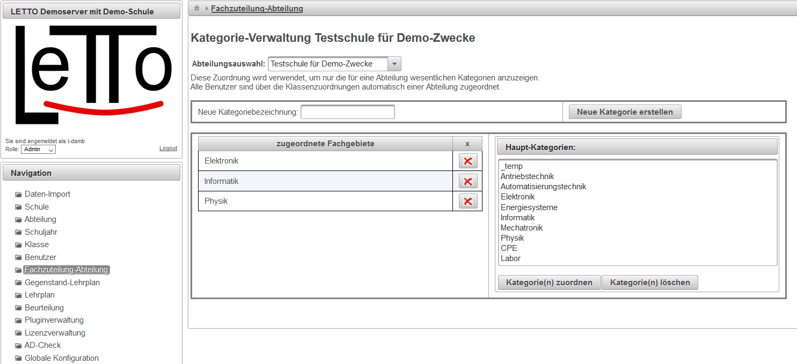

# Fachzuteilung-Abteilung
###  Allgemeines 
 

####  Neue Kategorie erstellen 
Legt die links angegebene Kategorie als neue globale Kategorie an.

####  Kategorie zuordnen 
Fügt die gerade selektierte Kategorie der linken Liste der zugeordneten Fachgebiete zu.

####  Kategorie löschen 
Löscht die gerade selektierte Kategorie

###  siehe auch 
[Globale Kategorien](../GlobaleKategorien/index.md)
[Administrator](/notimplemented/index.md)

Kategorie:Dialoge

