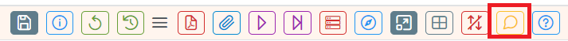
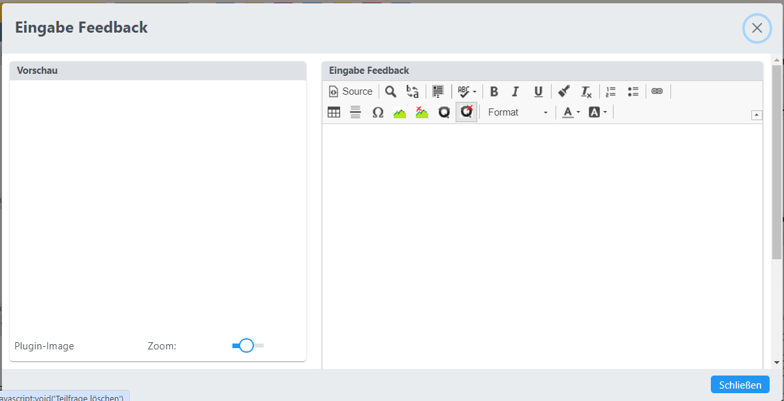

# Feedback / Tipps zu Fragen

Mit dem Feedback-Eingabefeld können für Fragen Musterlösungen zu den Beispielen 
und Tipps, die während der Aktivitäts-Ausführung angezeigt werden, definiert werden.

### Öffnen des Feedback-Dialoges über die Toolbar-Leiste
 
Dabei öffnet sich ein Dialog, in dem die Musterlösung und die Tipps eingegeben werden können.
 
Das Einfügen von Bildern und die Verwendung von Plugins ist wie bei der Eingabe des Fragetextes möglich.

## Syntax

### Allgemeiner Teil
* Allgemeiner Text
* `[hint]`: Allgemeiner Tipp

Ist nur eine Teilfrage definiert oder ist die Frage eine Freitextfrage, dann wird dieser Teil
der Feedbackdefinition für die gesamte Frage genommen. Es wird also der allgemeine
Teil als Feedbackdefinition für die erste Teilfrage verwendet.

### Default-Lösungen und Tipps pro Teilfrage

Mit einer ähnlichen Syntax können Musterlösungen und Tipps zu allen Teilfragen
einer Mehrfach-Berechnungsfrage definiert werden.

* `[Qx]`: Musterlösung, Erklärung zu einer Teilfrage, x ist die Nummer der Teilfrage
* `[Qx hint]`: Tipp, der dem Schüler zu dieser Teilfrage angezeigt werden kann. Zur Testlaufzeit wird dem Schüler dann ein Button präsentiert, der weiterführende Informationen und Tipps bereitstellt.
* `[Qx hint, 30%]`: Tipp wie oben, nur werden dem Schüler beim Drücken des Tipp-Buttons -30% für die richtige Lösung abgezogen.
* `[Qx hint, 0, 3]`: Tipp wie oben mit 0% Abzügen, der Tipp-Button wird nach dem 3. Versuch angezeigt
* `[Qx hint, p=10%, n=3]`: Tipp mit Zahlenzuordnung: p=...Peanlty, n: Anzahl an Versuchen, nach dem der Tipp angezeigt wird.
* `[Qx hint, p=0.1, n=3]`: Tipp mit Zahlenzuordnung: p=...Peanlty: 10%, n: Anzahl an Versuchen, nach dem der Tipp angezeigt wird.

Allgemein formuliert:
`[SQ-Name hint, p=prozent, n=versuchsanzahl]`:
Wenn die Reihenfolge der Zahlenangaben nicht bekannt ist, dann kann durch
* p=prozent: Abzüge beim Einblenden des Tipps in %, folgende Eingaben sind möglich: **10%**, **0.1**: Eingaben entsprechen 10 Prozent 
* n=versuchsanzahl: Nach dem n.ten Fehlversuch wird der Tipp-Button zu der Teilfrage eingeblendet
eine Syntax gewählt werden, wo die Reihenfolge keinen Einfluss hat.

Diese Parameter sind optional!

### KI-Beurteilungs-Grundlagen pro Teilfrage

* `[Qx ai]` Text, der die Anweisungen an die KI enthält, wie die Teilfrage zu beurteilen ist.

# Konfiguration des Feedbacks in einer Aktivität (Aktuell in Definition ... )
Dieser Anschnitt dient im Moment nur der Spezifikation des zukünftigen Verhaltens von Aktivitäten, ist noch nicht umgesetzt!

## Penalty
Festlegung, wie das Verhalten in der Aktivität bei wiederholten fehlerhaften Versuchen, 
Definition von Punkte-Abzügen bei Fehlversuchen:
* Kein Penalty bei Fehlversuchen
* Penalty wie in der Frage defniert (entspricht der Checkbock ***Punkteabzug bei fehlerhafter Eingabe***)
* Penalty für alle Fragen der Aktivität in Prozent, wird für für alle Fragen der Aktivität angewendet.

## Anzeige von Tipps
Anzeige von Tipps zum Lösen der Frage, die aus dem Feedback-Feld der Frage bezogen werden:
* Keine Anzeige von Tipps in dieser Aktivität.
* Anzeige der Tipps, wie in der Frage spezifiziert.
* Anzeige von Tipps, Penalty und Anzahl an Fehlversuchen wird in der Aktivität festgelegt. Gilt dann für alle Beispiele, die Tipps im Feedback-Feld gespeichert haben.

## Anzeige von Feedbacks nach Beendigung des Tests durch den Lehrer
Konfiguration des Verhaltens einer Aktivität nach Beendigung des Tests durch den Lehrer, 
Konfiguration, welche Ergebnisse für den Schüler sichtbar sind:
* keine Fragen sichtbar
* Fragen ohne Schülerantworten sichtbar
* Fragen mit Schülerantworten ohne korrekte Ergebnisse
* Anzeige von Ergebnissen bei Berechnungsfragen (ohne Multiple-Choice, Zuordnungen, ...)
* Anzeige von allen automatischen Ergebnissen 
* Anzeige von allen Informationen mit Anzeige von Musterlösungen aus dem Feedback-Feld

