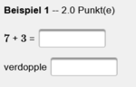
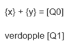
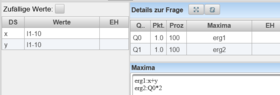
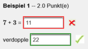

# Folgefehlerbehandlung
[Video](https://youtu.be/CbpX537brTM)

LeTTo unterstützt die Behandlung von Folgefehlern. LeTTo rechnet mit nicht korrekten Zwischenergebnissen von Schülern weiter, um Teilpunkte für abgeleitete Ergebnisse vergeben zu können. Das einfache Beispiel demonstriert die Funktion. 
 

Zwei Zahlen x und y sollen addiert werden. Die Summe (x+y) soll verdoppelt werden.
Im Editiermodus von LeTTo ist das Beispiel entsprechend folender Abb. implementiert.
 

Der Autor des Beispiels kann mit der Eingabe der SchülerInnen weiterverarbeiten(Q0) und das Ergebnis erg2 berechnen.

 

Ein etwaiger Berechnungsfehler der SchülerInnen wird korrekt von LeTTo behandelt.
 

