# Fragen-Vorschau

Die Fragen-Vorschau kann in der Ansicht [Beispielsammlung Editieren](../BeispielsammlungEditieren/index.md) über die [Toolbar](../Toolbar/index.md) mit dem
Button 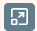 geöffnet werden.

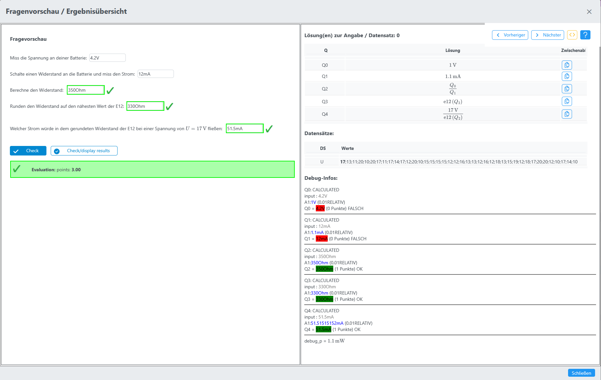

* Mit der Vorschau einer Frage kann rasch eine Frage bei der Erstellung kontrolliert werden.
* In der linken Hälfte des Dialoges wird die Frage dargestellt, wie sie später in einem [Online-Test](/notimplemented/index.md) verwendet werden kann.
* Es kann sofort das Verhalten der Frage und die entsprechende Ergebniskorrektur getestet werden.
* In der rechten Hälfte des Dialoges ist oben eine Toolbar zur Steuerung der Vorschau zu sehen:
* Darunter auf der rechten Seite sind alle Lösungen zur aktuell ausgewählten Datensatz-Nummer angegeben.
* Darunter werden die Werte von allen Datenensätzen (Variablen) angezeigt.
* Darunter werden nach Eingabe einer Lösung in der Debug-Vorschau Informationen über die Korrektur angezeigt.

### linke Hälfte - Fragen Vorschau

* Über den Button  in der Toolbar kann zwischen Debug- ,Schüler- und App-Ansicht umgeschaltet werden.
* Die Art der Ansicht kann an den Buttons der linken Hälfte des Dialoges erkannt werden.

#### Debug-Ansicht mit Debug-Variablen
* In dieser Ansicht können Schülereingaben simuliert werden und die Korrektur der Eingabe wird in der rechten Hälfte des 
  Dialogs unterhalb der Datensätze angezeigt. Die Debug-Informationen sind nur in der Debug-Ansicht sichtbar.
* Die Debug-Ansicht ist die Standardansicht, wenn die Vorschau das erste Mal geöffnet wird.
* Die Debug-Informationen in der rechten Hälfte des Dialoges enthalten alle Teilfragen und deren Korrektur. 
  Anschließend werden alle Variablen des Maxima-Feldes angezeigt welche mit dem Wort "debug" beginnen.
* Buttons: 
  
  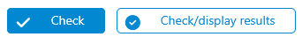

#### Schüler-Ansicht
* In dieser Ansicht wird die Frage so dargestellt, wie sie später in einem Online-Test verwendet werden kann.

  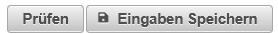

#### App-Ansicht
* In dieser Ansicht wird die Frage so dargestellt, wie sie später in der LeTTo-App verwendet werden kann.
* Die App-Ansicht ist nur sichtbar wenn die App im Setup-Service aktiviert ist.

  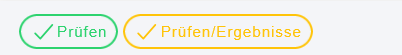

### Toolbar

* bei "Lösung(en) zur Angabe / Datensatz:" wird die Nummer des aktuell ausgewählten Datensatzes angezeigt.

| Button                    | Funktion                                              |
|---------------------------|-------------------------------------------------------|
| 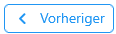   | wechselt zum vorigen Datensatz.                       |
|    | wechselt zum nächsten Datensatz.                      |
|    | Schaltet zwischen Debug- ,Schüler- und App-Ansicht um |
|  | Hilfe                                                 |

### rechten Seite - alle Lösungen zur aktuell ausgewählten Datensatz-Nummer

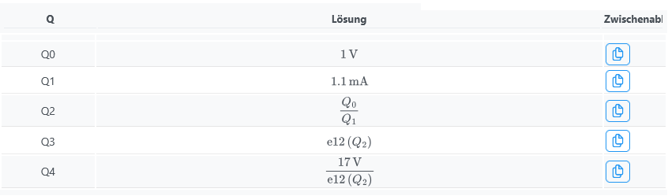

* Mit dem Button 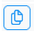 kann die Lösung in die Zwischenablage kopiert werden um sie einfach als
Lösung auf der linken Seite einfügen zu können.
* Bei jeder Teilfrage wird die erste korrekte Lösung angezeigt.

### rechte Seite - Datensätze

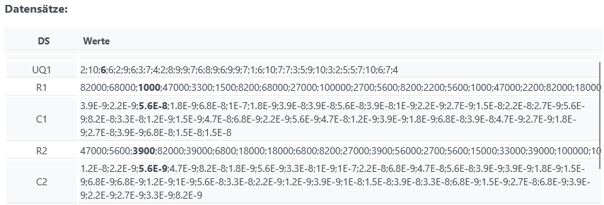

* In der Liste aller Datensätze werden alle Datensätze angezeigt wobei der gerade aktuelle Datensatz fett hervorgehoben ist.

### rechte Seite - Debug-Informationen

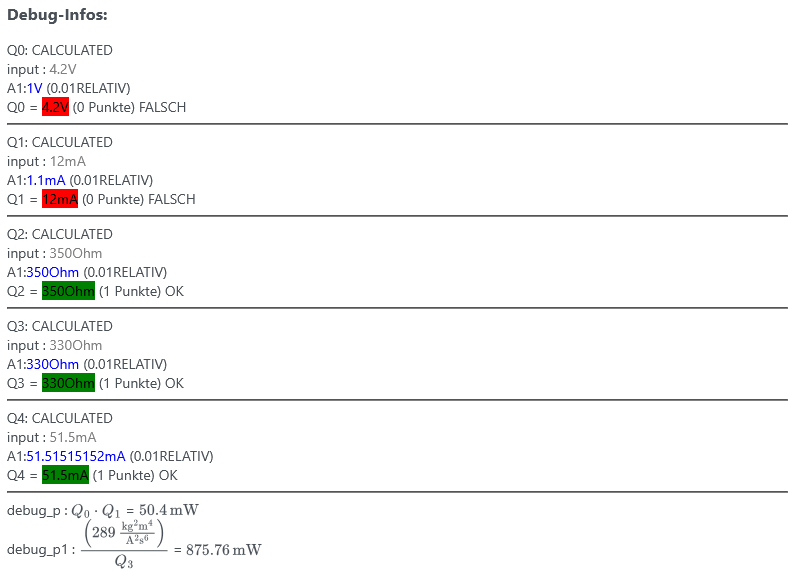

* Für jede Teilfrage wird die Korrektur angezeigt mit:
  * Fragetyp
  * Schülereingabe
  * korrekte Lösung
  * Korrektur der Schülereingabe
* Anschließend werden alle Variablen des Maxima-Feldes angezeigt welche mit dem Wort "debug" beginnen.
  * In die Debug-Variablen können die Eingaben des Schülers über die Teilfrage-Nummer direkt eingesetzt werden.
  * Zum Beispiel folgt für das Maxima-Feld   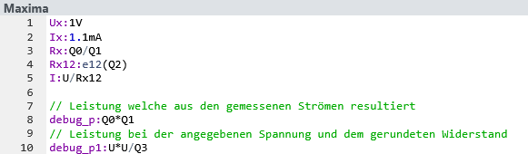 
  * die Ausgabe der Variablen mit dem Wort "debug"   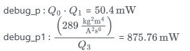
  