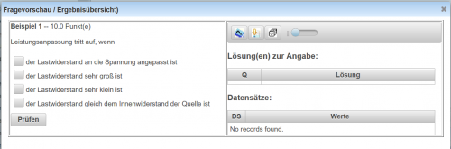

# Fragen-Vorschau
 

Die Fragen-Vorschau kann in der Ansicht [Beispielsammlung Editieren](../BeispielsammlungEditieren/index.md) über den [Toolbar](../Toolbar/index.md) mit dem Button  geöffnet werden.

Mit der Vorschau einer Frage kann rasch eine Frage bei der Erstellung kontrolliert werden.
In der linken Hälfte des Dialoges wird die Frage dargestellt, wie sie später in einem [Online-Test](/notimplemented/index.md) verwendet werden kann.
Es kann sofort das Verhalten der Frage und die entsprechende Ergebniskorrektur getestet werden.

Auf der rechten Seite sind alle Lösungen zur akt. ausgewählten Datensatz-Nummer angegeben.
Darunter werden die Werte von allen Datenensätzen (Variablen) angezeigt.

In der rechten Hälfte des Dialoges ist oben ein Toolbar zur Steuerung der Vorschau zu sehen:
### Toolbar
 

| Hilfe    | Der Hilfe-Button führt auf diese Wiki-Seite                                                                                                                                                                                                  |
|----------|----------------------------------------------------------------------------------------------------------------------------------------------------------------------------------------------------------------------------------------------|
| Feedback | Umschalten zwischen Eingabe- und Feedback-Ansicht: In der Eingabeansicht kann das Frageverhalten getestet werden, in der Feedback-Ansicht wird die Frage nach der Beurteilung dargestellt.                                                   |
| Würfeln  | Mit diesem Button können die Antworten bei [Multiple-Choice-Fragen](/notimplemented/index.md) und bei [Zuordnungsfragen](/notimplemented/index.md) neu gewürfelt werden und damit das Verhalten von Fragen dieses Fragetyps getestet werden. |
| Scroller | Mit dem Scroller können alle Datensätze getestet werden. Der Fragetext wird mit den Variablen der aktuell ausgewählten Datensatz-Nummer angezeigt und alle Grafiken von [Plugins](../Plugins/index.md) werden neu gezeichnet.                |

Im Bild zu sehen ist die Vorschau für eine [Multiple-Choice-Frage](/notimplemented/index.md).

Kategorie:Dialoge Kategorie:Beispiele Editieren

