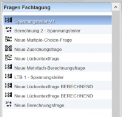
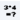
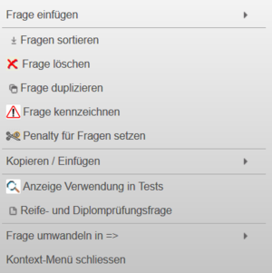

# Fragenliste
## Liste mit allen Fragen der aktuellen Kategorie

 
In der Titelzeile der Fragenliste wird die aktuelle Kategorie, die diese Fragen enthält, angezeigt.
Von allen Fragen wird immer der [Name der Frage](../BeispielsammlungEditieren/index.md#name-der-frage) in der Liste geführt, der [Fragetyp](../Fragetypen/index.md) wird durch ein Icon gekennzeichnet:

|  | [Mehrfachberechnungsfrage](../Fragetypen/index.md#mehrfachberechnungsfrage) |
|-----------------------------------------------------------------------|----------------------------------------------------------------------------------------------------------------------------------|
|  | [Zuordnungsfrage](../Fragetypen/index.md#zuordnungsfrage)                                                                        |
|  | [Multiple-Choice-Frage](../Fragetypen/index.md#multiple-choice-frage)                                                            |
|  | [Freitextfrage](../Fragetypen/index.md#freitextfrage)                                                                            |
|  | [Berchnungsfrage](../Fragetypen/index.md#berchnungsfrage)                                                                        |
|  | [Lückentextfrage](../Fragetypen/index.md#lückentextfrage)                                                                        |

### Kontextmenü zur Fragenliste
 
Das Kontextmenü wird über die rechte Maustaste aktiviert und enthält folgende Einträge:
* Alle Fragetypen können eingefügt werden
* Fragen sortieren: Alle Fragen werden nach dem Fragen-Namen alphabetiscg sortiert
* Frage löschen: Aktuelle Frage wird gelöscht
* Frage duplizieren: Frage wird untern neuem Namen dupliziert

* Kopieren (CTRL-C): Eine Frage kann in die Zwischenablage kopiert werden und später an anderer Stelle neu eingefügt werden
* Ausschneiden: Die Frage wird zum späteren Ausschneiden vorgemerkt. Wenn Sie später an anderer Stelle eingefügt wird, dann wird die Frage an der alten Stelle gelöscht.
* Einfügen (CTRL-V): Eine Frage aus der Zwischenablage an anderer Stelle einfügen. Dafür muss die Fragenliste den Fokus haben. Dann wird die Frage an der akt. Position eingefügt.

* Reife- und Diplomprüfungsfrage: Druck der Frage als PDF zur Verwendung bei der mündlichen RDP.
* Frage umwandeln: Hiermit kann jede Frage in einen beliebigen anderen Fragetyp umgewandelt werden und der Inhalt der Frage wird nach Möglichkeit an den neuen Fragetyp angepasst.

