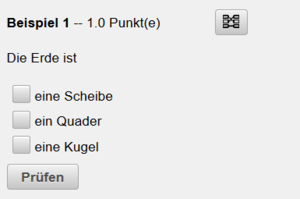

# Fragetypen
siehe auch [Beispielsammlung](../Beispielsammlung/index.md) und [Beispielsammlung Editieren](../BeispielsammlungEditieren/index.md)

## [Mehrfachberechnungsfrage](../BeispielsammlungEditieren/index.md#mehrfachberechnungsfrage)  
* [Video](https://youtu.be/z_xfPxh33hA)
* Fragen dieses Typs sind sehr flexibel. 
* Die Frage kann mehrere Teilantworten beinhalten. Jede Teilfrage wird im Fragetext durch einen [Qx](Qx)-Tag (x..Fragenummer) positioniert. Bei der Schülereingabe wird der Tag durch ein Eingabefeld für die Ergebniseingabe ersetzt.
* Die Angabewerte sind wie bei Berechnungsfragen mittels Datensätzen definierbar und variieren von Schüler zu Schüler.
* Alle verwendeten Variablen müssen im Angabetext in geschwungene Klammern gesetzt werden. Im Maximafeld und im Lösungsfeld ist die Klammer nicht notwendig.
* Für jede Variable wird ein Dataset mit möglichen Werten angelegt. Diese Datasets können über einen Formatierungsstring definiert werden und danach auch direkt in einer Liste bearbeitet werden.
* siehe auch: 
  [Berechnungen](../Berechnungen/index.md) 
  [Korrektur](../Korrektur/index.md) 

##  [Zuordnungsfrage](../BeispielsammlungEditieren/index.md#zuordnungsfrage) 
[Video](https://youtu.be/UUfoF03YkFM)

Die Antwort auf jede der Unterfragen muss aus einer Liste von Möglichkeiten ausgewählt werden.Bei der Zuordnungsfrage können die Begriffe auf der linken und auf der rechten Seite gemischt werden. Im Prinzip hat der Schüler 2 Listen mit Antworten und Fragen, die er richtig zuordnen muss. Geben Sie in den beiden Listen Elemente an, welche keine korrekten Zuordnungen haben sollen, dann ist die entsprechende Zelle in der Tabelle ohne Eintrag zu verwenden. Es können Bsp. der Variante 2 aus 5 oder 4 aus 8 sehr schnell und einfach erstellt werden. 
 
 

Dem Schüler stehen zwei unterschiedliche Modi zur Fragenbeantwortung zur Verfügung:
* drag &amp; drop
* klick-klick

Moduswechsel erfolgt durch den Schüler zur Laufzeit des Tests mit einem Klick auf das Symbol . Der Schüler kann den Modus beliebig oft wechseln.

Für eine dynamische Fragenerstellung ist es möglich Werte aus dem Maximaberechnungsfeld oder auch Werte aus Datensätzen zu benutzen. Bsp: Eine Variable mit der Bezeichnung "wert" soll eingesetzt werden. Diese ist mit "{=wert}" in die Tabelle der Zuorndungsfrage einzutragen. 
 

Die Variable "wert" kann jetzt aus einem Datensatz oder aber auch als Berechnung aus dem Maximafeld stammen.
Als Angabe bzw. Lösungen werden auch Bilder unterstützt. Diese sind in der betreffenden Zelle der Tabellen einfach mit STRG+V (wenn das Bild im Zwischenspeicher ist) oder über Klick der rechten Maustaste auf die entsprechende Zelle und dem Menüpunkt Image einfügen, einzubinden.

## [Multiple-Choice-Frage](../BeispielsammlungEditieren/index.md#multiple-choice-frage) ## 

[Video](https://youtu.be/NLEePJMMWoE)

Vorteil dieses Fragentyps
* Fragen sind schnell erstellt
* dynamische Bsp-Gestaltung möglich
* Bilder in Frage und Antwort möglich
* schnelle Beantwortung durch Schüler beim Test 

Nach Forumulierung der Frage werden die möglichen Antworten in Form einer Tabelle definiert. Die Selektion der korrekten Antworten erfolgt durch Markieren der selbigen.
 
 
Für eine dynamsiche Beispielgestaltung können Werte aus definierten Datensätzen aber auch Werte aus dem Maximafeld als Antwort defniert werden - siehe Vorgangsweise Zuordnungsfrage.

##  [Freitextfrage](../BeispielsammlungEditieren/index.md#freitextfrage-) 
[Video](https://youtu.be/drhmdWO2PAE)

Vorteile der Freitextfrage sind
* Frage schnell erstellt
* dynamische Fragengestalltung ist möglich
* Beantwortung ist handschriftlich möglich --&gt; Upload von Kammerafoto
* Bilder aus Zwischenablage können vom Schüler zur Beantwortung der Frage genutzt werden
* Enzyklopädisches Wissen kann abgefragt werden
* Subjektiver Einfluss der Beurteilung durch die Schülerhandschrift kann entfallen
* Einheitliches Fragenlayout bei der Verwendung der Frage in einem klassischen Test (=Test auf Papier) --&gt; Frage in LeTTo erstellt --&gt; Druck der Frage

Nachteile
* keine Vollautomatische Beurteilung möglich
* Subjektiver Einfluss durch Lehrerkorrektur 
* Schüler verliert zeitnahes Feedback --&gt; Bewertung durch Lehrer erfolgt verspätet

Die Frage wird im Fragentextfenster formuliert. Der Schüler hat dich Möglichkeit die Frage in einem eigenen Textfenster mit Hilfe der Tastatur zu beantworten. Zusätzlich besteht die Möglichkeit Images aus dem Zwischenspeicher für die Beantwortung der Frage zu nutzen.

Enthält die Fragenbeantwortung z.B. Handskizzen, dann sind diese nach deren Anfertigung auf Papier mittels der Funktion "Foto aufnehmen" vom Schüler hochladbar. Diese stehen dem Lehrkörper bei der Beurteilung zur Verfügung.
 

##  [Berechnungsfrage](../BeispielsammlungEditieren/index.md#berechnungsfrage) 

* Berechnende Fragen sind wie die [Mehrfachberechnungsfrage](#mehrfachberechnungsfrage-) mit nur einer Teilfrage, bei dem das Antwortfeld automatisch erscheint.
* Jeder Schüler bekommt eine eigene Angabe
* Durch das Drucken kann die Frage auch für Projektangaben verwendet werden (Jeder Schüler hat eigene Angaben).
* [Berechnungen](../Berechnungen/index.md) erfolgen mit [Maxima](../BeispielsammlungEditieren/index.md#maxima-feld)
* Alle verwendeten [Variablen](../Datensätze/index.md) müssen im Angabtext in geschwungene Klammern gesetzt werden. Im Maximafeld und im Lösungsfeld ist die Klammer nicht notwendig.
* Für jede Variable wird ein [Datensatz](../Datensätze/index.md) mit möglichen Werten angelegt. Diese [Datasets](../Datensätze/index.md) können über einen Formatierungsstring definiert werden und danach auch direkt in einer [Liste](../Datensatz-Dialog/index.md#anzeige-aller-variablenwerte-und-ergebnisse) bearbeitet werden.

##  [Lückentextfrage](../BeispielsammlungEditieren/index.md#lückentextfrage) 
[Video](https://youtu.be/qfj6tPgWl0U)

 
 

Vorteile der Lückentextfrage sind
* Frage schnell erstellt
* dynamische Fragengestalltung ist möglich
* Einheitliches Fragenlayout bei der Verwendung der Frage in einem klassischen Test (=Test auf Papier) --&gt; Frage in LeTTo erstellt --&gt; Druck der Frage

