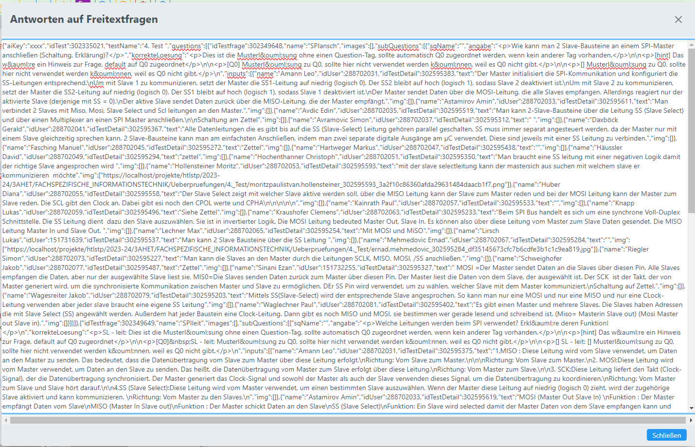

# Export von Freitextfragen mit Schülerantworten

Der Export von Freitext-Schülereingaben dient primär dem Experimentieren mit einer automatischen Beurteilung 
von Freitextfragen mit KI-Tools.

## Aktualisierung der Services
* Edit-Service
* Main-Service
* Data-Service

## Key/Token für OpenAI-Anwendung hinterlegen
Der Token kann entweder für die ganze Schule hinterlegt werden oder für einen Benutzer.
* Schule: Hinterlegung des Tokens als Administrator in den ***Globalen Parametern*** unter dem Schlüssel **aiKey**
* Benutzer: 
Einstellungen öffnen: <br>
Im Konfigurations-Dialog auf dem 2. Tab den AI-Token eintragen:<br>


## Definition Angabe für KI / Musterlösungen
Für die Angabe der Teilfragen wird der Fragetext herangezogen und automatisch in das DTo eingebunden.

Für die Definition der Musterlösungen sollte das Feedback-Feld für Fragen verwendet werden: siehe [Feedback von Fragen](../Feedback/index.md)


## Export der Freitextfragen
Wenn ein Token für die Verwendung der KI hinterlegt wurde, dann ist im Kontext-Menü von Aktivitäten 
ein Eintrag zum ***Laden aller Eingaben auf Freitextfragen*** verfügbar.<br>


Alle Freitext-Antworten werden lt. untenstehender Schnittstellendefinition als JSON in einem Dialog
angezeigt. Der JSON-Text kann mit CTRL-A + CTRL-C in die Zwischenablage zur weiteren Verwendung 
kopiert werden.<br>


## Schnittstelle 

```java
/**
 * DTO zur Übergabe aller Texteingaben von Freitextfragen, die in einem Test vorkommen
 */
public class OpenAiFreitextInput {
    /** Lizenz-Key zur Nutzung des AI-Services */
    private String aiKey = "";
    /** Allgemeine Angaben, wie AI die Beurteilung vornehmen soll */
    private String aiFeedback = "";
    /** ID des Tests, von dem die Antworten kommen */
    private int idTest;
    /** Bezeichnung des Tests */
    private String testName = "";
    /** Informationen zu allen Fragen, die Freitextelemente enthalten + Schülerlösungen */
    private List<OpenAiQuestion> questions = new Vector<OpenAiQuestion>();
}

/**
 * DTO zur Übergabe aller Texteingaben von Freitextfragen, die in einer Frage vorkommen
 */
public class OpenAiQuestion {
    /** ID der Testfrage, wesentlich für Übernahme der Daten */
    private int idTestfrage;
    /** Name der Frage */
    private String name = "";

    /** Links zu den Dateien und Images, die in der Frage enthalten sind */
    private List<String> images = new Vector<String>();

    /** Liste mit allen Teilfragen, die Freitextfragen enthalten */
    private List<OpenAiSubQuestion> subQuestions = new Vector<>();
}

/**
 * DTO für Teilfrage: Angabe, Musterlösung und alle Schülerinputs dazu
 */
public class OpenAiSubQuestion {
    /** ID der Teilfrage */
    private int idSq;
    /** Name der Teilfrage */
    private String sqName;
    /** Angabetext zu dieser Teilfrage */
    private String angabe;
    /** Korrekte Lösung zum Vergleich */
    private String korrekteLoesung;
    /** Text, der die Anweisungen an die KI enthält, wie die Teilfrage zu beurteilen ist */
    private String beurteilungsAnweisung;
    /** Schülereingaben zu dieser Teilfrage */
    private List<OpenAiStudentInput> inputs;
}

public class OpenAiStudentInput {
    /** Optional: Name des Schülers */
    private String name ="";
    /** Optional: User-ID des Schülers */
    private int idUser;

    /** ID der Testfrage für den Schüler, wesentlich für Übernahme der Beurteilungen */
    private int idTestDetail;
    /** Eingabetext */
    private String text = "";
    /** optional: Web-Path zu abgegebenem Schülerimage */
    private List<String> img;
}


```

