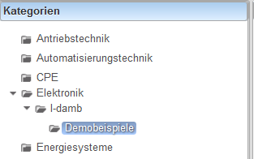

# Globale Kategorien
###  Allgemeines 
Globale Kategorien werden meist für die Gegenstände der Schule vergeben. 
 
###  Lehrer-Verzeichnis 
Innerhalb der globalen Kategorie kann jeder Lehrer ein Unterverzeichnis haben in dem er seine Fragen und Unterkategorien speichern kann.
###  Anlegen einer globalen Kategorie 
Eine globale Kategorie kann als Administrator der Schule unter [Fachzuteilung-Abteilung](../Fachzuteilung-Abteilung/index.md) erfolgen.

###  siehe auch 
[Ordnerverwaltung](../Ordnerverwaltung/index.md)

[Abos](../Abos/index.md)

[Fachzuteilung-Abteilung](../Fachzuteilung-Abteilung/index.md)

