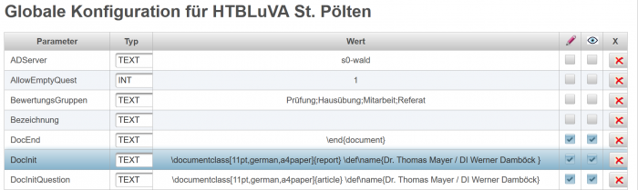
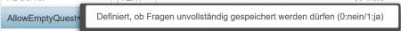
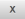

# Globale Konfiguration
Die Defininition von Parametern, die für den Letto-Server wesentlich sind, erfolgt in Listenform:
 

Die einzelnen Parameter sind über Tooltips kurz beschrieben:
 

###  Tool zum Test von Konfigurationseinstellungen 
[Konfigurations-Tester](../Konfigurations-Tester/index.md)

### Spalten der Konfigurations-Liste
* Paramter: Name des Paramters. Unter dieser Bezeichnung wird der Parameter der in der Anwendung ausgelesen und verwendet. Ein Tooltipp gibt nähere Informationen zu der Bedeutung dieses Parameters
* Typ: Typ des Paramters:
  * TEXT: Parameter in Textform
  * IMAGE: Hiermit kann ein Bild hochgeladen werden. Das Bild wird base64-codiert als Text gespeichert
  * DOUBLE: Gleitkommatzahl
  * INT: Ganzzahl
* Wert: Wert des Parameters
* : Dieser Parameter kann von den Benutzern mit eigenen, selbstdefinierten Werten geändert werden.
* : Dieser Eintrag ist für alle Benutzer in der lokalen Konfiguration sichtbar
* : Löschen des gewählten Parameters

###  wichtige Parameter
####  Parameter für den Serverbetrieb 

| Parameter          | Beschreibung                                                                                                                                                          | Beispielwert                                                         |
|--------------------|-----------------------------------------------------------------------------------------------------------------------------------------------------------------------|----------------------------------------------------------------------|
| lizenz             | aktuell installierter Lizenzschlüssel                                                                                                                                 |                                                                      |
| TEX_Compiler       | ausführbarer Compiler für die Latex-übersetzung. Wenn kein Systempfad gesetzt ist muss der absolute Pfad angegeben werden (unter Linux im Normalfall nicht notwendig) | pdflatex                                                             |
| TEX_Parameter      | Parameter mit denen der TEX_Compiler gestartet wird.                                                                                                                  | -interaction=nonstopmode -max-print-line=120 -output-directory=%d %f |
| maximaPath         | ausführbare Datei für Maxima (in Windows maxima.bat)                                                                                                                  | maxima                                                               |
| maximaForSave      | Gibt an ob vor dem Speichern der Frage das Maxima-Feld durchgerechnet wird (1-ja,0-nein)                                                                              | 1                                                                    |
| moodle.mac         | Maxima-Code, der vor jeder Berechnung des Maxima-Feldes ausgeführt wird.                                                                                              | ... V 1.04 ...                                                       |
| pathDatabaseBackup | Pfad für die Speicherung von Datenbank-Backups                                                                                                                        | /opt/letto/backup/                                                   |
| pathProjektAbgaben | Speicherort für die Projektabgaben der Schüler                                                                                                                        | /opt/letto/projekt/                                                  |
| pathUserPhotos     | Speicherort für die Portrait-Bilder der Schüler                                                                                                                       | /opt/letto/photos/                                                   |
| pluginpath         | Speicherort für installierte Plugins                                                                                                                                  | /opt/letto/plugins                                                   |
| addLehrerKuerzel   | Gibt an ob beim Lehrerimport ein "L-" vor das Lehrerkürzel gesetzt wird                                                                                               | 1                                                                    |
| dialogSize         | Größe des Frage-Vorschau-Dialoges                                                                                                                                     | 1000;600                                                             |
| errTimerAngabe     | Fehlermeldung bei einem Fehler von GetAngabeMitZahlen                                                                                                                 | Fehler beim Rendern des Angabetextes                                 |
| errTimerAntwort    | Fehlermeldung bei einem Fehler beim Rendern der Antworten                                                                                                             | Fehler beim Rendern von Antworten                                    |
| errTimerCalcErg    | Fehler beim Berechnen der Lösung für die Frage                                                                                                                        | Fehler beim Berechnen der Lösung für die Frage                       |
| externeBenutzer    | Gibt an ob externe Benutzer auf freigegebene Fragesammlungen zugreifen können                                                                                         | 0                                                                    |

####  Parameter der Schule 

| Parameter       | Beschreibung                                                  | Beispielwert |
|-----------------|---------------------------------------------------------------|--------------|
| image           | Bild welches links-oben auf der Letto-Seite eingeblendet wird |              |
| schulname       | Name der Schule                                               |              |
| startSchulstufe | Schulstufe welche der ersten Klasse der Schule entspricht     | 9            |

####  Parameter für den Active-Directory-Login 

| Parameter  | Beschreibung                                                              | Beispielwert                     |
|------------|---------------------------------------------------------------------------|----------------------------------|
| ADServer   | Name des Active-Directory Servers                                         | s0-wald                          |
| LDAPServer | Bezeichnung des LDAP Servers                                              | ldap://s0-wald.htl-stp.local:389 |
| LDAPparams | Parameter der LDAP-Verbindung. Strichpunkt-getrennt par1=wert1;par2=wert2 |                                  |
| domain     | Bezeichnung der lokalen Domain des Active-Directory                       | htl-stp.local                    |

####  Parameter für die Druckausgabe 

| Parameter        | Beschreibung                                                                          | Beispielwert                                                                                                |
|------------------|---------------------------------------------------------------------------------------|-------------------------------------------------------------------------------------------------------------|
| DocInit          | erste Zeilen jedes TeX-Dokuments                                                      | &#92;documentclass[11pt,german,a4paper](11pt,german,a4paper){report} &#92;def&#92;name{Dr. Thomas Mayer / DI Werner Damböck } |
| DocIinitQuestion | erste Zeilen des TeX-Dokuments einer gedruckten Frage                                 | &#92;documentclass[11pt,german,a4paper](11pt,german,a4paper){report} &#92;def&#92;name{Dr. Thomas Mayer / DI Werner Damböck } |
| DocInitTest      | erste Zeilen des TeX-Dokuments eines gedruckten Tests                                 | &#92;documentclass[11pt,german,a4paper](11pt,german,a4paper){article}                                         |
| moodle.sty       | Tex-Packages welche bei Fragen und Tests direkt nach "DocIinit" geladen werden sollen |                                                                                                             |
| rdpfragen.sty    | Tex-Packages und Konfigurationen für den Reifeprüfungsdruck                           |                                                                                                             |
| DocStart         | Definition des Bereiches rund um begin{document}                                      | &#92;PageNormal &#92;begin{document}                                                                               |
| DocStartQuestion | Definition des Bereiches rund um begin{document} bei Fragesammlungen                  | &#92;PageQuestion &#92;begin{document}                                                                             |
| DocStartTest     | Definition des Bereiches rund um begin{document} bei Tests                            | &#92;PageTest &#92;begin{document}                                                                                 |
| DocEnd           | Ende des TeX-Dokuments                                                                | &#92;end{document}                                                                                            |

####  Parameter für das Beurteilungssystem 

| Parameter               | Beschreibung                                                                                                   | Beispielwert                                                                                                                     |
|-------------------------|----------------------------------------------------------------------------------------------------------------|----------------------------------------------------------------------------------------------------------------------------------|
| BewertungsGruppen       | Mögliche Gruppierungen von Prüfungen                                                                           | Prüfung;Hausübung;Mitarbeit;Referat                                                                                              |
| userBewertungen         | Beurteilungen für Benutzer (Wird bei jedem User überschrieben)                                                 |                                                                                                                                  |
| angezeigteBeurteilungen | Angabe, welche Beurteilungsarten im Katalog angezeigt werden sollen. Einstellbar über Katalog und Setup-Button | [SMÜ, Test, Hausübung, Schularbeit, Rechenübung, Mahnung, Noten](SMÜ, Test, Hausübung, Schularbeit, Rechenübung, Mahnung, Noten) |

####  Allgemeine Konfiguration des Serververhaltens 

| Parameter             | Beschreibung                                                                                                                                        | Beispielwert                                                                     |
|-----------------------|-----------------------------------------------------------------------------------------------------------------------------------------------------|----------------------------------------------------------------------------------|
| AllowEmptyQuest       | Gibt an, ob unvollständige Fragen gespeichert werden können (0-nein, 1-ja)                                                                          | 1                                                                                |
| showQuestionCount     | Anzeige der Frageanzahl bei der Kategorie                                                                                                           | 1                                                                                |
| questChangeTestSolved | Gibt ob Fragen in gespeicherten Tests geändert werden dürfen (0..ja, 1..Dialog, 2..Nein)                                                            | 0                                                                                |
| lastSelectedCategory  | Die vom Benutzer zuletzt ausgewählte Kategorie                                                                                                      |                                                                                  |
| ShowWarningEmptyQuest | Definiert ob beim Benutzer eine Warnung bei unvollständigen Fragen angezeigt wird                                                                   | 0                                                                                |
| alleGegenstaende      | Anzeige aller Gegenstände bei Lehrer-Klassen-Zuteilungen                                                                                            | 0                                                                                |
| datasetDefault        | Angabe welche Werte und Einheiten Datensätze zugewiesen bekommen Für jeden Eintrag eine  Zeile Prefix des Variablennamen;Einheit;0;Definition | default;;0;I1-10  R;Ohm;0;E12:1k-100k  L;H;0;1m-100m  C;F;0;E12:1n-100n |

### Siehe auch
[Konfigurations-Tester](../Konfigurations-Tester/index.md)
[Administration](../Administration/index.md)

