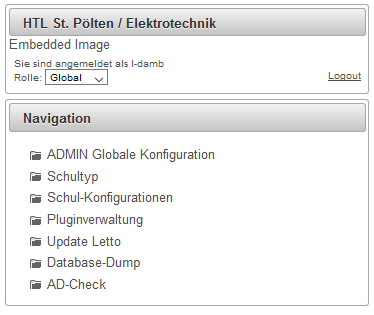

# Globaler Administrator
###  Allgemeines 
 

* ADMIN Globale Konfiguration :

Hier können alle globalen Einstellungen des Server parametriert werden -&gt; siehe '''[Globale Konfiguration](../GlobaleKonfiguration/index.md)'''

* Schultyp:

Hier können die möglichen Schultypen, welche auf dem Server verwaltet werden konfiguriert werden.

* [Schul-Konfiguration](../Schul-Konfiguration/index.md)
* [Pluginverwaltung](../Pluginverwaltung/index.md)
* Update Letto: Hier kann direkt auf die aktuelle Version upgedaten werden -&gt; siehe [Live-Update](../Live-Update/index.md)
* [Database-Dump](../Database-Dump/index.md)
* [AD-check](../AD-check/index.md)

###  siehe auch 
* [Benutzer](../Benutzer/index.md)
* [Schul-Administrator](../Schul-Administrator/index.md)
* [Installation](../Installation/index.md)

[Administration](../Administration/index.md)

