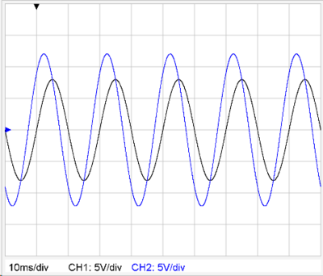

# Graph
##  Digigraph 
Mit dem Graph-[Plugin](../Plugins/index.md) können Zeitverläufe von beliebigen Signalen in einem, einem Oszilloskop nachgebildeten, Graphen dargestellt werden.

##  Plugin Definition 
Bei der Definition des Plugins muss nichts angegeben werden - Kein Eintrag im Plugin-Menü notwendig. Es reicht das Plugin bei der Frage hinzuzufügen. Die Signale werden dann nur über das PIG-Tag angegeben.

##  Signaldefinition im PIG-Tag 
* Beim PIG-Tag können alle Parameter zur [Konfiguration des Oszilloskopes](../KonfigurationdesOszilloskopes/index.md) angegeben werden.
* Es sind die Kanäle ch1(t) bis ch9(t) verwendbar wobei eine Legende nur für die Kanäle ch1(t) bis ch4(t) angezeigt wird!

Beispiele:
<pre>
[PIG plugin1 "ch1(t):5V*sin(2*pi*50*t);ch1:div=2V;ch2(t):5V*sin(2*pi*50*t+2);ch2:div=2V,name=Ux; time:trigger=3"/](PIG plugin1 "ch1(t):5V*sin(2*pi*50*t);ch1:div=2V;ch2(t):5V*sin(2*pi*50*t+2);ch2:div=2V,name=Ux; time:trigger=3"/)
</pre>
 

<pre>
[PIG plugin1 "ch1(t):csin(8V,50Hz);ch1:div=5V;ch2(t):csin(8V+i*9V,50Hz);ch2:div=5V"/](PIG plugin1 "ch1(t):csin(8V,50Hz);ch1:div=5V;ch2(t):csin(8V+i*9V,50Hz);ch2:div=5V"/)
</pre>
 

<pre>
[PIG plugin1 "ch1(t):periodic(t,5s,interpol([0s,1s,2s,3s,4s,5s](PIG plugin1 "ch1(t):periodic(t,5s,interpol([0s,1s,2s,3s,4s,5s),[0V,2V,2V,-3V,0V,0V](0V,2V,2V,-3V,0V,0V),t))"/]
</pre>
 

<pre>
[PIG plugin1 "ch1(t):periodic(t,10ms,5,interpol([0,1,2,3,4,5](PIG plugin1 "ch1(t):periodic(t,10ms,5,interpol([0,1,2,3,4,5),[0,2,2,-4,0,0](0,2,2,-4,0,0),t))"/]
</pre>
 

<pre>
[PIG plugin1 "ch1(t):csin(30V,50Hz);ch1:fill,color=red,size=4"/](PIG plugin1 "ch1(t):csin(30V,50Hz);ch1:fill,color=red,size=4"/)
</pre>
 

#### Zeichenelemente des Plot-Plugins
Durch Strichpunkt getrennt können auch die [Zeichenelemente](../Plot/index.md#vordefinierte-graphische-funktionen-) des Plot-Plugins eingefügt werden.

Das Koordinatensystem des Bildschirmfensters hat den Nullpunkt links unten.

Die positive horizontale Achse reicht von 0 bis 100 von links nach rechtes.

Die postitive vertikale Achse reicht unten nach oben und beginnt unten bei 0. Der maximale Wert ist abhängig vom Seitenverhältnis des Fensters.

[Plugins](../Plugins/index.md)

