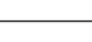
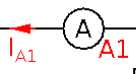
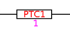
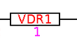
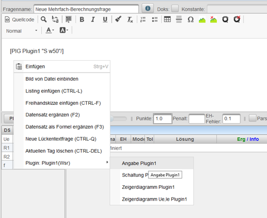

# Gsr
## Plugin GSR

* Zeichnet lineare elektrische Schaltungen für Gleichspannung.
* Besteht die Schaltung nur aus linearen Elementen, dann liefert das Plugin auch das mathematische Modell in Form von Maxima-Befehlen.

siehe auch: [Plugins](../Plugins/index.md)

### Definition der Schaltung
#### Schaltungselemente
Die Schaltung wird im Plugindialog über einen String(Zeichenkette) definiert, wobei folgende lineare Bauteile definiert sind:

| Name              | Bedeutung                                                    | Symbol                                                          |
|-------------------|--------------------------------------------------------------|-----------------------------------------------------------------|
| R                 | Widerstand                                                   |   |
| C                 | Kondensator                                                  |   |
| L                 | Induktivität                                                 |   |
| LL                | Leerlauf oder Unterbrechung                                  |   |
| KS                | Drahtbrücke oder Kurzschluss                                 |   |
| DB                | Drahtbrücke ohne besondere Funktion                          |   |
| U                 | Spannungsquelle                                              |   |
| UR                | Spannungsquelle in Rückwärtsrichtung                         |   |
| UW                | Wechselspannungsquelle                                       |   |
| UWR               | Wechselspannungsquelle in Rückwärtsrichtung                  |   |
| BAT               | Batterie als Spannungsquelle                                 |   |
| BATR              | Batterie als Spannungsquelle in Rückwärtsrichtung            |   |
| I                 | Stromquelle                                                  |   |
| IR                | Stromquelle in Rückwärtsrichtung                             |   |
| A                 | Amperemeter                                                  |   |
| AR                | Amperemeter in Rückwärtsrichtung                             |   |
| V                 | Voltmeter                                                    |   |
| VR                | Voltmeter in Rückwärtsrichtung                               |   |
| Par(R,R)          | Parallelschaltung von zwei Widerständen                      |   |
| Ser(R,R)          | Serienschaltung von zwei Widerständen                        |   |
| B(R1,R2,R3,R4,R5) | Brückenschaltung von 5 Bauelementen                          |   |
| B(R)              | Brückenschaltung von 5 Widerständen mit verschiedenen Werten |   |

Folgende Bauteile, welche nicht mit Maxima berechnbar sind, sind ebenfalls definiert:

| Name | Bedeutung                       | Symbol                                                          |
|------|---------------------------------|-----------------------------------------------------------------|
| D    | Diode                           |   |
| DR   | Diode in Rückwärtsrichtung      |   |
| ZD   | Zenerdiode                      |   |
| ZDR  | Zenerdiode in Rückwärtsrichtung |   |
| LED  | LED                             |   |
| LEDR | LED in Rückwärtsrichtung        |   |
| Lamp | Glühbirne                       |   |
| X    | Glühbirne                       |   |
| NTC  | NTC-Widerstand                  |   |
| PTC  | PTC-Widerstand                  |   |
| VDR  | VDR-Widerstand                  |   |
| S    | Schalter als Schließer          |   |
| O    | Schalter als Öffner             |   |

Die Verschaltung der Bauelement erfolgt über die folgenden Operatoren:

| Operator | Priorität | Bedeutung         |
|----------|-----------|-------------------|
| *        | 15        | Parallelschaltung |
| +        | 10        | Serienschaltung   |

#### Zusammenschaltung von Zweipolen

| Schaltung                                                               | Bedeutung                                                | Beispiel           | Bild                                                            |
|-------------------------------------------------------------------------|----------------------------------------------------------|--------------------|-----------------------------------------------------------------|
| einzelner Zweipol als Serienschaltung                                   | Wird horizontal dargestellt und ohne Beistrich definiert | R+C                |   |
| einzelner Zweipol als Parallelschaltung                                 | Wird horizontal dargestellt und ohne Beistrich definiert | R*C                |   |
| senkrechter Zweipol                                                     | führt bei einigen Berechnungen noch zu Fehlern!          | ,R+C               |   |
| Links offene Schaltung mit einer Eingangsspannung Ue und zwei Bauteilen | beginnt mit einem Komma                                  | ,R,C               |   |
| Spannungsquelle mit zwei Bauteilen                                      |                                                          | U,R,C              |   |
| Vierpol                                                                 |                                                          | ,R,C,,             |   |
| Vierpol mit 3 Elementen                                                 |                                                          | ,R1,R2,R3,         |   |
| Vierpol als T-Glied                                                     |                                                          | ,R1,R2,,R3,LL      |   |
| Vierpol als Pi-Glied                                                    |                                                          | ,,R1,,R2,R3,,      |   |
| Zweipol mit mehreren Elementen                                          |                                                          | ,R1,R2,R3,R4,R5,R6 |   |

#### angezeigte Spannungen und Ströme
* Die angezeigten Ströme und Spannung können nach der Schaltungsdefinition durch einen Strichpunkt getrennt erfolgen. 
* Sie werden einfach durch Beistrich getrennt angegeben
Folgenden Definitionen sind hierbei möglich:

| Operator      | Beispiel | Bedeutung                                                                                                                                  |
|---------------|----------|--------------------------------------------------------------------------------------------------------------------------------------------|
| ohne Operator | UR1      | der Spannungspfeil für R1 wird gezeichnet                                                                                                  |
| _             | UR1_     | Das Größensymbol wird in der Schaltung unterstrichen                                                                                       |
| -             | Ue-      | Der Pfeil wird in der Schaltung nicht mehr gezeichnet                                                                                      |
| !             | IR1!     | Der berechneten Wert wird zum Pfeil dazugeschrieben. Die Wert ist nur verfügbar, wenn er auch im Maxima-Feld berechnet wurde!              |
| ?             | UR1?     | Der Pfeil wird ohne Namen gezeichnet                                                                                                       |
| &gt;          | UR1&gt;x | Der Indizes der Größe wird ausgetauscht. In diesem Beispiel wird Ux statt UR1 geschrieben. In Maxima bleibt der Index unverändert.         |
| :             | R1:Rx    | Ein Bauteilname kann umbenannt werden. Hier R1 auf Rx. Dies hat keinen Einfluss auf die Maxima-Berechnung, hier bleibt der Namen erhalten. |

Die Operatoren _-!? können auch nach einer Änderung mit &gt; zusätzlich verwendet werden wie zB: UR4&gt;x!_ 
 

#### Beispiele

| Definition                                        | Schaltung                                                       |
|---------------------------------------------------|-----------------------------------------------------------------|
| U,R,R,A;UR1,UR2,IR1&gt;1,IA1-                     |   |
| U,R,R,A;UR1,UR2,IR1&gt;1,IA1-,A1:.,R2:Rx,URx&gt;x |   |
| ,R,R;Ue?,Ie-,UR1?,UR2&gt;a                        |   |

### Datensätze
* Das Plugin erstellt automatisch beim Beenden des Plugin-Editors die benötigten Datensätze
* Für alle Bauteilwert darf aktuell nur ein reeller und kein komplexer Wert verwendet werden
* Für Bauteile kann man den zugehörigen Datensatz löschen und durch eine Berechnung in Maxima überschreiben (Der Datensatz wird aber dann aktuell jedesmal wenn man in den Plugin-Dialog wechselt neu angelegt -&gt; Bug)

### Verwendung des Plugins in der Frage
#### Einfügen von Angabewerten
Im Frageeditor kann man mit der rechten Maustaste und Plugin-Angabe die Angabe für alle generierten Datensätze in den Fragetext einfügen lassen.
 
Wird später das Plugin verändert wird dieser Test **nicht automatisch** nachgeführt. Er muss dann entweder gelöscht und neu eingefügt, oder händisch angepasst werden.

Beispiel:

| Schaltung                                                       | Angabe                                     |
|-----------------------------------------------------------------|--------------------------------------------|
|   | $U_{Q1}={UQ1}$, $R_{1}={R1}$, $C_{1}={C1}$ |

#### Einfügen von Graphiken
Eine Graphik kann durch das Plugin-Tag 
<pre>
[PIG pluginname "typ parameter"/](PIG pluginname "typ parameter"/)
</pre>
im Fragetext eingefügt werden. Dies erfolgt entweder direkt über die Eingabe des Textes oder über die rechte Maustaste im Fragetext-Editor.

Folgende Parameter können angegeben werden:

| Graphiktyp | typ parameter   | Beschreibung                                                                       | Beispiel                                         |
|------------|-----------------|------------------------------------------------------------------------------------|--------------------------------------------------|
| Schaltung  | keine Parameter |                                                                                    | [PIG plugin1]                                    |
| Schaltung  | S W,w20         | W,werte..Werte der Bauteile drucken  w20..Breite in Prozent des Bildschirms  | [PIG plugin1 "S W,w60"/](PIG plugin1 "S W,w60"/) |

#### Zeichenelemente des Plot-Plugins
Durch Strichpunkt getrennt können auch die [Zeichenelemente](../Plot/index.md#vordefinierte-graphische-funktionen-) des Plot-Plugins eingefügt werden.

Das Koordinatensystem des Bildschirmfensters hat den Nullpunkt links unten.

Die positive horizontale Achse geht von links nach rechts von 0 bis 100 und bei Schaltungen von 0 bis zur Schaltungsbreite wobei ein Widerstand eine Länge von 3 hat.

Die postitive vertikale Achse reicht unten nach oben und beginnt unten bei 0. Der maximale Wert ist abhängig vom Seitenverhältnis des Fensters.

Beispiele:

| Plugin-Definition | PIG-Tag                                                                                                      | Bild                                                                        |
|-------------------|--------------------------------------------------------------------------------------------------------------|-----------------------------------------------------------------------------|
| ,R,R,,R,LL;Ia     | S w,w50;loop(2.5,1.5,0.6,tex="I");loop(7.5,1.5,0.6,tex="II");circle(5,4,0.3,color=red);text(5,4.7,tex="III") |   |

#### Maximafeld
Im Maximafeld kann ein Satz von Berechnungsformeln für das Plugin über den Tag

<pre>
[pluginname/](PIM)
</pre>

automatische eingefügt werden. Dieses Tag kann auch über die rechte Maustaste im Maximafeld eingefügt werden.
Das PIM-Tag wird vor der Maxima-Berechnung automatisch durch die Formeln des Plugins ersetzt.

Folgende Variablen werden im Maxima-Feld definiert und können für das Ergebnis 
verwendet werden:

| Variable | Beschreibung                                                    |
|----------|-----------------------------------------------------------------|
| UR1      | Spannung am Widerstand R1                                       |
| IC1      | Strom im Kondensator C1                                         |
| Rges     | Gesamtwiderstand wenn die Schaltung als Zweipol darstellbar ist |
| Ue       | Gesamtspannung am Eingang eines Zweipols oder Vierpols          |
| Ie       | Gesamtstrom am Eingang eines Zweipols oder Vierpols             |

Werden in der Schaltung **Induktivitäten oder Kapazitäten** verwendet werden alle Ströme und Spannungen im Laplace-Bereich 
und im Gleichstromarbeitspunkt berechnet.

| Variable | Beschreibung                                                   | Ergebnistyp          |
|----------|----------------------------------------------------------------|----------------------|
| UR1      | Spannung am Widerstand R1 im Laplace-Bereich als Funktion in s | Übertragungsfunktion |
| IC1      | Strom im Kondensator C1 im Laplace-Bereich als Funktion in s   | Übertragungsfunktion |
| dcUR1    | Gleichspannung am Widerstand R1 im Arbeitspunkt                | Gleichspannung       |
| dcIL1    | Gleichstrom in der Induktivität L1 im Arbeitspunkt             | Gleichstrom          |

Werden in der Schaltung **Schalter** verwendet, so werden alle notwendigen Größen für **Schaltvorgänge** berechnet.

| Variable | Beschreibung                                                                                     | Ergebnistyp          |
|----------|--------------------------------------------------------------------------------------------------|----------------------|
| dcUR1    | Gleichspannung am Widerstand R1 vor der Betätigung des Schalters                                 | Gleichspannung       |
| UR1      | Spannung am Widerstand R1 vor dem Betätigen des Schalters im Laplace-Bereich als Funktion von s  | Übertragungsfunktion |
| npUR1    | Spannung am Widerstand R1 direkt nach dem Betätigen des Schalters                                | Momentanwert         |
| infUR1   | Gleichspannung am Widerstand R1 nach unendlich langer Zeit nach dem Betätigung des Schalters     | Gleichspannung       |
| sUR1     | Spannung am Widerstand R1 nach dem Betätigen des Schalters im Laplace-Bereich als Funktion von s | Übertragungsfunktion |

[Plugins](../Plugins/index.md)

