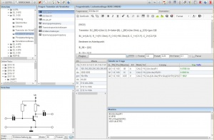

# Hauptseite

| Browser-Empfehlung        | Firefox &amp; Chrome                                                                      |                                                                                            |                                                                              |                                                               |                                                    |                                                                                                  |
|---------------------------|-------------------------------------------------------------------------------------------|--------------------------------------------------------------------------------------------|------------------------------------------------------------------------------|---------------------------------------------------------------|----------------------------------------------------|--------------------------------------------------------------------------------------------------|
| Einführung                | [Einführung](../Einführung/index.md)                                                      | [LeTTo-Hauptansicht](../LeTTo-Hauptansicht/index.md)                                       | [Beispielsammlung](../Beispielsammlung/index.md)                             | [Beispiele bearbeiten](../BeispielsammlungEditieren/index.md) | [Fragetypen](../Fragetypen/index.md)               |                                                                                                  |
| Bearbeiten von Beispielen | [Ordnerverwaltung](../Ordnerverwaltung/index.md)                                          | [Fragenliste](../Fragenliste/index.md)                                                     | [Editor für den Angabetext](../EditorfürdenAngabetext/index.md)              | [Datensätze](../Datensätze/index.md)                          | [Berechnungen](../Berechnungen/index.md)           |                                                                                                  |
| Online-Tests/Aktivitäten  | [Einführung Tests](../Online-Tests/index.md)                                              | [Erstellen von Tests](../ErstellenvonTests/index.md) [Video](https://youtu.be/jBtaOZVF-cE) | [Tests#test-durchführen-](/notimplemented/index.md)                          | [Test-Ergebnisse](../Test-Ergebnisse/index.md)                |                                                    |                                                                                                  |
| Beurteilungen             | [Übersicht Beurteilungssystem](../Katalog/index.md) [Video](https://youtu.be/a0R4YYYkrMo) | [Konfiguration](../Beurteilungskonfiguration/index.md)                                     | [Klassenweise Beurteilungen](../Katalog/index.md#klassenweise-beurteilungen) | [Auswertungen](/notimplemented/index.md)                      |                                                    |                                                                                                  |
| Kompetenzen               | [Kompetenzen](../Kompetenzen/index.md)                                                    | [Lehrpläne](../Lehrpläne/index.md)                                                         | [ Zuordnung v. Beispielen](../Zuordnungv.Beispielen/index.md)                | [mehreren Beispiel zuordnen](/notimplemented/index.md)        | [Ergebnisse](/notimplemented/index.md)             |                                                                                                  |
| Mathematik                | [Datensätze](../Datensätzedefinieren/index.md) [Video](https://youtu.be/fZEv62EWVtE)      | [Einheiten](../Einheit/index.md)                                                           | [Berechnungen](../Berechnungen/index.md)                                     | [Plugins](../Plugins/index.md)                                | [Zahlendarstellung](../Zahlendarstellung/index.md) | [Folgefehlerbehandlung](../Folgefehlerbehandlung/index.md) [Video](https://youtu.be/CbpX537brTM) |
| Sonstiges                 | [Neuigkeiten/Änderungen](../Neuigkeiten/index.md)                                         | [Shortcuts](../Shortcuts/index.md)                                                         | [FAQ](../FAQ/index.md)                                                       |                                                               |                                                    |                                                                                                  |

**Vorgänge**:

| Passwort     | [eigenes Lehrerpasswort ändern](/notimplemented/index.md) | [Schülerpasswort setzen](../Schülerpasswortsetzen/index.md)           | [Lehrerpasswort setzen](../Lehrerpasswortsetzen/index.md)           | [Passwort mit Domain-Passwort synchronisieren](/notimplemented/index.md) |                                          |                                             |
|--------------|-----------------------------------------------------------|-----------------------------------------------------------------------|---------------------------------------------------------------------|--------------------------------------------------------------------------|------------------------------------------|---------------------------------------------|
| Online-Tests | [Test anlegen](../Testanlegen/index.md)                   | [Beispiele zu Test hinzufügen](../BeispielezuTesthinzufügen/index.md) | [Testbearbeitung fortsetzen](../Testbearbeitungfortsetzen/index.md) | [Test ausführen](/notimplemented/index.md)                               | [Test beenden](/notimplemented/index.md) | [Test beurteilen](/notimplemented/index.md) |
| Labor        | [Labor Benotung](../LaborBenotung/index.md)               | [Laborübung anlegen](../Laborübunganlegen/index.md)                   | [Labor Übungstest](../LaborÜbungstest/index.md)                     |                                                                          |                                          |                                             |

### Neuigkeiten
[Neuigkeiten](../Neuigkeiten/index.md)

### Administration 

gehe zu [Administration](../Administration/index.md)

## Allgemeines

**LeTTo** ist ein, vom Österreichischen Bundesministerium für Bildung, Wissenschaft und Forschung empfohlener E-Learning-Server. LeTTo ist breit einsetzbar und vor allem für technisch-mathematische-Gegenstände optimiert. LeTTo zeichnet sich durch einen kompetenzorientierten im System integrierten Notenkatalog aus.

Wird der Server gestartet, so befindet man sich im [Lernbereich](../LeTTo-Hauptansicht/index.md) des Servers.

Die Erweiterbarkeit des Servers durch Module für Spezialanwendungen ist durch [Plugins](../Plugins/index.md) gegeben.

Informationen zum [Hilfesystem](../Hilfesystem/index.md)

###  Aufbau 
* [LeTTo-Hauptansicht](../LeTTo-Hauptansicht/index.md)
* [Beispielsammlung](../Beispielsammlung/index.md)
* [Beispielsammlung Editieren](../BeispielsammlungEditieren/index.md)

###  Dokumentation 

Die Dokumentation das LeTTo-Servers erfolgt in mehreren Formen:

* Die Online-Hilfe im Browser, die durch F1 die Doku für das gerade aktive Element im Browser liefert
* Mit der Taste F10 erfolgt die Verlinkung zur Hilfe im Wiki
* Das LeTToWiki, das über [http://wiki.letto.at](http://wiki.letto.at) erreichbar ist
* [https://www.letto.at](https://www.letto.at) als Hauptseite für das LeTToprojekt mit Links und Video-Tutorials
* Das [Letto-Forum](https://forum.letto.at) als Plattform für FAQ's und Austausch zwischen Usern

###  [Administration](../Administration/index.md) 
gehe zu [Administration](../Administration/index.md)

[Update von rev65xx auf aktuelle Stable rev66xx](../Updaterev66xx/index.md)

