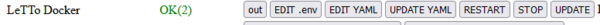
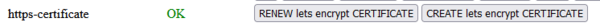
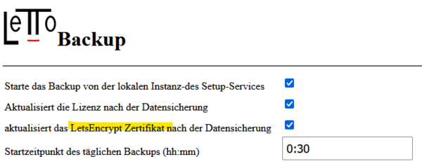

# Https-Zertifikat
##  siehe auch 
* [Administration](../Administration/index.md)
* [Installation](../Installation/index.md)

* Der LeTTo-Server muss aus dem Internet über eine https-Verbindung erreichbar sein. Im Normalfall ist das System so eingestellt, dass jede http-Anfrage an Port 80 auf https mit Port 443 weitergeleitet wird.
* Um mit https korrekt kommunizieren zu können muss dem Browser ein korrektes https-Zertifkat vom Server zur Verfügung gestellt werden. Da sich alle System hier etwas unterschiedlich Verhalten stehen mehrere Varianten für die Verwaltung des Zertifikates zur Verfügung.

* Grundsätzlich werden die Einstellungen für das https-Zertifikat im Docker-Container letto-proxy in der Konfigurationsdatei **/opt/letto/docker/compose/letto/.env** vorgenommen, die im Setupservice über den Button "Edit .env" in der Zeile "LeTTo Docker" editierbar ist 
  
* Nach einer Änderung in der Zertifikatseinstellung oder in der .env-Datei muss der letto-proxy neu gestartet werden mit "RESTART" bei "LeTTo Docker" im Setup-Service oder von der Kommandozeile des Hosts mit 
  <pre>cd /opt/letto/docker/compose/letto
docker compose down
docker compose up -d</pre>

##  Einträge in der .env Datei für die Zertifikatsverwaltung 

| Variable          | Beschreibung                                                                                                                                                  | gültige Werte | Default   |
|-------------------|---------------------------------------------------------------------------------------------------------------------------------------------------------------|---------------|-----------|
| SELF_SIGNED       | Gibt an ob ein selbstsigniertes Zertifkat erstellt werden soll                                                                                                | 0,1           | 1         |
| CERT_EXTERN       | Gibt an ob ein externes Zertifikat verwendet werden soll                                                                                                      | 0,1           | 0         |
| CREATE_HTTPS      | Gibt an ob die Datei https.conf der Proxy-Konfiguration automatisch beim Start des Proxy neu erzeugt werden soll.                                             | 0,1           | 1         |
| USE_HTTP          | Gibt an ob HTTP-Anfragen an Port 80 verarbeitet (1) oder automatisch an Port 443 redirected werden sollen(0).                                                 | 0,1           | 0         |
| SERVER_NAME       | Standard Domain Name als Hauptname für ein Lets-Encrypt Certifikat                                                                                            |               | localhost |
| DOMAIN_ALTERNATIV | Liste von weiteren Domain-Bezeichnungen für den Server für die ein  Lets-Encrypt Certifikat erzeugt werden soll. Die Domains sind duch Leerzeichen zu trennen |               |           |

Anmerkung: wird CREATE_HTTPS von 1 auf 0 geändert, könnte danach die Datei https.conf im Verzeichnis /opt/letto/docker/proxy fehlerhaft sein (ein nicht vorhandenes Zertifikat enthalten). Ist USE_HTTP=1 kann einfach die Datei /opt/letto/docker/proxy/https.conf gelöscht werden und der Proxy neu gestartet werden, andernfalls sollte der Fehler genauer analysiert werden.

##  selbstsigniertes Zertifikat 
* Ist keine Einstellung für eine Zertifikat vorhanden wird vom letto-proxy Container automatisch ein selbstsigniertes Zertifikat für https verwendet. Mit diesem Zertifikat ist nur eine eingeschränkte Kommunikation mit dem Server möglich indem man am Browser das selbstsignierte Zertifikat akzeptiert. Für den normalen Betrieb eines Servers kann diese Zertifikat nicht verwendet werden!
* Mit der Variablen **SELF_SIGNED=0** in der .env-Datei kann man die Erzeugung des selbstsignierten Zertifikates verhindern. 

##  Zertifikat mit Certbot 
* In der Standardeinstellung wird CertBot verwendet um ein Let's-Encrypt Zertifikat zu erstellen.
* Zertifikat und Zertifikatsinfo wird in den Docker-Volumes **certs** und **certs-data** gespeichert
* Das Zertifikat wird für die Domain welche in der Variablen **SERVER_NAME** angegeben ist und für alle Namen der Variable **DOMAIN_ALTERNATIV** erzeugt.
* Wird die Domain-Bezeichnung oder die DOMAIN_ALTERNATIV Bezeichnungen geändert, muss das Zertifikat neu erstellt werden. 
* Das Zertifikat wird neu erstellt:
  * im Setup-Service mit **CREATE lets encrypt CERTIFICATE" im Punkt **https-certificate''': 
  * Bei Linux-Hosts auch von der Linux-Kommandozeile aus mit dem Script: 
   /opt/letto/docker/compose/createcert.sh
* Das Zertifikat wird erneuert mit:
  * im Setup-Service mit **RENEW lets encrypt CERTIFICATE" im Punkt **https-certificate''': 
  * Automatisch bei der Datensicherung, wenn die Datensicherung **aktiviert** ist und der Punkt **aktualisiert das LetsEncrypt Zertifikat nach der Datensicherung** angehakt ist 
  * Bei Linux-Hosts auch von der Linux-Kommandozeile aus mit dem Script: 
   /opt/letto/docker/compose/certrenew.sh

##  eigenes Zertifikat als PEM-Zertifikat 
* Ist ein eigenes https-Zertifikat für die Domain vorhanden kann auch diese im letto-proxy direkt verwendet werden.
* Kopieren sie hierfür von einem **PEM-Zertifikat** das Zertifikat in die Datei **/opt/letto/docker/cert/cert.crt** und den Zertifikats-Key in die Datei **/opt/letto/docker/cert/cert.key**
  /opt/letto/docker/cert/cert.crt
  /opt/letto/docker/cert/cert.key
* Setzen sie in der .env-Datei die Variable **CERT_EXTERN=1**
  <pre>CERT_EXTERN=1</pre>
* Restarten sie den letto-proxy mit "RESTART" bei "LeTTo Docker" im Setup-Service oder aus der Linux Kommandozeile wie oben beschrieben

##  Verwendung eines externen Reverse-Proxy welcher das https-Zertifikat verwaltet 
* Wird der LeTTo-Server hinter einem externen Reverse-Proxy betrieben, welcher das https-Zertifikat für den Server verarbeitet, muss von diesem auf den Port 80 des letto-proxy weitergeleitet werden.
* Damit der Reverse-Proxy nicht wieder auf https redirected muss die Variable **USE_HTTP=1** gesetzt werden
  USE_HTTP=1
* Im letto-proxy ist dann kein https-Zertifikat mehr notwendig, da nur Port 80 vom letto-proxy verwendet wird.

Anmerkung: wird CREATE_HTTPS von 1 auf 0 geändert, könnte danach die Datei https.conf im Verzeichnis /opt/letto/docker/proxy fehlerhaft sein (ein nicht vorhandenes Zertifikat enthalten). Löschen sie die Datei /opt/letto/docker/proxy/https.conf und starten den Proxy neug.

##  Sondereinstellungen von https im letto-proxy 
* Die Datei **/opt/letto/docker/proxy/https.conf** wird im Normalfall bei jedem Start vom Proxy neu geschrieben. Setzt man die Variable **CREATE_HTTPS=0** dann wird die Datei https.conf nicht mehr überschrieben und man kann die Konfiguration von https in dieser Datei an die gewünschten Anforderungen anpassen. Verwenden sie dazu die Doku von nginx um Weiteres zu erfahren.

[Administration](../Administration/index.md)

