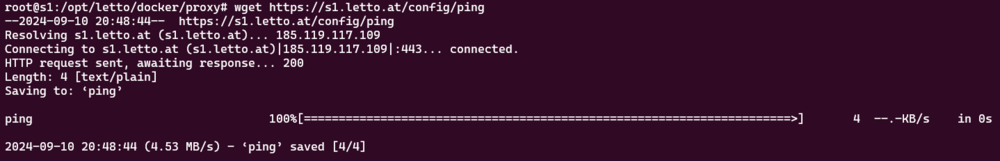

# Https REST ping
* Jeder Server muss von den Clients sowie auch von sich selbst über https erreichbar sein! 
* Um dies zu überprüfen senden das Setup-Service an sich selbst über die öffentliche Adresse des Servers eine Anfrage. Ist diese Anfrage fehlerhaft so wird dies im Setup-Service bei https-REST-ping self angegeben.
   
* Der Rest-ping kann auch direkt aus der Kommandozeile des Host-Rechners überprüft werden und muss als Resultat pong liefern.
<pre>wget https://eigener.servername/config/ping
</pre>
   
* Weiters muss der Server sich auch über einen normalen ping selbst erreichen können. <pre>ping eigener.servername</pre>
* Wenn der REST-ping oder der Ping auf die eigenen Adresse des Servers nicht funktioniert führt dies zu einer eingeschränkten Serverleistung.
* Das Problem eines nicht funktionierenden REST-ping liegt im Normalfall in der vorgelagerten Firewall oder dem Routing im Netzwerk wo sich der Server befindet. Der Administrator des Netzwerkes sollte mit den zwei oben angegebenen Befehlen überprüfen können ob der Ping funktioniert und das Netzwerk dementsprechend konfigurieren. Am LeTTo-Server selbst kann dabei nicht eingegriffen werden,  er kann lediglich überprüfen ob die Konfiguration funktioniert.

