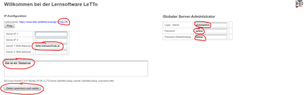
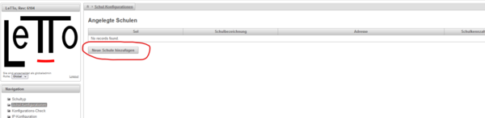
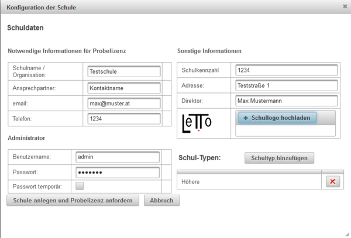
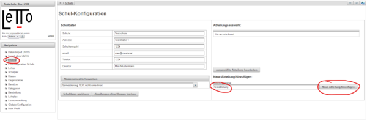
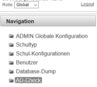

# Installation
##  Allgemeines 
Der LeTTo-Server wurde in Java für JavaEE [https://www.oracle.com/technetwork/java/javaee/overview/index.html](https://www.oracle.com/technetwork/java/javaee/overview/index.html) Server entwickelt. Prinzipiell sollte LeTTo auf jedem JavaEE-Server unter Windows oder Linux lauffähig sein. Wir haben jedoch als Serverumgebung nur Ubuntu-Server mit TomEE getestet und empfehlen deshalb auch diese Laufzeitumgebung.

Als Datenbank wird eine MySQL-Datenbank verwendet, welche idealerweise am gleichen Server wie der TomEE läuft. Es ist jedoch auch mögliche einen zentralen MySQL-Server zu verwenden welcher im LAN zur Verfügung steht.

####  siehe auch 
* [Administration](../Administration/index.md)
* [Anforderungen](../Anforderungen/index.md)
* [Migration LeTTo zu Docker](../MigrationLeTTozuDocker/index.md)
* [Dockerinstallation Erstkonfiguration](../DockerinstallationErstkonfiguration/index.md)
* [Verzeichnisse und Docker-Volumes](../VerzeichnisseundDocker-Volumes/index.md)
* [Container Struktur](../ContainerStruktur/index.md)
* [Setup-Service](../Setup-Service/index.md)
* [Datensicherung-Docker](../Datensicherung-Docker/index.md)

##  Installation des Servers 

###  Installation auf einem Ubuntu/Debian-Server mit Docker-Containern (empfohlen) 
* Installation von Ubuntu 22.04 Server oder Debian 11 ohne apache webserver (Port 80,443 und 9096 müssen frei sein!)
  * !! **Docker aus den Ubuntu oder Debian-Quellen darf nicht installiert sein**, bzw. muss vor dem Installationsscript deinstalliert werden. Das Install-Script installiert Docker aus den original Docker-Quellen !! 
* Einrichten der Namensauflösung dass der Server aus dem Internet über seinen Namen erreichbar ist
* Download des Installationsscripts von [https://build.letto.at/download/install/scripts/debian-ubuntu/install-letto-ubuntu-docker.sh](https://build.letto.at/download/install/scripts/debian-ubuntu/install-letto-ubuntu-docker.sh)
  <pre>wget https://build.letto.at/download/install/scripts/debian-ubuntu/install-letto-ubuntu-docker.sh</pre>
* start des Installationsscripts als **root**
  <pre>bash ./install-letto-ubuntu-docker.sh</pre>
* Nach der Installation ist das Setup-Service über einen Browser auf dem https-Port 9096 erreichbar. 
* Alle weiteren Konfigurationen erfolgen dann im [Setup-Service](../Setup-Service/index.md)
  * Beim [ersten Start](../DockerinstallationErstkonfiguration/index.md) muss eine allgemeine Information des Servers für den Lizenzserver und die Passwörter für den MySQL-Server angegeben werden.
  * Dann kann die Schule angelegt werden. Es wird dabei vom Lizenzserver eine beschränkte Demolizenz angefordert. Das Schulkürzel welches bei der Einrichtung agegeben wird erscheint immer als Kennung der Schule am Server (auch in der URL) und kann später nicht mehr geändert werden!
  * Nach der Installation der Schule bitte mit uns in Verbindung setzen, dass wir eine angepasste Demolizenz vergeben können.

###  Installation auf anderen Host-Systemen mit Docker-Containern 
* Prinzipiell ist natürlich jeder Server für die Docker-Installation von LeTTo verwendbar. Es existiert lediglich nur für Ubuntu ein fertiges Installationsscript für die Installation. Für andere Host-Betriebssysteme bitte ebenfalls das Installationsscript für Ubuntu herunterladen jedoch nicht direkt ausführen sondern an das Betriebssystem anpassen bzw. schrittweise angepasst die Installation händisch durchführen. Den Großteil der Installation übernimmt das Setup-Programm lettosetup.jar welches nach der Installation direkt am Host am https-Port 9096 läuft.
* Unter Windows gibts es nur ein sehr experimentelles Basis-Script nachdem noch einige undokumentierte Anpassungen notwendig sind [https://build.letto.at/download/install/scripts/windows/install-letto-windows-docker.bat](https://build.letto.at/download/install/scripts/windows//install-letto-windows-docker.bat)

###  Installation unter Ubuntu (unterstützt bis September 2023) 
* getestet für die LTS-Version 18.04, 20.04 und 22.04
* VIDEO-Anleitung: [Installation](https://www.dropbox.com/s/pyljp9g8pwt4zfp/Letto-Installation.mp4?dl=0) [Fertigstellung](https://www.dropbox.com/s/fimmw23l4s6zc6z/Letto-Installation-fertigstellung.mp4?dl=0)
* Download von Ubuntu Server [http://cdimage.ubuntu.com/releases/22.04/release/](http://cdimage.ubuntu.com/releases/22.04/release/)und Erzeugung eines Boot Mediums [https://wiki.ubuntuusers.de/Ubuntu-CD/](https://wiki.ubuntuusers.de/Ubuntu-CD/) (zB. DVD)
* Installation mit einem Benutzer **letto**
* Bei der Installation nur den **OpenSSH Server** mit installieren
* Der Server sollte über eine **funktionierende Namensauflösung** aus dem **Internet** erreichbar sein.
* Eine gegebenenfalls vor dem Server sitzende Firewall sollte ins Internet mindestens folgende Ports freischalten:
  * Eingehend TCP: 80(HTTP), 443(HTTPS)
  * Eingehend ICMP: echo(ping)
  * Ausgehend TCP: 80(HTTP), 443(HTTPS)
  * Ausgehend UDP: 53(DNS)
  * Ausgehend ICMP: echo(ping)
  * Und natürlich alle Antworten auf ausgehende Anfragen
  * Falls eine Authentifizierung über LDAP gewünscht wird muss natürlich der LDAP oder AD-Server mit den notwendigen Ports erreichbar sein.

* falls der Server nicht auf aktuellem Stand ist, die Updates einspielen und den Server neu starten
<pre>
  sudo apt-get -y update 
  sudo apt-get -y upgrade
  sudo apt-get -y dist-upgrade
  sudo apt-get -y autoremove
  sudo apt-get -y install -f
  sudo reboot
</pre>
* Konfiguration des Servers
  * Starten des Servers
  * Wechseln zu Benutzer root.<pre>sudo su</pre>
  * Wechsel in das Verzeichnis opt<pre>cd /opt</pre>
  * **Download** des Installationsscripts<pre>wget https://letto.at/download/letto/install-letto-ubuntu.sh</pre>
  * Script in einem Editor **konfigurieren** <pre>nano install-letto-ubuntu.sh</pre>
*** Wenn gewünscht, setzen von DNS-Namen, Passwörtern, Email und Heap-Speicher. Notwendíge Einstellungen werden interaktiv abgefragt wenn sie nicht angegeben werden.
*** Mit &lt;Strg&gt;-O und Enter das Script speichern
*** Mit &lt;Strg&gt;-X den Editor verlassen 
  * Setzen von Ausführungsrechten <pre>chmod 755 install-letto-ubuntu.sh</pre>
  * Script **starten** <pre>./install-letto-ubuntu.sh</pre> Die Ausführung des Scripts wird je nach Server-Hardware zwischen 20 und 60 Minuten dauern, da die notwendige Installation von LaTeX und Inkscape relativ lange dauert. Falls das Script während der Ausführung abbricht sollte es (ggf. nach Behebung des Fehlers) einfach nochmals gestartet werden.

* Zertifikat für den Server installieren: Bei der Standardeinstellung wurde noch das selbstsignierte Zertifikat vom Apache2 in der Datei /etc/apache2/sites-enabled/letto.conf eingebunden. Dieses Zertifikat kann nun durch ein eigenes gültiges Zertifikat für den Server-DNS-Namen ersetzt werden.   Falls kein eigenes Zertifikat vorhanden ist, kann auch mit dem Certbot ein selbstzertifiziertes Zertifikat installiert werden. Hierzu kann wie folgt vorgegangen werden:
  * Starten des certbot als root-Benuter <pre>certbot --apache -d meinedomain.at</pre>
*** Hierbei müssen einige Fragen wie email etc. beantwortet werden.
  * Eintragen des certbot in einen Cronjob wie zB. in der Datei /etc/crontab <pre>05 05 * * * root certbot renew</pre>

* Datensicherung einrichten:  Die Datensicherung wird durch das Script so eingerichtet, das täglich in das Verzeichnis /sicherung gesichert wird. Diese Verzeichnis sollte nun auf eine externe Hardware regelmäßig mit einem sinnvollen Archivierungskonzept gesichert werden.

* Konfiguration von LeTTo :   Nun kann der Server über seine URL erreicht und konfiguriert werden.  
* globalen Administrator anlegen:    
  * Der Ping zum Lizenzserver muss OK sein damit der Server am Lizenzserver eingetragen werden kann
  * Die Webadresse muss die Adresse sein, mit welcher der Server vom Browser auch erreicht wird, da daran die Lizenz gebunden wird!
  * Der globale Administrator ist für die Administration des Servers zuständig. Für die Verwaltung der Klassen,Lehrer und Schüler gibt es einen getrennten Schuladministrator, welcher bei der Anlage der Schule erstellt wird.
  * Daten speichern und weiter ist nur möglich wenn der Lizenzserver erreichbar ist.

* als globaler Administator eine Schule anlegen:             Durch "Schule anlegen und Probelizenz anfordern" wird die Schule erzeugt und vom Lizenzserver eine Demolizenz geladen.
* als Schuladministrator eine Abteilung anlegen:    

###  Installation unter Ubuntu 18.04 
* Wir empfehlen ausdrücklich die Installation unter Ubuntu 20.04. Das Installationsscript für 18.04 wird ab 2021 nicht mehr gewartet.
* Download von Ubuntu Server [http://cdimage.ubuntu.com/releases/18.04/release/](http://cdimage.ubuntu.com/releases/18.04/release/) und Erzeugung eines Boot Mediums [https://wiki.ubuntuusers.de/Ubuntu-CD/](https://wiki.ubuntuusers.de/Ubuntu-CD/) (zB. DVD)
* Die weitere Vorgehensweise ist gleich wie bei Ubuntu 20.04 nur sollte das Script **install-letto-ubuntu.sh** statt install-letto-ubuntu-20.04.sh verwendet werden <pre>wget https://letto.at/download/letto/install-letto-ubuntu.sh</pre>

##  Migration einer bestehenden LeTTo-Installation auf eine Docker-Installation 
###  Migration einer Linux-basierten LeTTo-Installation direkt auf den bestehenden Server 
Besteht bereits eine lokale Installation auf einem Linux Server (idealerweise Ubuntu 18.04,20.04,22.04 oder Debian 11) dann kann direkt auf diesem Server eine dockerbasierte Installation vorgenommen und dabei die bestehenden Daten übernommen werden.

[Migration Linux Installation auf Docker am gleichen Server](../MigrationLeTTozuDocker/index.md#migration-einer-linux-basierten-letto-installation-direkt-auf-den-bestehenden-server-)

###  Migration einer bestehenden LeTTo-Installation auf einen neuen Linux-Server als Docker-Installation 
Liegt eine LeTTo-Installation auf einem beliebigen System vor, so kann sie wie hier beschrieben in eine Docker-Installation auf einem Linux-Server übertragen werden.

[Migration LeTTo Installation auf Docker](../MigrationLeTTozuDocker/index.md#migration-einer-bestehenden-letto-installation-auf-einen-neuen-linux-server-als-docker-installation-)

###  Migration einer bestehenden LeTTo-Installation auf einen neuen Windows-Server als Docker-Installation 
[Migration zu Docker auf Windows](../MigrationLeTTozuDocker/index.md#migration-einer-bestehenden-letto-installation-auf-einen-neuen-windows-server-als-docker-installation-)

###  Migration einer bestehenden LeTTo-Installation auf einen neuen MAC-Server als Docker-Installation 
[Migration zu Docker auf einem Mac](../MigrationLeTTozuDocker/index.md#migration-einer-bestehenden-letto-installation-auf-einen-neuen-mac-server-als-docker-installation-)

##  globale Konfiguration 
Folgende Einstellungen sollte der [globale Administrator](../GlobalerAdministrator/index.md) vornehmen:
* Anpassen der notwendigen Systemeinstellungen in der '''[globalen Konfiguration](../GlobaleKonfiguration/index.md)'''.
  * [Parameter](../GlobaleKonfiguration/index.md#parameter-für-den-active-directory-login-) für die Active-Directory oder LDAP Authentifikation
  * [Parameter](../GlobaleKonfiguration/index.md#parameter-für-den-serverbetrieb-) für den Server-Betrieb 
  * Wenn nur eine Schule vorhanden ist, die Konfiguration der [Schul-Parameter](../GlobaleKonfiguration/index.md#parameter-der-schule-)
  * Konfiguration des [Serververhaltens](../GlobaleKonfiguration/index.md#allgemeine-konfiguration-des-serververhaltens-)
* Konfiguration des [Schultyps](../Schultypen/index.md)
* Anlegen einer neuen [Schule](../Schul-Konfiguration/index.md)
* Konfiguration der [Schul-Parameter](../GlobaleKonfiguration/index.md#parameter-der-schule-)

##  Lizenz-Key einspielen 
* Im Regelfall wird die Lizenz automatisch bei der Konfiguration als globaler Administrator als Demolizenz angelegt. 
* Bitte danach mit dem LeTTo-Team in Verbindung setzen damit wir die Demolizenz verlängern oder ein Angebot für eine Lizenz legen können.

= Einspielen der Daten = 
* Das [Einspielen der Daten](../Datenimport/index.md) wird bei einer LeTTo-Admin-Schulung erklärt

##  Konfiguration der globalen Einstellungen 
 
* Im Dialog "[Globale Konfiguration](../GlobaleKonfiguration/index.md)" müssen noch die Parameter für Server, AD-Login und Schule eingestellt werden.
* Als globaler Administrator kann man mit dem Menüpunkt "[AD-check](../AD-check/index.md)" die Authentifikation an einem LDAP-Server oder an einem Active-Directory konfigurieren.

##  Letzte wichtige Server-Konfigurationen 
Folgende Konfigurationen sollten noch vorgenommmen werden, werden aber in diesem Wiki nicht explizit beschrieben, sondern sollten von einem Linux/Unix-Fachmann vorgenommen werden.
* [Datensicherung](../Datensicherung-Docker/index.md#datensicherung-) einrichten 
* Firewall einrichten

[Administration](../Administration/index.md)

