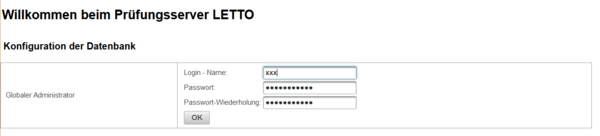

# Installation Glassfish Server
##  Installation Glassfish Server
* Aktionen durchführen als user "letto"
* Download der glassfish-4.1.2.zip [https://javaee.github.io/glassfish/download](https://javaee.github.io/glassfish/download), entpacken der zip und verschieben nach /opt
<pre>wget http://download.java.net/glassfish/4.1.2/release/glassfish-4.1.2.zip
unzip glassfish-4.1.2.zip
sudo mv glassfish4 /opt/
</pre>
* Kontrolle ob der Benutzer "letto" alle Recht im Verzeichnis /opt/glassfish4 hat
* Glassfish Secure Admin starten und Admin-Passwort setzen (altes Passwort ist nach einer Neuinstallation leer!)
<pre>/opt/glassfish4/glassfish/bin/asadmin --port 4848 change-admin-password
</pre>
* Glassfish Server starten als Benutzer "letto"
<pre>/opt/glassfish4/glassfish/bin/asadmin start-domain
</pre>
* Secure-Admin aktivieren
<pre>/opt/glassfish4/glassfish/bin/asadmin --port 4848 enable-secure-admin
</pre>
* MySQL Database-Connector [https://dev.mysql.com/downloads/connector/j/](https://dev.mysql.com/downloads/connector/j/) herunterladen und ins Glassfish-Verzeichnis kopieren:
<pre>wget https://dev.mysql.com/get/Downloads/Connector-J/mysql-connector-java-5.1.47.zip
unzip mysql-connector-java-5.1.47.zip
cp mysql-connector-java-5.1.47/mysql-connector-java-5.1.47.jar /opt/glassfish4/glassfish/domains/domain1/lib/
</pre>
* Glassfish neu starten
<pre>/opt/glassfish4/glassfish/bin/asadmin stop-domain
/opt/glassfish4/glassfish/bin/asadmin start-domain
</pre>
* Im Webbrowser die Glassfish-Admin-Konsole am Port 4848 öffnen und nun die Admin-Konsole konfigurieren
###  Glassfish Konfiguration in der Admin-Konsole 
####  Einrichten der JPA-Datenbank-Verbindung 
* Resources - JDBC - JDBC Connection Pools - New
<pre>Pool Name: letto
Resource Type: java.sql.Driver
Database Driver Vendor: MySql
</pre>
-&gt; Next
<pre>URL: jdbc:mysql://localhost/letto?useSSL=false
user: letto
password: Passwort welches am MySQL-Server für den Benutzer letto angelegt wurde
</pre>
-&gt; Finish
*Resources - JDBC - JDBC Resources - New
<pre>
JNDI-Name: jdbc/letto
Pool-Name: letto
</pre>
-&gt; ok

####  Heap-Speicher setzen 
Der Heap-Speicher sollte maximal so groß gesetzt werden, dass noch genug RAM für Linux übrig bleibt (zB. 70-80% das verfügbaren RAM-Speichers)
* Configuration - Server config - JVM settings - JVM Options
<pre>-Xmx8192m
</pre>
###  Einrichten des Security-Managers für das SourceCode-Plugin 
* Von der Konsole aus die Datei /opt/glassfish4/glassfish/domains/domain1/config/server.policy bearbeiten
* Am Ende anfügen: 
<pre>grant {
      permission java.util.PropertyPermission "java.security.policy", "write";
      permission java.lang.RuntimePermission "createSecurityManager";
      permission java.lang.RuntimePermission "setSecurityManager";
      permission java.security.SecurityPermission "getPolicy";
      permission java.security.SecurityPermission "setPolicy";
      permission java.lang.RuntimePermission "accessDeclaredMembers";      
      permission java.lang.RuntimePermission "setIO";
      permission java.lang.reflect.ReflectPermission "suppressAccessChecks";
};
</pre>
* Suche nach 
<pre>permission java.io.FilePermission       "&lt;&lt;ALL FILES&gt;&gt;", "read,write";
</pre>
wenn es gefunden wurde -&gt; ändern auf:
<pre>permission java.io.FilePermission "&lt;&lt;ALL FILES&gt;&gt;","read"; 
</pre>
###  Nach den Konfigurationen Glassfish neu starten 
* Glassfish Server starten als Benutzer "letto"
<pre>/opt/glassfish4/glassfish/bin/asadmin stop-domain
/opt/glassfish4/glassfish/bin/asadmin start-domain
</pre>

##  letto.war deployen 
* Die aktuelle Version von letto als Datei letto.war auf einem Client herunterladen
* Im Webbrowser die Glassfish-Admin-Konsole am Port 4848 öffnen
* Applications - Deploy 
* Das war-File eintragen und ok
* Nun sollte auf Port 8080 der http und auf Port 8181 der https-Server im Verzeichnis /letto zugreifbar sein
* Beim Ersten Zugriff auf den Server muss der [globale Administrator](../GlobalerAdministrator/index.md) gesetzt werden.
 
* Danach kann man mit dem globalen Administrator einloggen und den Server weiter konfigurieren
##  siehe auch 
* [Installation](../Installation/index.md)

