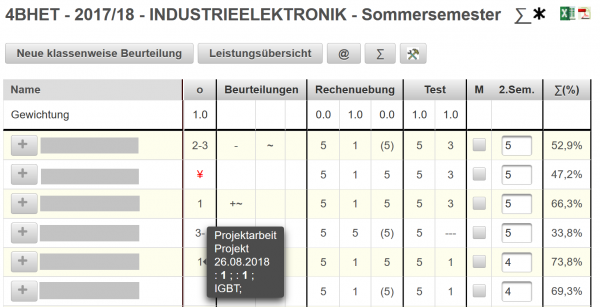

# Katalog
 
Unter Katalog versteht man bei LeTTo eine Sammlung von allen Leistungen der Schüler eines Gegenstandes in einer Klasse (Namen wurden in nebenstehender Abbildung unkenntlich gemacht).

Wenn Sie zB. in einer Klasse 3 Fächer unterrichten, dann finden sie im [Klassenzimmer](../Klassenzimmer/index.md) drei Kataloge für jeden Gegenstand.
Je nach Lehrplan und Schultyp (Klassen jahrweise geführt, Klassen semestriert laut NOST, ...) sind die Kataloge über das ganze Schuljahr oder nur über ein Semeseter geführt.

Einstellungen zur Gewichtung der Beurteilungen, zum Freischalten der Eingaben für Schüler und zur Definition der Darstellung finden Sie unter [Beurteilungskonfiguration](../Beurteilungskonfiguration/index.md).

### Übersicht
In der Titelzeile finden Sie Klasse, Schuljahr und Gegenstandbezeichnung sowie eventuell die Einschränkung auf Sommer- oder Wintersemester. Folgende Icons stehen in der Titelzeile für weitere Aktionen bereit:
* : [Lehrerübergreifende Anzeige von allen Leistungen im ganzen Schuljahr](../LehrerübergreifenderKatalog/index.md)
* : Anzeige des Wintersemesters
* : Anzeige des Sommersemester
* : Export des Katalogs als Excel-File
* : Druck des Katogs in ein PDF-Dokument

In der zweiten Zeile finden Sie folgenden Buttons:
* **Neue Klassenweise Beurteilung**: Fügt eine neue [Klassenweise Beurteilungen](#klassenweise-beurteilungen-) ein
* **Leistungsübersicht**: Anzeige einer Leistungsübersicht für alle Schüler der Klassen inklusive **kompetenzorientierter Auswertung**.
* : Anzeige des angewendeten Beurteilungsschemas und der dort definierten Einstellungen
* : Umschalten zwischen der eigenen Ansicht und der Summenansicht über alle Lehrer, die in einer Klasse den selben Gegenstand unterrichten (zB. Labor mit 4 Lehrern in der gleichen Klasse).
* : Definition, welche Spalten angezeigt werden sollen und was eingebbar sein soll.

Darunter finden Sie eine Tabelle mit der Dokumentation von Beurteilungen von allen Schülern dieser Klasse.
 

Folgende Spalten sind verfügbar:
* Name: Name des Schülers
* Beurteilungen: Anzeige von allen [Individualbeurteilungen](#individualbeurteilungen-), die in dieser Klasse verwendet wurden. Die Spaltenanzahl verändert sich dynamisch, angepasst an die Anzahl pro Schüler.
Spalten für alle Arten von [Online-Tests](../Online-Tests/index.md) wie Tests, Schularbeiten, Stundenwiederholungen, Rechenübungen oder Hausübungen. Jede Test-Art wird in einer eigenen Bereich angezeigt und kann auch pro Testart über die [Konfiguration der Anzeige](#konfiguration-der-anzeige-) wieder ausgeblendet werden.
* Spalten zur Noteneingabe mit einer Teilspalte für Mahnungen und für die vergebene Note im Semester oder Schuljahr. Auch die Notenspalten sind über die [Konfiguration der Anzeige](#konfiguration-der-anzeige-) einstellbar.

**Gewichtung**: Alle [Online-Tests](../Online-Tests/index.md) und alle [Klassenweise Beurteilungen](#klassenweise-beurteilungen-) haben standardmäßig eine Gewichtung von 1, die jedoch im Bedarfsfall geändert werden kann. Damit können zB. unterschiedlich lange Projektarbeiten angepasst gewichten oder Vorbereitungs-Tests für eine Schularbeit ganz von der Beurteilung ausklammern (Gewichtung = 0).

Die ganze Tabelle ist bei vielen Eingaben auch vertikal verschiebbar (scrollbar)!

### Konfiguration der Anzeige
 

Mit dem -Button öffnen Sie einen Dialog zur Konfiguration der Anzeige. 
In der ersten Zeile sind alle Arten von [Online-Tests](../Online-Tests/index.md) angeführt, die ein- oder ausgeblendet werden können.
Die Checkboxen der zweiten Zeile haben folgende Bedeutung:
* Mahnungen: Im Katalog wird pro Semester eine Spalte mit Checkboxen für Mahnungen eingeblendet.
* Noten editierbar: Ist die Checkbox ausgewählt, dann können direkt im Katalog die Noten eingetragen werden. Bei negativen Noten wird automatisch eind Dialog zur Auswahl von negativen Lehrinhalten geöffnet.
* Fotos: Im Katalog werden die Schülerfotos eingeblendet, wenn die [Fotos hochgeladen hochladen-von-schülerfotos](../Datenimport/index.md#hochladen-von-schülerfotos) wurden.
* Prozentanzeige: Im Katalog werden für die meisten Beurteilungen keine Symbole, sondern Prozentwerte angezeigt. Welche Beurteilungsformen davon betroffen sind, wird in der [Beurteilungskonfiguration](../Beurteilungskonfiguration/index.md) festgelegt.

Mit dem -Button werden die Darstellungs-Optionen für all ihre Kataloge gespeichert. Mit der ESC-Taste kann der Dialog auch geschlossen werden.

### Individualbeurteilungen
Individualbeurteiungen werden verwendet, wenn nur für einzelne Schüler eine Aufzeichnung geführt werden soll. Beispiele sind einzelne Mitarbeitsaufzeichnungen, Prüfungen etc., die nicht aller Schüler der Klasse betreffen.

#### Hinzufügen einer neuen Individualbeurteilung
 
Zur Eingabe einer neuen Note für eine Individualbeurteilung klicken Sie bitte auf das -Symbol links neben dem Schülernamen. Damit öffnet Sie die Eingabemaske für die Beurteilung.

##### Noteneingabe
Im linken Bereich finden Sie alle Bedienelemente zur Beurteilung einer Schülerleistung:

Die Buttons in der ersten Zeile stellen die möglichen Beurteilungsarten lt. [Beurteilungskonfiguration](../Beurteilungskonfiguration/index.md) dar. Wählen Sie davon eine Beurteilungsart aus. Je nach gewählter Beurteilungsart werden die möglichen Symbole für die Beurteilung eingeblendet.

Wählen Sie das gewünschte Beurteilungssymbol aus. Damit wird auch automtisch ein Prozentwert lt. Beurteilungskonfiguration definiert.

Bei dafür vorgesehenen Beurteilungsarten können Sie auch Prozentwerte für die Leistung eingeben.

Im Textfeld Fragetext können Sie auch die Aufgabenstellung dokumentieren.

##### Kompetenzen/Deskriptoren
Auf der rechten Seite der Eingabe finden Sie die Themen, die im aktuellen Semester/Schuljahr zu unterrichten sind. Details unter [Kompetenzen](../Kompetenzen/index.md).

Wählen Sie für die Individualbeurteilung ein Thema und die Tiefe (Grundlagen, Erweiterungswissen) der Fragestellung aus.

Mit **Speichern** wird die Beurteilung abgeschlossen.

**Abbrechen** bricht die Beurteilung ab und schließt das Eingabeformular.

### Klassenweise Beurteilungen
Im Gegensatz zu Individualbeurteilungen ist bei Klassenweisen Beurteilungen die Leistung von allen Schülern der Klasse zu erbringen. Beispiele für Klassenweise Beurteilungen sind Aufzeichnungen über Hausübungen, Tests, Laborübungen, Projektarbeiten etc.

Jede Klassenweise Beurteilung wird im Katalog als eigene Spalte geführt, um die Übersichtlichkeit zu erhöhen. In der [Beurteilungskonfiguration](../Beurteilungskonfiguration/index.md) wird festgelegt, wie die Spaltenüberschrift dargestellt wird. Optionen sind ein o-Symbol, die ersten Zeichen des Namens oder die vollständige Bezeichnung. Das Kreis-Symbol wird verwendet, um die Tabelle übersichtlich zu halten. Tooltips, die den Namen der Spalte und die Beurteilungsart anzeigen, unterstützen Sie, beim Noteneintragen die richtigen Spalten zu finden.
 

Alle Noten, die zu einer Klassenweisen Beurteilung gehören, haben eine gleiche Bezeichnung, gleiche Aufgabenstellung, gleiche Beurteilungsart und gleiche Kompetenzen zugewiesen.

 
#### Hinzufügen einer klassenweisen Beurteilung

Nach dem Drücken des Buttons **Neue Klassenweise Beurteilung** wird ein Dialog zur Definition einer neuen klassenweisen Beurteilung geöffnet.

Die **Bezeichnung** legt die Namen der Klassenweisen Beurteilung fest. Dieser Namen wird dann in allen Tooltips bei der Eingabe angezeigt.

Das **Datum** legt das Startdatum dieser Beurteilung fest. Nach diesem Datum werden im Katalog die Spalten der Klassenweisen Beurteilungen sortiert!

Mit der Checkbox **Datum anzeigen** wird ausgewählt, ob bei der Beurteilungseingabe zu einer klassenweisen Beurteilung auch das Beurteilungsdatum eingeblendet und damit änderbar ist. Damit kann vor allem eine Beurteilung in ein anderes Semester verschoben werden. Beurteilungen, deren Beurteilungsdatum nicht im aktuellen Semester liegen, werden bei semestrierten Klassen ausgegraut dargestellt und werden nicht für die Prozentberechnung herangezogen.

**Noten importieren:** ist ein Zusatzfeature, mit dem Noten von externen Quellen (ExcelSheets,...) importiert werden können: Die einzelnen Noten können durch Leerzeichen, Beistrich oder Strichpunkt getrennt sein. Die Noten werden den Schülern in alphabetischer Reihenfolge aufsteigend zugeordnet.

Die **Aufgabenstellung** kann eine optionale Beschreibung der Aufgabenstellung enthalten.

Die Buttons in der folgenden Zeile stellen die möglichen Beurteilungsarten lt. [Beurteilungskonfiguration](../Beurteilungskonfiguration/index.md) dar. Wählen Sie davon eine Beurteilungsart aus. Je nach gewählter Beurteilungsart werden bei der späteren Noteneingabe die möglichen Symbole, Prozenteingaben oder auch Teilnoten festgelegt.

Im Bereich Kompetenzen / Deskriptoren können Sie die entsprechenden Lehrinhalte und das Level der Aufgabenstellung festlegen.

Mit Speichern wird die Definition der Klassenweisen Beurteilung abgeschlossen. Abbruch beendet den Dialog, ohne die Eingaben zu speichern.

#### Eingeben von Noten zu einer Klassenweise Beurteilung
Navigieren Sie mit der Maus in die entsprechende Zeile und Spalte im Katalog. Tooltips, die den Namen der Spalte und die Beurteilungsart anzeigen, unterstützen Sie, die richtigen Spalten zu finden.
 
An der gewünschte Postition klicken Sie die Stelle an und es wird ein Dialog zur Noteneingabe angezeigt. Dieser Dialog ist abhängig von der definierten Beurteilungsart und kann sehr unterschiedlich wirken.

  
Dialog, der bei der Eingabe einer Mitarbeitsnote verwendet wird
 
Noteneingabe, die sich aus mehreren Teilnoten zB. bei einer Laborübung zusammensetzt. Nächer Informationen unter [Beurteilungskonfiguration](../Beurteilungskonfiguration/index.md).
Bei mehreren Teilnoten wird durch die definierte Gewichtung (ist neben der Beichnung der Teilnoten in Klammern gesetzt) automatisch die Gesamtnote berechnet, die jedoch noch durch den Lehrer überschrieben werden kann.

#### Zusammengesetzte Beurteilungen
Bei Klassenweisen Beurteilungen kann sich eine Note aus mehreren Teilnoten zusammensetzen. Die verwendeten Teilergebnisse und deren Gewichtung wird in der [Beurteilungskonfiguration](../Beurteilungskonfiguration/index.md#weitere-beurteilungen) definiert.

Beispiele für solche zusammengesetzten Noten sind Laborübungen (Prüfung, Mitarbeit, Protokoll) oder Projekte (Mitarbeit, Dokumentation). Es kann auch festgelegt werden, welche Teile der Note zwingend vorgeschrieben sind, um alle Anforderungen zu erfüllen. Beispiel hierfür ist eine Laborübung, wo ein Laborprotokoll zwingend erforderlich ist. Die Labornote erscheint im Katalog in roter Farbe wenn die Labornote negativ ist und dies ist unter folgenden Umständen der Fall:
* die Note für das Protokoll ist (noch) nicht eingetragen
* die Note für das Protokoll ist negativ
* die Gesamtnote, die aus dem Mittelwert der Teilnoten gebildet wird, ist negativ

Soll ein Schüler von so einer erzwungen Noteneingabe befreit werden, kann als Note ein * eingegeben werden. Dies führt dazu, dass zB. kein Protokoll erstellt werden muss und die Note erscheint im Katalog in blauer Farbe.

### Ergebnisse von [Online-Tests](../Online-Tests/index.md)
Nach dem Starten des Testversuchs eines Schülers sind die Ergebnisse (Noten) bereits im Katalog sichtbar. Wenn 

### Mahnungen und Noteneingabe
Wenn bei der [Konfiguration der Anzeige](#konfiguration-der-anzeige-) die Checkboxen für  gesetzt wurden, dann können Sie Mahnungen für Schüler vermerken oder die Semester- bzw. Jahresnoten eintragen. 

 
**Tipp:** Bei der Eingabe von negativen Noten öffnet sich ein Dialog zur Auswahl von Lehrzielen und Lehrinhalten, die nicht positiv beurteilt wurden. Die Lehrinhalte und Lehrziele entsprechen den am Zeugnisbeiblatt abgebildeten negativen Teilen. Sollte eine Klasse **kompetenzorientiert** geführt werden, dann Setzen Sie bitte hier die entsprechenden Checkboxen bei den negativen Inhalten.

Dieser Dialog ünterstützt Sie bei der Auswahl der neagtiven Lehrinhalte und Deskriptoren: Sie bekommen alle Beurteilungen, die Themen und Lehrinhalten zugeordnet wurden, zusammengefasst angezeigt und können nicht erbrachte Lehrinhalte auswählen. Ist dieser Lehrinhalt genau einem Deskriptor zugeordnet, dann wird dieser automatisch negativ gesetzt. Sind mehrere Deskriptoren für diesen Lehrinhalt möglich, dann werden alle passenden Deskriptoren eingeblendet und Sie müssen die passenden Deskriptoren auswählen.

 

### Gruppierung
Wenn in der [Beurteilungskonfiguration gruppierung](../Beurteilungskonfiguration/index.md#beurteilungsgruppierungen-) für diesen Katalog die Gruppierung aktiviert wurde, dann ist im linken Bereich eine Spalte mit Gruppe vorhanden. Weiters ist in der obersten Button-Leiste des Katalogs der 
-Button sichtbar, mit dem die Gruppen-Spalte zum Bearbeiten freigeschaltet werden kann.

Die Schüler können dann Gruppen zugeordnet werden. 

Nach dem Eintragen der Gruppenbezeichnungen können die Schüler gruppenweise sortiert werden, indem Sie auf die Spaltenüberschrift 'Gruppe' klicken. Die alphabetische Sortierung erreichen Sie über einen Klick auf die Spaltenüberschrift 'Name'.

