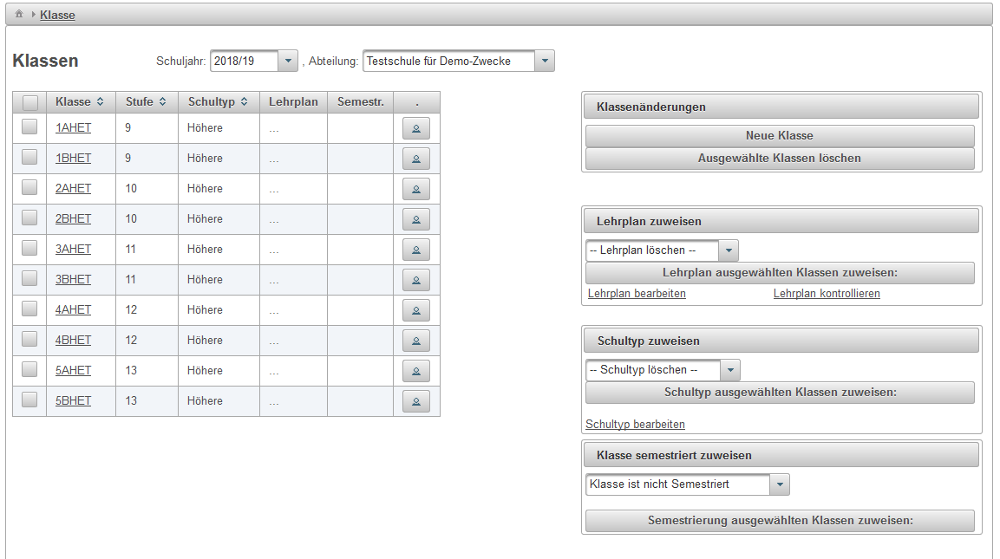
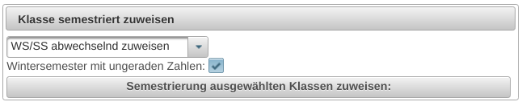
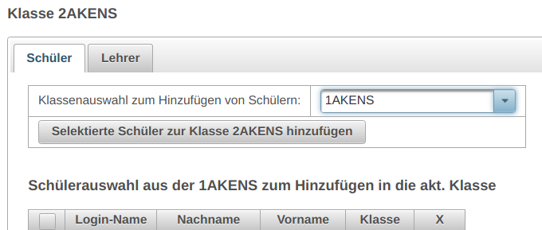

# Klasse
##  Allgemeines 

Änderungen dürfen nicht in der Rolle _Lehrer_, sondern müssen in der Rolle _Admin_ vorgenommen werden. 

 

###  Klasse semestriert zuweisen 

Mögliche Optionen sind:

* **Klasse ist nicht semestriert**: das sind typisch die 9. Schulstufe und höhere Schulstufen die nicht in der NOST sind, z.B. 1AHET
* **Klasse im Wintersemester**: das sind typisch die ungeraden Klassen des Kollegs, z.B. 3AKENS
* **Klasse im Sommersemester**: das sind typisch die geraden Klassen des Kollegs, z.B. 4AKENS
* **Klasse ganzes Jahr gültig**: das sind typisch die höheren Schulstufen, die sich in der NOST befinden
* **WS/SS abwechselnd zuweisen**: das ermöglich die automatisierte Zuweisung von z.B. Kollegklassen, die andernfalls manuell über **Klasse im Wintersemester** oder **Klasse im Sommersemester** eingestellt werden; bei dieser Auswahl kann man über eine Checkbox auswählen, ob Wintersemester den ungeraden Zahlen zugeordnet ist

 

###  Semestriert geführte Klassenbezeichnungen 

Semestriert geführte Klassen, beispielsweise eines Kollegs, können über die Schaltfläche _Klasse semestriert zuweisen_ gesondert dem Winter- oder Sommersemester zugewiesen werden. 

Bei einer semestriert geführten Klassenbezeichnung müssen die Schüler aus den Klassen des Wintersemesters nach den Semesterferien in die Klasse des Sommersemesters übernommen werden. Neue hinzugekommene Schüler müssen entweder eine Export-CSV-Datei der Daten aus Sokrates oder vom Administrator einzeln hinzugefügt werden. 

Um beispielsweise die Schüler der Klasse 1AKENS in die Klasse 2AKENS zu übertragen, klickt in der Zeile der Klasse 2AKENS, der man die Schüler zuordnen möchte, auf das ganz links befindliche Symbol _Anzeige von Schülern und Lehrern in dieser Klasse_. Dann wählt man die Abteilung die Klasse 1AKENS aus der man die Schüler hinzufügen möchte.

 

Wählt man das Häkchen ganz links oben aus, so werden alle Schüler markiert. Andernfalls kann man die Häkchen auch manuell auswählen. Danach klickt man auf die Schaltfläche _Selektierte Schüler zur Klasse 2AKENS hinzufügen_ aus.

##  siehe auch 

* [Schul-Administrator](../Schul-Administrator/index.md)

