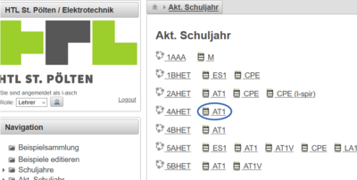
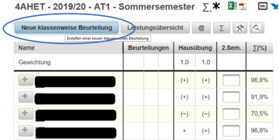
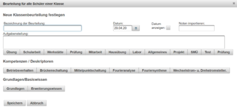
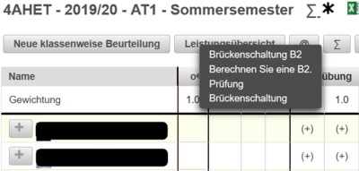

# Klassenweise Beurteilungen

 Um eine neue klassenweise Beurteilung im Notenkatalog einzutragen wählen Sie die betreffende Klasse in Ihrer Hauptansicht am LeTTo-Server (Dargestellt am Bsp. 4AHET in AT1).
 Sie werden zur Beurteilungsübersicht weitergeleitet. Wählen Sie den Button **Neue klassenweise Beurteilung**.
Der sich öffnende Dialog erlaub Ihnen unterschiedlichste Beurteilungen für die gesamte Klasse anzulegen.

 

 

