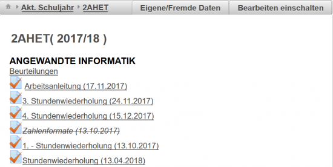
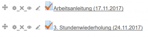
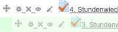
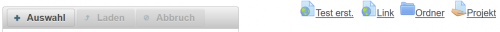
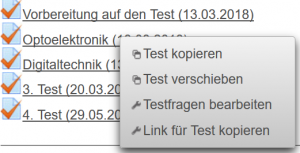

# Klassenzimmer
 
Das **Klassenzimmer** bietet eine Übersicht über alle für diese Klasse bereitgestellten Lernmaterialien (Aktivitäten), ähnlich einem Kurs in MOODLE. 

Aufruf der Klassenzimmer-Seite über die [Schuljahr-Ansicht](../Schuljahr/index.md).

## Klassen-Übersicht
In der **Kopfzeile** finden sie Links zur Navigaton zu anderen Klassen.
* Akt.Schuljahr: Hier kann zur Klassenliste des aktuellen Schuljahres gewechselt werden
* 2AHET: die aktuelle Ansicht
* Eigene/Fremde Daten: Blendet fremde Gegenstände von anderen Lehrern aus oder ein.
* Bearbeiten einschalten: Hier können die Aktivitäten für dieses Klassenzimmer konfiguriert/geändert werden.

Gegenstandsbereich:
Nach der Klassen- und Schuljahresbezeichnung folgen die unten beschriebenen Links.

### Beurteilungen / 1.Semester / 2. Semester
Über diese Links, die immer in der Zeile unterhalb der Gegenstandbezeichnung zu finden sind, kann man den [Katalog](../Katalog/index.md) des jeweiligen Gegenstandes öffnen.

Abhängig vom Lehrplan oder der Schulform (Jahrgangsweise / Semestrierung lt. Nost / ...) wird der Katalog für das ganze Schuljahr oder nur für ein Semester geführt.

Für Schüler sind die Beurteilungen des Lehrers dann sichtbar, wenn in der [Beurteilungskonfiguration](../Beurteilungskonfiguration/index.md) die Freigabe der Anzeige der Noten ausgewählt wurde.

### Aktivitäten
Alle Materialien, die dem Schüler bereitgestellt werden, sind unter dem Begriff Aktivitäten zusammengefasst. Dazu gehören:
* **Link**: Ein normaler Link im Internet
* Verzeichnis / **Ordner**: Ein Verzeichnis, das wieder mehrere andere Elemente/Aktivitäten enthalten kann
* **Test**: Ein Online-Test, der mit dem Testmodul erstellt wurde
* **Projekt**: Ein Projekt bei dem die Schüler Daten am Server abgeben können (Noch nicht implementiert!)
* **Dokumente**, die dem Schüler bereitgestellt werden.

### Bearbeiten einschalten (Inhalte bearbeiten)
Mit dem Button **Bearbeiten Einschalten** können Lehrer in den Bereichen, die ihre Fächer betreffen, Änderungen vornehmen. 
Beim Umschalten ändert sich die Ansicht, um den Betriebsmodus **Änderung** deutlich zu machen.
 

Sie können
* die Ordnung von Aktivitäten über das -Symbol ändern und Einträge in ihrer Position verschieben (Sortieren der Aktivitäten). Achten Sie bei den Drag-and-Drop-Operationen darauf, dass sie nur in den grünen Einfügebereichen die Maustaste wieder loslassen. Wenn Sie Aktivitäten (Tests, Dokumente, ...) in einen Ordner verschieben wollen, dann 
  müssen Sie das Verschiebe-Symbol auf das Ordner-Icon () ziehen,
* Aktivitäten über das -Lösch-Symbol löschen ,
* Aktivitäten mit dem -Bleistift-Symbol umbenennen,
* die Sichtbarkeit über das -Augen-Symbol ändern (damit können Tests,... für die Schüler unsichtbar gemacht werden). Ist eine Aktivität für den Schüler unsichtbar, dann ändert sich das Icon auf ein durchgestrichenes Auge und die Bezeichnung der Aktivität wird grau/durchgestrichen oder unterstrichen dargestellt (abhängig vom Browser). Das Umschalten der Sichtbarkeit wird empfohlen beim Tests, die erst im Klassenzimmer unmittelbar vor Testbeginn so freigegeben werden.

#### Einfügen von Aktivitäten / Dokumenten
 

Am Ende jedes Gegenstand-Bereiches finden Sie einen Upload-Bereich für bereitgestellte Dokumente: Über **+ Auswahl** können Sie beliebige Dateien auswählen und mit **Laden** dann auf den Server stellen.

Mit **Test erstellen**, **Link**, **Ordner** können Sie diese Aktivitäten am Server definieren.

**ACHTUNG:** [Tests](../ErstellenvonTests/index.md) bitte in der [Beispielsammlung](../Beispielsammlung/index.md) oder im [Editiermodus](../BeispielsammlungEditieren/index.md) definieren!
#### Kontext-Menü
 

Bei allen Aktivitäten ist ein Kontext-Menü verfügbar:
* [Test kopieren](../Testkopieren/index.md): Hiermit können Sie eigene Tests oder auch Tests von Kollegen (siehe [Eigene / Fremde Daten](#eigene-/-fremde-daten-)) in einen anderen Gegenstand/Ordner kopieren und dort unter neuem Namen anlegen.
* [Test verschieben](../Testkopieren/index.md#test-verschieben): Hiermit können Sie nur eigene Tests in einen anderen Gegenstand/Ordner verschieben.
* Testfragen bearbeiten: Hiermit wechseln Sie in die [Beispielsammlung](../Beispielsammlung/index.md) und es wird automatisch der ausgewählte Test zur Bearbeitung festgelegt, sodass Sie Testfragen hinzufügen, löschen oder ändern können.
* Link für Test kopieren: Mit dem hiermit erstellen Link können Sie einen Verweis erstellen, den Sie auf externen HTML-Seiten verwenden können. Beim Aufruf dieses Links wird nach dem Login automatisch der gewünschte Test geöffnet.

### Eigene / Fremde Daten
Lehrer sehen standardmäßig nur die Inhalte von den Fächern, in denen sie unterrichten. Mit dem Button **Eigene/Fremde Daten** kann diese Ansicht erweitert werden, sodass alle Unterrichts-Materialien von allen Gegenständen angezeigt werden. Nach einem weiteren Klick auf diesen Button werden wieder nur mehr die eigenen Gegenstände angezeigt.

Das Umschalten auf **Fremde Daten** kann dazu genutzt werden, einen Test eines Kollegen in einer bestimmten Klasse in einem _eigenen_ Gegenstand zu verwenden und diesen Test mit allen angehängten Fragen zu kopieren. 

Dazu auf dem gewünschten Test mit der rechten Maustaste das Kontext-Menü öffnen und **Test kopieren** wählen.

