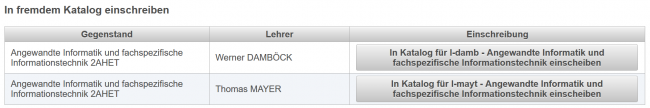

# Klassenzuordnung
[Zurück zur Hauptansicht](../LeTTo-Hauptansicht/index.md)

### Neuen Eintrag in der Lehrfächerverteilung erstellten
Im oberen Bereich können Sie einen neuen Gegenstand hinzufügen.
 
Mit den Auswahlboxen bitte Schuljahr, Abteilung, Klasse und Gegenstand auswählen und mit **Zuordnung hinzufügen** abschliessen.
Optional wird in [speziellen Konfigurationsfällen](/notimplemented/index.md) ein Button zum Anlegen von neuen Gegenständen angezeigt. 

### Liste aller Gegenstände laut Lehrfächerverteilung
Unter **Bisher zugeteilte Klassen** finden sie alle Gegenstände und Klassen laut Lehrfächerverteilung und alle Einträge, die sie selber hinzugefügt haben.
 

Die Spalten am rechten Rand haben folgende Funktion:
* : Katalog ist sichtbar oder unsichtbar
* : Kollegen dürfen sich in ihren Katalog _einschreiben_: Das bedeutet, dass Sie in diesem Gegenstand Beurteilungen und Online-Tests anlegen dürfen, aber keine Änderungen ihrer Beurteilungen vornehmen können.

Die Gegenstandsbezeichnungen sind als Links ausgeführt, mit denen Sie alternative Bezeichnungen für dieses Fach vergeben können:
 
Dieser alternative Bezeichnungen führt zu einer Umbenennung des Katalogs, wie unten dargestellt:
 

### Liste mit allen benutzerdefinierten Gegenstands-Zuordnungen
Rechts davon sehen Sie alle vom Benutzer hinzugefügten Klassen / Fächer:
 
Alle benutzerdefiniert hinzugefügten Einträge können auch wieder vom Benutzer mit dem Löschen-Button gelöscht werden.

## Änderungen in fremden Katalogen
Um im Fall von Supplierungen oder beim Teamteaching nicht mehrere getrennte Kataloge führen zu müssen, können Sie sich in Katalogen von Kollegen einschreiben.

Dazu muss dieser [Liste aller Gegenstände laut Lehrfächerverteilung](#liste-aller-gegenstände-laut-lehrfächerverteilung-) worden sein. 

Wählen Sie bitte Schuljahr, Abteilung, Klasse und Gegenstand in der Auswahlbox oben aus, dann sehen Sie eine Liste mit Auswahlmöglichkeiten zum Einschreiben in fremde Kataloge:
 
Wählen Sie den entsprechenden Button zum Einschreiben in diesem Katalog. Ist das Bearbeiten dieses Katalogs vom Lehrer freigegeben worden, dann können Sie ab sofort in diesem Katalog Eintragungen und Online-Tests durchführen.

Alle Einschreibungen auf **fremde Kataloge** werden in einer Liste angezeigt. Über den Button **Eintrag wieder löschen** können Sie die Einschreibung im fremden Katalog wieder aufheben.
 

Nach der Einschreibung ist in der Schuljahresübersicht dieser fremde Katalog unter der Gegenstandsbezeichnung und in Klammern dem Kürzel des hauptverantwortlichen Lehrers zu finden:
 
Sie können nun in diesem Katalog Beurteilungen eintragen und Online-Tests anlegen. Alle ihre Eintragungen werden unter ihrem Namen gespeichert, sind farblich gekennzeichnet und nachvollziehbar ihnen zugeordnet.
Sie können keine Beurteilungen des hauptverantwortlichen Lehrers ändern oder löschen.
 

