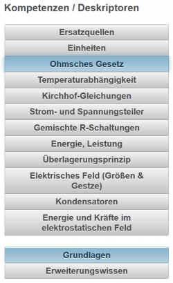

# Kompetenzen
Mit LeTTo können alle Beurteilungen bei [Online-Tests](../Online-Tests/index.md) als auch bei allen Formen von [Individualbeurteilungen](/notimplemented/index.md) und [Klassenweisen Beurteilungen](/notimplemented/index.md) **kompetenzorientiert** erfolgen. Dazu können die Lehrpläne aus Sokrates importiert werden. Die unterschiedlichen Lehrpläne können dann den entsprechenden Klassen, die nach diesen Lehrplänen geführt werden, zugeordnet werden. 

## Lehrpläne

Österreichische Lehrpläne sind aufgebaut aus Lehrzielen (Deskriptoren) und Lehrinhalten. Die Zuordnung zwischen Lehrzielen und Lehrinhalten ist leider nicht durchgängig erfolgt, sodass folgende Fälle auftreten können:
* Ein Lehrziel hat mehrere Lehrinhalte, die genau diesem Lehrziel zugeordnet sind.
* Mehrere Lehrziele sind mehreren Lehrinhalten zugeordnet, wobei hier keine eindeutige Zuordnung besteht.

Die Lehrinhalte sind in den Lehrplänen sehr unterschiedlich genau definiert. Es gibt Schulstufen, die für ein ganzes Jahr nur einen Lehrinhalt formuliert haben, andere wiederumg haben bis zu zehn Lehrinhalte definiert. Folgende Beispiele demonstrieren das:

**Beispiel 1: Energiesysteme 1. Klasse HTL für Elektrotechnik:**

* das Verhalten elektrischer Schaltungen in Gleichstromkreisen untersuchen und begründen;
  * Gleichstromtechnik (Größen und Gesetze, Leistung, Arbeit, Wirkungsgrad, Anpassung, Berechnung von linearen Netzwerken, Stromleitung, temperaturabhängige Widerstände); 
* die grundlegenden Gesetze der Elektrotechnik anwenden.
  * Elektrisches Feld (Größen und Gesetze, Energie und Kräfte im elektrostatischen Feld). 
Hier gibt es eine eindeutige Zuordnung zwischen Lehrzielen und Lehrinhalten, wobei die Lehrinhalte sehr allgemein formuliert sind.

**Beispiel 2: Antriebstechnik, 2. Jahrgang, 2. Klasse HTL für Elektrotechnik:**

* den Aufbau und die Eigenschaften magnetischer Werkstoffe beschreiben;
* die Anwendung und Ausnutzung magnetischer Felder in elektrischen Maschinen und Geräten erklären;
* die Induktionsvorgänge und die Kraftwirkungen in Magnetfeldern erklären.
  * Induktionsvorgänge (zeitlich veränderliche Magnetfelder, Bewegungsspannung, Induktivitäten, Selbstinduktion, Gegeninduktion);
  * Kräfte und Energie im Magnetfeld (Kräfte zwischen Leitern, Kräfte an Grenzflächen);
  * magnetische Felder, Feldverteilungen;
  * magnetische Größen;
  * magnetische Werkstoffe (dia-, para-, ferromagnetische Stoffe, Weicheisen, Dauermagnete);
  * magnetischer Kreis (Ersatzschaltung, Analogie zum elektrischen Kreis).
* die Bauformen, die Betriebsarten, die Schutzarten und die Kühlarten elektrischer Maschinen und Transformatoren auswählen;
  * Elektrische Ausrüstung von Maschinen, Motorschutz;
* die einschlägigen Vorschriften und Normen von elektrischen Maschinen und Transformatoren anwenden;
  * nationale und internationale Normen und Vorschriften (Betriebsarten, Schutzarten, Wärmeklassen, Kühlarten, Bauformen und Baugrößen);
* einfache Erwärmungs- und Abkühlvorgänge analysieren;
  * Verluste, Kühlung.
* das Leistungsschild elektrischer Maschinen und Transformatoren interpretieren.
  * Leistungsschildangaben.

Man sieht hier eine Menge von mehreren Lehrinhalten, die drei Deskritoren zuordenbar sind. Weiters sind die Lehrinhalte für nur ein Semester extrem stark aufgeschlüsselt. Vor allem der Unterschied zwischen diesen beiden Gegenständen ist signifikant. Die Lehrinhate sind weiters sehr ausführlich.

## Themen
 

Darum wurde in LeTTo ein **themenbezogener Ansatz** gewählt, bei dem jeder Lehrinhalt in ein bis mehrer Themen unterteilt werden, die möglichst kurze und sprechende Bezeichnungen haben sollten.

Ein weiterer Vorteil dieses **themenbezogenen Ansatzes** ist die Möglichkeit, die definierten Themen bei einer Lehrplanänderung einfach an den neuen Lehrplan zu binden und damit die Beispielsammlungen ohne großartige Änderungen auch an den neuen Lehrplan anzupassen.

Durch die Zuordnung eines Lehrplanes an eine Klasse bekommt der Lehrer bei einer Beurteilung alle Themen angezeigt, die im aktuellen Semester oder Schuljahr zu unterrichten sind. Einfache Auswahl von Thema und Schwierigkeitsgrad (Basiswissen, Erweiterungswissen) ist über die Oberfläche möglich.

Alle Themen können auch mit Erläuterungen zu Grundlagen- und Erweiterungswissen versehen werden, um für Schüler transparent zu machen, welche Leistungen sie zu welchem Thema erbringen müssen. Die Zuordnung zwischen Lehrinhalt und Themen erfolgt zentral und ist für alle Lehrer gleich.

 
Obige Abbildung zeigt so eine Zuordnung von Lehrinhalt zu Themen und die entsprechende Beschreibung für Basis- und Erweiterungswissen.

### Lehrplanimport

### Themendefinition

## Zuordnung von Kompetenzen zu Beurteilungen

## Zuordnung von Beispielen zu Themen

=Kompetenzorientierte Auswertungen der Kataloge=

