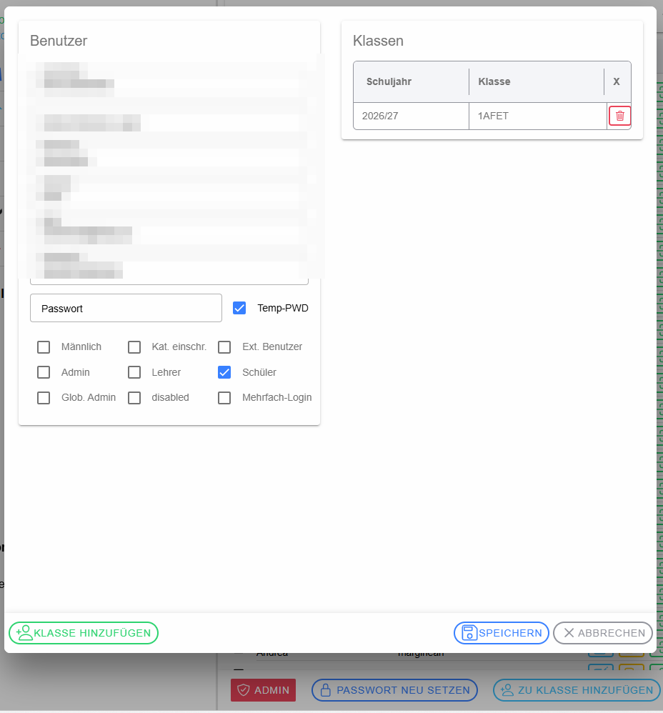
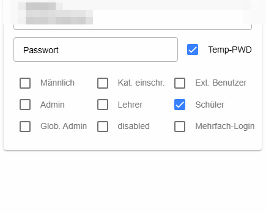
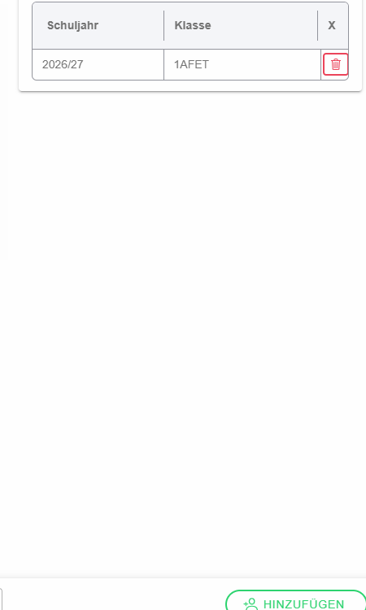

# Dialog „Benutzer anlegen / bearbeiten“

Der Dialog wird beim Anlegen eines neuen Benutzers oder über das Stift-Symbol eines bestehenden Benutzers geöffnet.

## Benutzerdaten

Links werden **Login-Name**, **Active-Directory-Login**, **Nachname**, **Vorname**, **E-Mail** und – sofern verwendet – eine **Sokrates-ID** gepflegt. Beim Anlegen sollte zumindest ein eindeutiger Login festgelegt werden; Vor- und Nachname erleichtern die spätere Suche und Zuordnung.

## Passwort

Im Passwortfeld kann ein Passwort festgelegt bzw. neu gesetzt werden. **Temporäres Passwort** kennzeichnet ein nur vorläufig vergebenes Passwort.

## Rollen und Optionen

Die Checkboxen steuern Eigenschaften und Berechtigungen des Benutzers: **Männlich** hinterlegt die entsprechende Geschlechtsangabe; **Kat. einschr.** schränkt die veränderbaren Kategorien/Abonnements ein; **Ext. Benutzer** kennzeichnet einen externen Benutzer. **Admin** vergibt Schul-/Organisationsadministrationsrechte, **Lehrer** die Lehrerrolle, **Schüler** die Schülerrolle und **Global** globale Administrationsrechte. **Deaktiviert** sperrt den Benutzer. **Mehrfach-Login** erlaubt die dafür vorgesehene parallele Nutzung desselben Kontos.

## Klassen und Lehrer-Kataloge

Rechts werden bestehende **Klassen-Zuordnungen** angezeigt. Bei Schülern sind dies die Klassen je Schuljahr; bei Lehrern werden zusätzlich Gegenstand/Katalog-Zuordnungen geführt. Der **Papierkorb** entfernt die jeweilige Zuordnung. Über die Auswahl des Schuljahrs können weitere Zuordnungen für das passende Jahr verwaltet werden.

## Speichern und Abbrechen

**Speichern** übernimmt die Änderungen. **Abbrechen** bzw. das Schließen des Dialogs verwirft nicht gespeicherte Änderungen.
