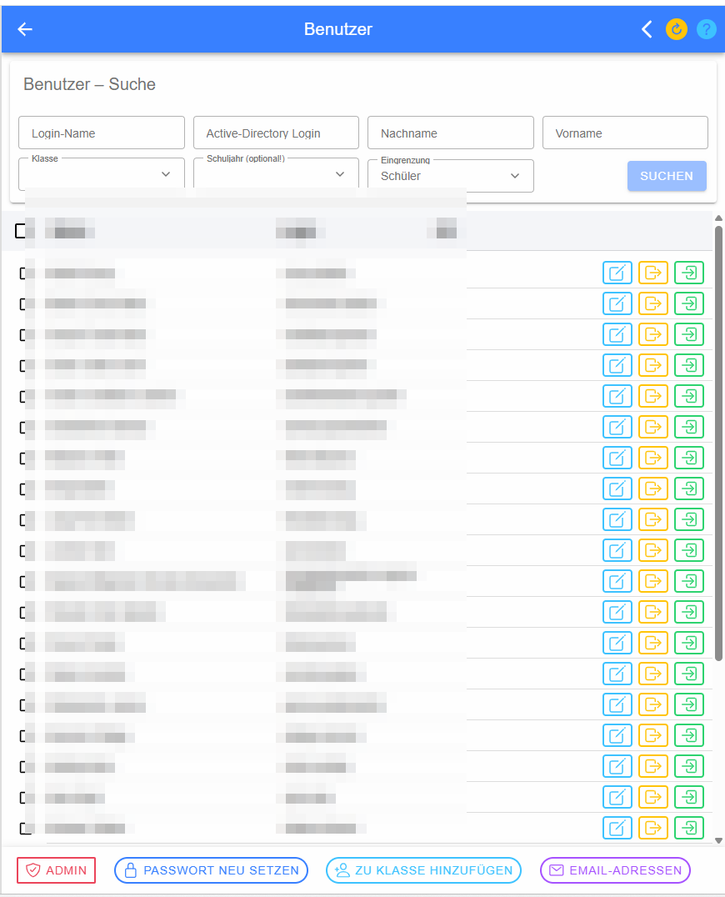
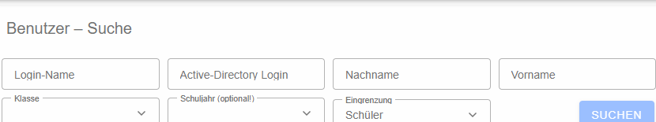
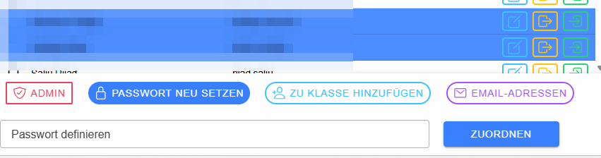
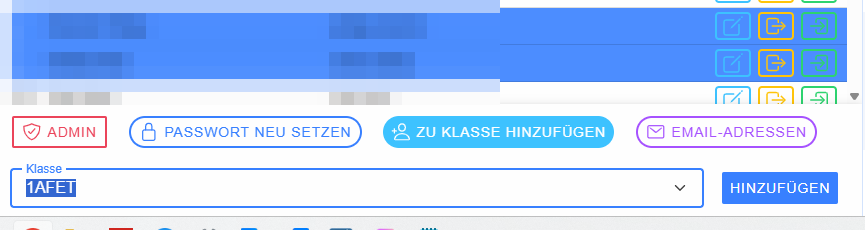
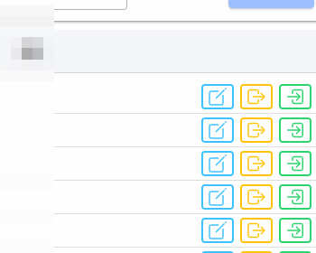

# Benutzer

Die Benutzerverwaltung dient zum Suchen, Auswählen und – abhängig von der eigenen Rolle – Bearbeiten von Benutzern. Administratoren können außerdem neue Benutzer anlegen.

## Benutzersuche

Die Suche kann über **Login-Name**, **Active-Directory-Login**, **Nachname**, **Vorname**, **Klasse**, optional **Schuljahr** sowie eine **Eingrenzung/Rolle** erfolgen. **Suchen** führt die Abfrage aus. **Neuer Benutzer** öffnet den Dialog zum Anlegen eines Benutzers.

## Ergebnisliste und Auswahl

Jede Zeile besitzt eine Checkbox. Über die Checkbox im Tabellenkopf können alle sichtbaren Treffer ausgewählt werden. Mehrere ausgewählte Benutzer können gemeinsam bearbeitet werden.

**Passwort neu setzen** vergibt für die markierten Benutzer ein neues Passwort. Das Passwort wird im Eingabefeld erfasst und mit **Zuordnen** übernommen.

**Zu Klasse hinzufügen** ordnet die markierten Benutzer der ausgewählten Klasse zu. Dies ist besonders hilfreich, wenn bereits vorhandene Schüler in eine weitere bzw. neue Klasse übernommen werden sollen. **E-Mail-Adressen** stellt die E-Mail-Adressen der Auswahl für weitere Verwendung bereit.

## Aktionen pro Benutzer

Das **Stift-Symbol** öffnet [Benutzer anlegen/bearbeiten](Dialoge/Benutzer-bearbeiten/index.md). Je nach Berechtigung stehen zusätzlich **Abmelden** und **Als Benutzer anmelden / Rolle wechseln** zur Verfügung.

> Beim Bearbeiten personenbezogener Daten sind die geltenden Datenschutzbestimmungen zu beachten.
