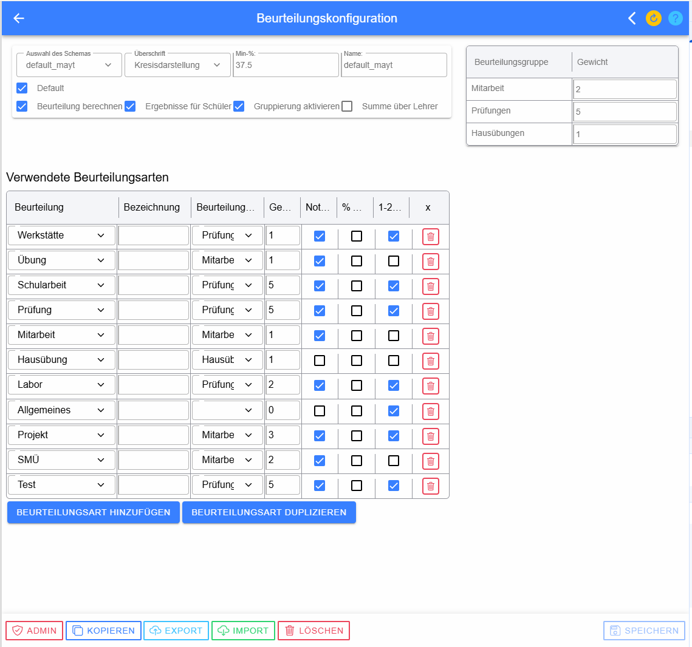
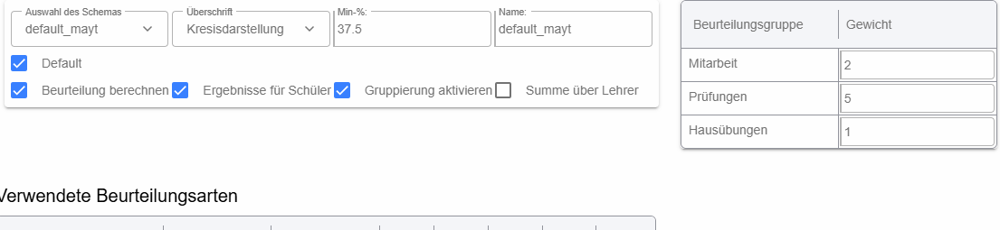
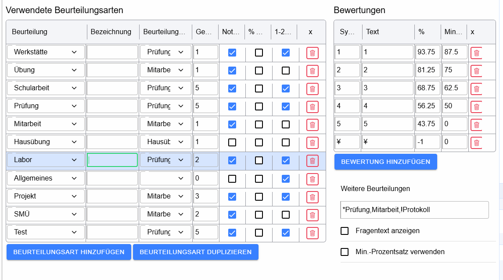
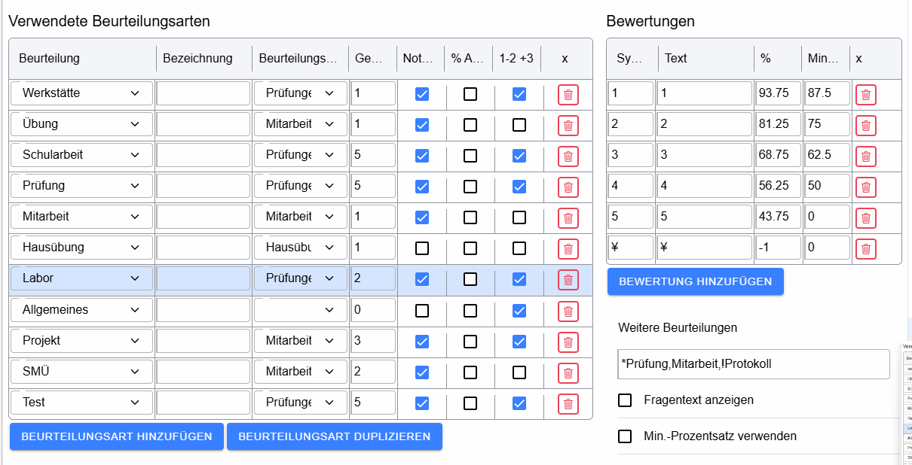

# Beurteilungskonfiguration

Beurteilungsschemata definieren, wie Leistungen in LeTTo erfasst und in eine Gesamtbeurteilung überführt werden. Dazu gehören Beurteilungsarten, Gewichtungen, zulässige Noten/Symbole, Prozentgrenzen und zusammengesetzte Beurteilungen.

## Schema-Einstellungen

Über **Auswahl des Schemas** wird das zu bearbeitende Schema gewählt. **Überschrift**, **Min.-Prozent** und **Name** definieren grundlegende Eigenschaften. **Default** kennzeichnet das Standardschema. Je nach Rolle können lokale bzw. globale Schemata nur eingeschränkt bearbeitbar sein.

## Verwendete Beurteilungsarten

Jede Zeile beschreibt eine Beurteilungsart, etwa Übung, Schularbeit, Prüfung, Mitarbeit, Hausübung, Labor oder Test. **Beurteilung** wählt die zugrunde liegende Art. **Bezeichnung** erlaubt einen abweichenden Namen. **Gruppierung** fasst Beurteilungsarten für die Auswertung zusammen; **Gewicht** bestimmt ihre relative Bedeutung.

Die Checkbox **Not.** erlaubt die Noten-/Prozenteingabe. **%-An.** steuert, ob Prozentwerte angezeigt werden. **1-2** bzw. **1-2 +3** erlaubt **Zwischennoten** wie `1-2`, `2-3`, `+2` oder `3-`; der zugehörige Prozentwert wird zwischen den definierten Bewertungsstufen entsprechend ermittelt. Der Papierkorb löscht die Beurteilungsart.

**Beurteilungsart hinzufügen** legt eine neue Art an. **Beurteilungsart duplizieren** kopiert eine bestehende Art einschließlich ihrer Bewertungen und eignet sich daher besonders für ähnliche Varianten.

## Bewertungen

Für die markierte Beurteilungsart wird rechts festgelegt, welche **Symbole/Noten** zulässig sind. **Symbol** ist die Eingabe im Katalog, **Text** die Bezeichnung, **%** der zugeordnete Prozentwert und **Min.-%** die Untergrenze, ab der die Bewertung gilt. Der Papierkorb löscht die Zeile; **Bewertung hinzufügen** ergänzt eine weitere Bewertungsstufe.

Negative Prozentwerte können verwendet werden, um reine Dokumentationseinträge von der Berechnung auszunehmen. Ein Wert von `0 %` geht dagegen als tatsächliche Leistung mit null Prozent in die Berechnung ein.

## Weitere Beurteilungen / zusammengesetzte Beurteilungen

Im Feld **Weitere Beurteilungen** wird festgelegt, ob sich eine Beurteilung aus Teilbeurteilungen zusammensetzt. Die Teilbereiche werden durch Beistriche getrennt, z. B. `Mitarbeit, Dokumentation`. Gewichte können direkt angefügt werden, etwa `Prüfung 2, Mitarbeit 1, Protokoll 5`; damit zählt das Protokoll fünfmal so stark wie die Mitarbeit.

Ein `!` vor oder nach einer Teilbeurteilung kennzeichnet eine für den Abschluss erforderliche Teilnote, z. B. `Prüfung 2, Mitarbeit 1, !Protokoll 5`. Solange diese fehlt, gilt die Beurteilung als noch nicht vollständig. Ein `*` kann bei einer erzwungenen Teilbeurteilung verwendet werden, wenn ein Schüler von diesem Teil befreit ist.

**Fragentext anzeigen** ermöglicht bei der Beurteilung die zusätzliche Erfassung der Aufgabenstellung. **Min.-Prozentsatz verwenden** berücksichtigt bei der Prozentberechnung die im Schema definierte Untergrenze.
