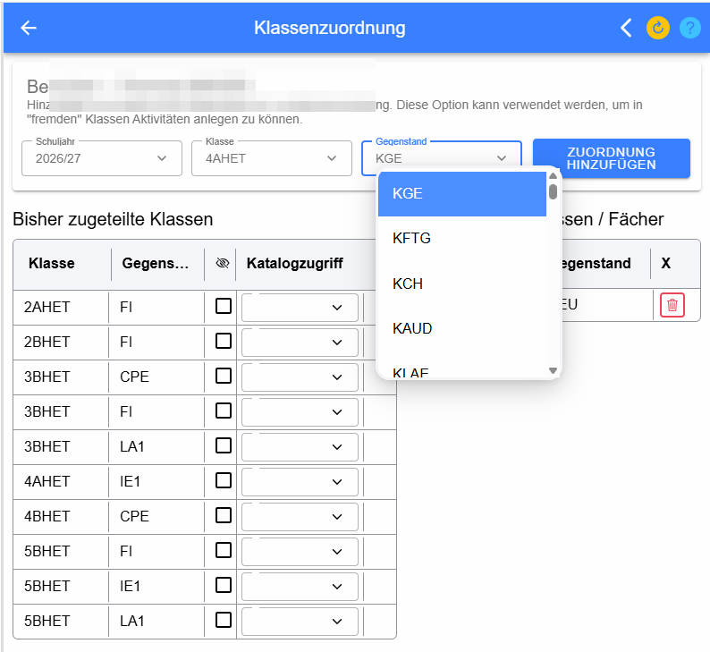
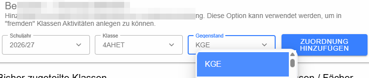
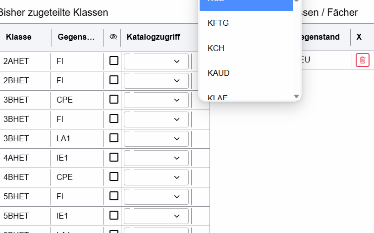
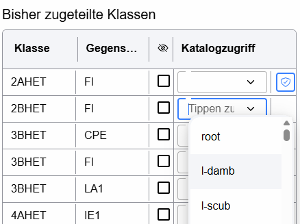

# Klassenzuordnung

Die Klassenzuordnung verwaltet die Lehrer-Kataloge des angemeldeten Benutzers. Sie kann auch verwendet werden, um zusätzliche Klassen/Gegenstände aufzunehmen oder Kolleginnen und Kollegen Zugriff auf einen Katalog zu geben. Dies ist beispielsweise bei Supplierungen und Teamteaching sinnvoll.

## Neue Zuordnung hinzufügen

Über **Schuljahr**, **Klasse** und **Gegenstand** wird festgelegt, welcher Katalog ergänzt werden soll. **Zuordnung hinzufügen** legt den zusätzlichen Eintrag an. Damit können etwa in einer fremden Klasse Tests angelegt und Beurteilungen geführt werden, sofern die entsprechenden Rechte vorhanden sind.

## Bisher zugeteilte Klassen

Die Tabelle zeigt die laut Lehrfächerverteilung bzw. bereits vorhandenen Zuordnungen. **Klasse** und **Gegenstand** identifizieren den Katalog. Die Checkbox mit dem durchgestrichenen Auge steuert die Sichtbarkeit bzw. Deaktivierung des Katalogs.

### Katalogzugriff für andere Lehrer

Im Feld **Katalogzugriff** kann ein anderer Lehrer ausgewählt werden. Dadurch erhält dieser Zugriff auf den Katalog. Bereits freigegebene Zugriffe werden über das Schild-Symbol angezeigt; dort können Rechte auch wieder entzogen werden. Ein fremder Lehrer kann eigene Eintragungen im gemeinsamen Katalog durchführen, aber nicht die Beurteilungen des hauptverantwortlichen Lehrers verändern. Die Eintragungen bleiben dem jeweiligen Lehrer zugeordnet.

## Hinzugefügte Klassen/Fächer und fremde Kataloge

Selbst hinzugefügte Zuordnungen werden separat geführt und können mit dem **Papierkorb** wieder gelöscht werden. Ebenso werden Zugriffe auf Kataloge anderer Lehrer aufgelistet; mit dem Papierkorb wird der fremde Katalog wieder zurückgegeben.
