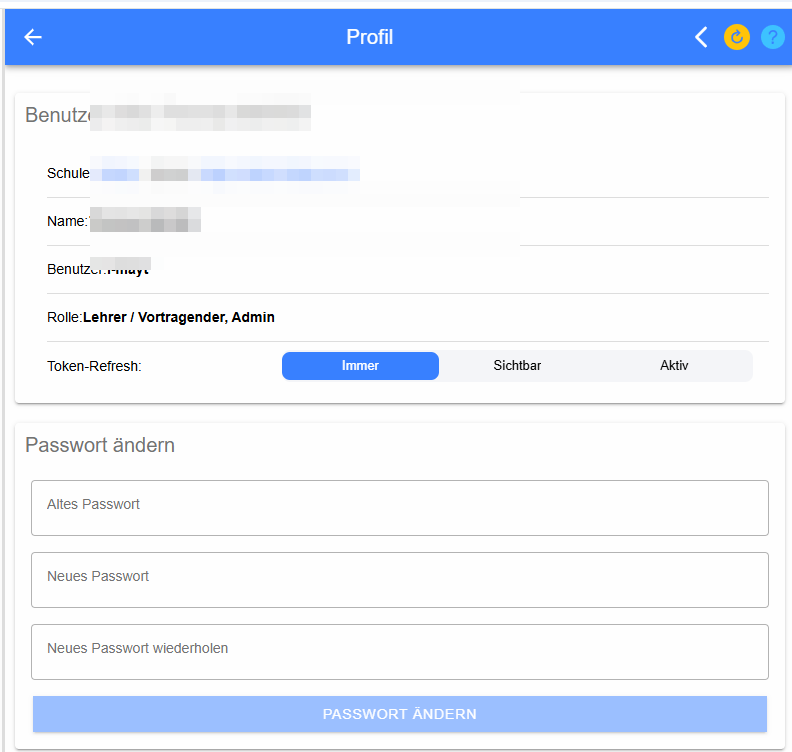
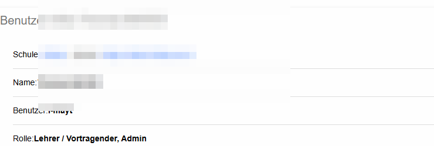
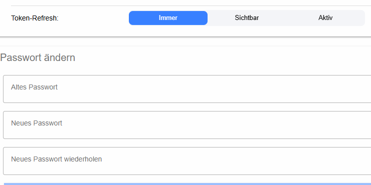

# Mein Profil

Auf dieser Seite werden die Daten des aktuell angemeldeten Benutzers angezeigt und das eigene Passwort kann geändert werden.

## Benutzerinformationen

Angezeigt werden unter anderem **Schule**, **Server**, **Name**, **Benutzer/Login**, **Rolle** und die für den Benutzer verfügbaren **Token-Rollen**. Diese Angaben dienen vor allem zur Kontrolle, mit welchem Benutzer und welchen Berechtigungen LeTTo gerade verwendet wird.

## Passwort ändern

Für eine Passwortänderung werden das **alte Passwort**, das **neue Passwort** und die **Wiederholung des neuen Passworts** eingegeben. Mit **Passwort ändern** wird die Änderung gespeichert. Die Wiederholung verhindert Tippfehler beim Festlegen des neuen Passworts.
