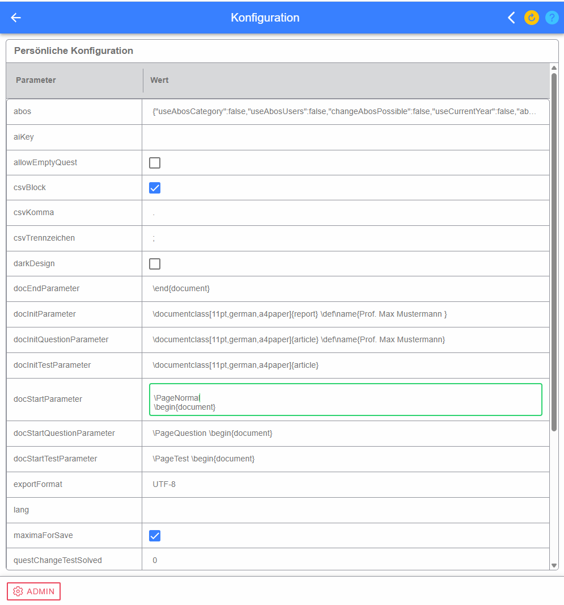
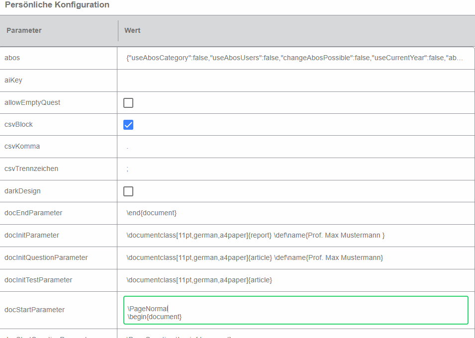
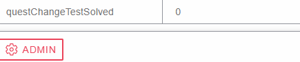

# User-Konfiguration

In der User-Konfiguration können LeTTo-Parameter an die eigenen Bedürfnisse angepasst werden. Die Werte werden tabellarisch als **Parameter** und **Wert** dargestellt.

## Parameter und Werte bearbeiten

Text- und Zahlenwerte werden durch Anklicken des Werts bearbeitet. Die Eingabe wird beim Verlassen des Feldes bzw. mit Enter gespeichert. Boolean-Parameter werden direkt über eine **Checkbox** ein- oder ausgeschaltet. Bei Bildparametern kann durch Anklicken des Bildbereichs ein anderes Bild ausgewählt werden.

Aus der früheren Konfiguration weiterhin wichtige Beispiele sind **DocInit** bzw. **DocInitQuestion** für Angaben, die auf erzeugten Dokumenten erscheinen können, **datasetDefault** für Vorgaben zu Formelzeichen, Einheiten und Wertebereichen sowie **showQuestionCount** zur Anzeige der Fragenanzahl in der Baumstruktur. Welche Parameter tatsächlich angeboten werden, hängt von der Serverversion und Konfiguration ab.

### datasetDefault

Die Definition kann mehrere Einträge enthalten. Historisch besteht eine Definition aus Formelzeichen, zugeordneter Einheit, automatischer Ergänzung und dem Wertebereich, der bei Datensätzen für dieses Formelzeichen verwendet werden soll.

## Persönliche und globale Konfiguration

Der Button **ADMIN** wechselt – sofern die notwendigen Rechte vorhanden sind – zwischen persönlicher und globaler Konfiguration. In der globalen Ansicht werden server-/organisationsweite Parameter angezeigt. Änderungen dort wirken nicht nur auf den aktuell angemeldeten Benutzer und sollten daher nur bewusst vorgenommen werden.
