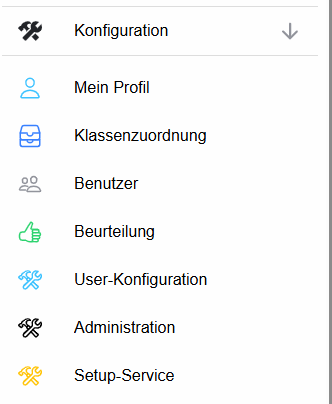
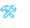
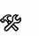

# Konfiguration

Über den Bereich **Konfiguration** werden persönliche Einstellungen, Klassenzuordnungen, Benutzer und das Beurteilungssystem verwaltet. Welche Punkte sichtbar sind, hängt von den Rechten des angemeldeten Benutzers ab.

## Bereiche

 **[Mein Profil](Mein-Profil/index.md)** – persönliche Benutzerinformationen anzeigen und das eigene Passwort ändern.

 **[Klassenzuordnung](Klassenzuordnung/index.md)** – eigene Lehrer-Kataloge verwalten, zusätzliche Klassen/Fächer zuordnen und Zugriffe auf Kataloge freigeben.

 **[Benutzer](Benutzer/index.md)** – Benutzer suchen und, abhängig von den Rechten, bearbeiten, Passwörter neu setzen oder Klassen zuordnen.

 **[Beurteilung](Beurteilung/index.md)** – Beurteilungsschemata, Beurteilungsarten und Bewertungssymbole konfigurieren.

 **[User-Konfiguration](User-Konfiguration/index.md)** – benutzerspezifische Konfigurationsparameter bearbeiten.

## Bereiche für Administratoren

 **Administration** ist für Schul-/Organisationsadministratoren vorgesehen. Die vollständige Beschreibung befindet sich in der **[ADMIN-Dokumentation](../admin/index.md)**.

 **Setup-Service** ist für **globale Administratoren** vorgesehen. Hinweise zu Installation, Serverkonfiguration, Updates und Setup finden Sie unter **[Setup-Service](../Setup-Service/index.md)**.
