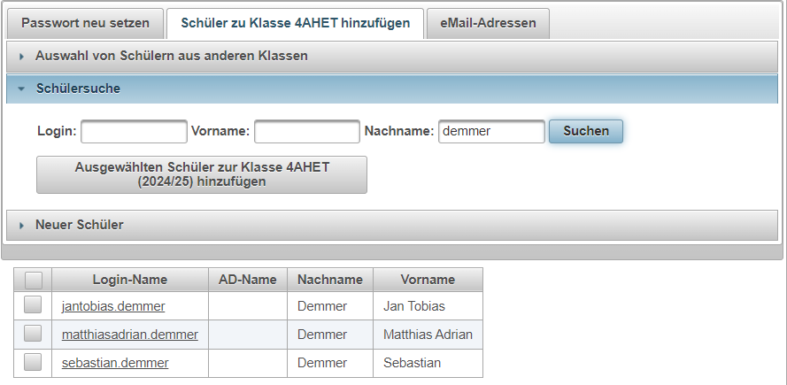

# Benutzer

***Wichtig:*** Das Schuljahr ist bereits vorausgefüllt. Wenn Sie nach Benutzern suchen, 
die nicht dem aktuellen Schuljahr zugeordnet sind, dann ändern Sie das Schuljahr bitte auf 
**--Bitte Schuljahr auswählen--**.

## Suche nach Klassen und Zuordnen von Schülern ##
Um als Lehrer Änderungen an Daten vornehmen zu können, muss die Scuhe auf Schüler eingegrenzt werden:
 
Danach wählen Sie die gewünschte Klasse und drücken bitte ***Suchen***
 
Oberhalb der Liste der gefundenen Schüler kann der Reiter ***Passwort neu setzen*** bzw. der Reiter 
***Schüler zu Klasse ... hinzufügen*** gewählt werden.

### Passwort zurücksetzen
1. Geben Sie das neue Passwort ein
2. Wählen Sie die Schüler aus, für die das Passwort gesetzt werden soll
3. Drücken Sie den Button ***PWD setzen***

## Schüler zu einer Klasse hinzufügen
Als Lehrer können Sie keine neuen Schüler im System eintragen, aber Sie können bereits
im System erfasste Schüler einer Klasse zuordnen. 
Wenn Sie die Klasse kennen, in der sich der Schüler früher befunden hat, dann können Sie 
über die unten abgebildete Eingabemöglichkeit nach dem Schüler oder allen Schülern 
einer anderen Klasse suchen. (zB.: Abendschule nach Semesterwechsel: Alle Schüler der
6ABET sollen in 7ABET hinzugefügt werden).
 

Um einzelne Schüler zu einer Klasse hinzuzufügen, wählen Sie besser die Suche nach dem Loginnamen aus:
 
Alle Schüler, die den Suchkriterien entsprechen, werden in der Liste angeziegt und Sie können den
gewünschten Schüler auswahlenund der Klasse hinzufügen.
