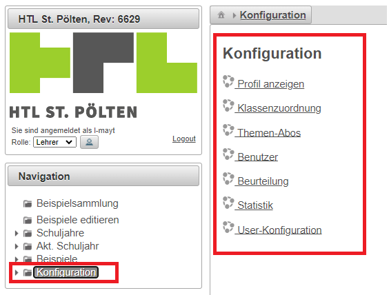

# Konfiguration - User

  
### Folgende Auswahlmöglichkeiten stehen für den Lehrer zur Verfügung:
* [Profil anzeigen:](../Profilanzeigen/index.md) Nutzerinfos und Passwort definieren
* [Klassenzuordnung:](../Klassenzuordnung/index.md) 
  * Verwaltung der Lehrer-Kataloge, 
  * Freigeben von Katalogen für andere Lehrer, 
  * Selbsteinschreibung in einer Klasse in einem Gegenstand ...
* [Benutzer:](../KonfigurationBenutzer/index.md) 
  * Suche nach Benutzern, 
  * Verändern von Schülerpassworten, 
  * Zuordnung von bestehenden Schülern im System zu anderen Klassen
* [Statistik:](../Statistik/index.md) Anzeige von angemeldeten Benutzern am Systen etc.
* [User-Konfiguration:](../User-Konfiguration/index.md) Definition von benutzerspezifischen Parametern in tabellarischer Übersicht