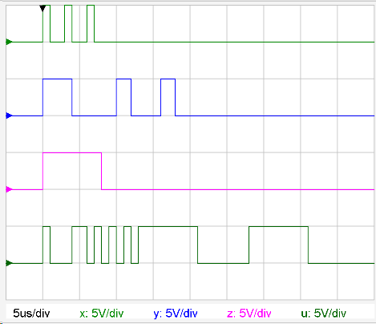

# Konfiguration des Oszilloskopes
## Grundsätzliches
Das Oszilloskop kann in einigen Plugins zur Darstellung von Strömen und Spannungen verwendet werden.
 

##  PIG-Tag 
###  Signal hinzufügen 
* Je nach Plugin ist es möglich, dass schon Signale definiert sind ([DigiGraph](../DigiGraph/index.md), oder die Signal erst im PIG-Tag hinzugefügt werden ([Graph](../Graph/index.md)).
* neues Signal hinzufügen:

_Channel_(_Variable_):_Funktion_

Bsp:
<pre>
ch1(t):10V*sin(2*t+0.2)
</pre>

* natürlich kann in der Funktion auch ein Ergebnis aus der Maxima-Berechnung verwendet werden.
* Es sind die Kanäle ch1(t) bis ch9(t) verwendbar wobei eine **Legende** nur für die Kanäle **ch1(t) bis ch4(t)** angezeigt wird!

###  Konfiguration im PIG-Tag 
* Die Konfiguration erfolgt normalerweise automatisch, jedoch können im PIG-Tag folgende weitere Konfigurationen vorgenommen werden:
* Die Konfiguration erfolgt durch Schalter oder Gruppen welche durch Strichpunkt getrennt werden
* Schalter sind nur einfache Anweisungen
* Eine Gruppe beginnt mit dem Gruppennamen gefolgt von einem **Doppelpunkt** und dann der Parameterliste, welche aus Zuweisungen mit einem **Gleichheitszeichen** besteht, welche durch **Beistrich** getrennt sind. Nach dem Gleichheitszeichen einer Zuweisung kann ein konstanter Wert, oder eine Variable stehen, welche ein Datensatz ist oder im Maxima-Feld berechnet wurde.
Bsp:
<pre>
[PIG plugin1 "ch1:div=5V,color=#008800 ; time:div=3us,trigger=0"/](PIG plugin1 "ch1:div=5V,color=#008800 ; time:div=3us,trigger=0"/)
[PIG plugin1 "ch1:div=5V,color=green; time:div=5us, trigger=0;grid:color=white,bgcolor=black,textcolor=yellow"/](PIG plugin1 "ch1:div=5V,color=green; time:div=5us, trigger=0;grid:color=white,bgcolor=black,textcolor=yellow"/)
</pre>

###  Schalter 

| Schalter | Funktion                                                                                                |
|----------|---------------------------------------------------------------------------------------------------------|
| oszi     | normales Oszilloskop (Standard, muss nicht gesetzt werden)                                              |
| graph    | Darstellung als x-y-Graph mit der Nulllinie in der Mitte und der y-Achse beim Triggerpunkt, ohne Gitter |
| oszi2ch  | 2-Kanal-Oszilloskop mit automatischem Aufteilen der Kanale über das Display                             |
| oszi4ch  | 4-Kanal-Oszilloskop mit automatischem Aufteilen der Kanale über das Display                             |

###  Gruppen 
####  Channels 
* Gruppenname: **ch1** für Kanal1, **ch2** für Kanal2, etc.
* Es sind die Kanäle ch1 bis ch9 verwendbar wobei eine Legende nur für die Kanäle ch1 bis ch4 angezeigt wird!

| Parameter | Funktion                                                                                                  | Bsp                |
|-----------|-----------------------------------------------------------------------------------------------------------|--------------------|
| div       | setzt die Verstärkung Skalenteilung für eine Teilung                                                      | div=5V             |
| color     | setzt die Farbe des Kanals (siehe [Farben](../Farben/index.md))                                           | cholor=red         |
| null      | setzt die Lage der Nulllinie in Skalenteilungen von unten nach oben wobei am unteren Displayrand null ist | null=3             |
| name      | setzt den Namen des Kanals                                                                                | name=U2            |
| dc        | Kopplung direkt                                                                                           | dc                 |
| ac        | Kopplung ohne Gleichspannung (Über den Mittelwert, ohne Tiefpassfilter!!)                                 | ac                 |
| gnd       | Signal wird auf 0 gesetzt                                                                                 | gnd                |
| fill      | setzt den Füllgrad einer Flächenfüllung zwischen Nulllinie und Signal                                     | fill=0.3   fill |
| size      | setzt die Linienstärke der Signallinie                                                                    | size=4             |

####  Zeitbasis 
* Gruppenname: **time**

| Parameter | Funktion                                                                                                      | Bsp       |
|-----------|---------------------------------------------------------------------------------------------------------------|-----------|
| div       | setzt die Teilung                                                                                             | div=20ms  |
| trigger   | setzt die Lage des Tiggerpunktes (Zeit-Nullpunktes) in Skalenteilen von links bei Null beginnend (Standard:1) | trigger=3 |

####  Design und Gitter 
* Gruppenname: **grid**

| Parameter | Funktion                                                        | Bsp               |
|-----------|-----------------------------------------------------------------|-------------------|
| color     | setzt die Gitterfarbe (siehe [Farben](../Farben/index.md))      | color=blue        |
| bgcolor   | setzt die Hintergrundfarbe (siehe [Farben](../Farben/index.md)) | bgcolor=lightgray |
| textcolor | setzt die Textfarbe (siehe [Farben](../Farben/index.md))        | textColor=red     |

####  Bildgröße 

| Parameter         | Beschreibung                                                                                           | Beispiel |
|-------------------|--------------------------------------------------------------------------------------------------------|----------|
| w[breite](breite) | Breite des Bildes setzen. Die Breite wird als Zahlenwert zwischen 1 und 100 als Prozentwert angegeben. | w80      |

##  siehe auch 
* [Plugins](../Plugins/index.md)
* [DigiGraph](../DigiGraph/index.md)
* [Graph](../Graph/index.md)
* [Farben](../Farben/index.md)

