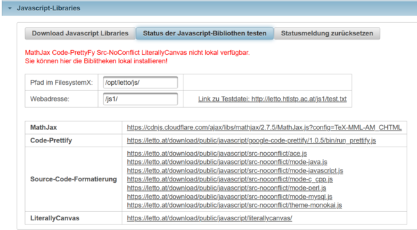

# Konfigurations-Tester
Siehe auch [Installation](../Installation/index.md), [Globale Konfiguration](../GlobaleKonfiguration/index.md) 
## Javascript Libraries

LeTTo kann alle verwendeten Javascript-Libraries auch lokal bereitstellen, damit bei der Verwendung als Prüfungsserver keine externen Ressourcen verwendet werden müssen. Innerhalb der Schule können somit alle externen Verbindungen über die Firewall geschlossen werden.

Über den Bereich **Javascript-Libraries** können diese JS-Bibliotheken eingebunden werden. 
 

In rot werden die nicht lokal verfügbaren Bibliotheken angezeigt. Unterhalb sind die aktuellen Links auf alle js-Dateien aufgeführt, die in LeTTo verwendet werden. Die Links zeigen im Moment auf den Download-Bereich von LeTTo und sind nicht innerhalb der IP-Adressen des eigenen Servers.

Über die Eingabefelder können der Speicherort, wo die Libraries abgelegt werden und die WEB-Referenz eingestellt werden. Siehe auch [Verlinkung am Apache-Server](../InstallationTomEE-8/index.md#erzeugung-der-ordner-und-verlinkung-zum-apache-server)
 
Vor dem Download wird eine Testdatei geschrieben und versucht, diese über den Web-Server wieder zu lesen. Tritt hierbei ein Fehler auf, wird der Downloadvorgang unterbrochen. Der Link zur Testdatei ist neben den Eingabeldern zu finden und darf keine Not Found Meldung (404) liefern.

Über den Button **Download Javascript Libraries** werden alle notwendigen Libraries heruntergeladen und am eigenen Server entpackt ud damit dem System lokal bereitgestellt.

Der Download-Vorgang kann etwas länger dauern, über F5 können sie die Seite aktualisieren ud den akt. Status abfragen.

## Bildverwaltung

 
Mit der Bildverwaltung können Sie testen, ob die Konfiguration aller Ordner und des Web-Servers zusammenpassen. Bilder, die am Dateisystem abgelegt werden, müssen über den Webserver angezeigt werden können.

Mit **Bildverwaltung laden** werden Testdaten am Filesystem abgelegt und wieder über den Webserver geladen und Status-Informationen angezeigt.

Die Eingabefelder **Pfad im Filesystem** und **Webadresse** müssen die Verzeichnisse im Dateisystem und die entsprechende [Verlinkung am Apache-Server](../InstallationTomEE-8/index.md#erzeugung-der-ordner-und-verlinkung-zum-apache-server) abbilden.

[Administration](../Administration/index.md)

