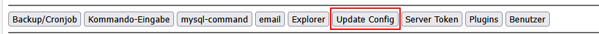
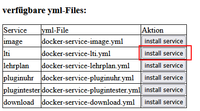

# LTI-Service
##  Allgemeines zu LTI
[LTI](https://www.imsglobal.org/activity/learning-tools-interoperability) kann für die Anbindung von [LeTTo über LTI](https://docs.moodle.org/501/en/LTI_and_Moodle) ab einen [Moodle-Server](https://moodle.com) verwendet werden.

Die Anbindung erfolgt über das LTI-Service welches in einem eigenen Docker-Container läuft.

## Installation des LTI-Services
* wähle "update-config" im Setup-Service(/config) 
* wähle unten bei den verfügbaren yml-Files bei lti "install Service" 
* starte das LTI-Service 

## LTI-Verbindung im Moodle konfigurieren
* Am Moodle als Administrator anmelden
* Gehe zu "Website-Administration" -> "Plugins" -> "External tool" -> "Manage tools"
* Klicke auf "Neues Werkzeug hinzufügen"

| -                                                   |                                                                                                                                                                            | Beispiel                                       |
|-----------------------------------------------------|----------------------------------------------------------------------------------------------------------------------------------------------------------------------------|------------------------------------------------|
| Name des Tools                                      | Ist frei vergebbar aber sinnvollerweise **LeTTo**                                                                                                                          | LeTTo                                          |
| Tool-URL                                            | Wird aus dem Formular der Plattform-Konfiguration von LeTTo übernommen.                                                                                                    | https://t1.letto.at/lti/lti3                   |
| Tool-Beschreibung                                   | frei wählbar                                                                                                                                                               | LeTTo t1 Testserver                            |
| LTI-Version                                         | LTI 1.3                                                                                                                                                                    | LTI 1.3                                        | 
| Client-ID                                           | Wird erst beim Speichern des externen Tools berechnet. Zum Auslesen der Client-ID muss nach dem Speichern des externen Tools nochmals das externer Tool bearbeitet werden. |                                                |
| öffentlicher Schlüssel                              | Wird aus dem Formular der Plattform-Konfiguration von LeTTo übernommen.                                                                                                    |                                                |
| Anmelde-URL                                         | Wird aus dem Formular der Plattform-Konfiguration von LeTTo übernommen.                                                                                                    | https://t1.letto.at/lti/oidc/login_initiations |
| Umleitungs-URI(s)                                   | Wird aus dem Formular der Plattform-Konfiguration von LeTTo übernommen.                                                                                                    | https://t1.letto.at/lti/lti3                   |
| Angepasste Parameter                                | können noch frei bleiben, werden erst bei der Verwendung in einem Kurs gesetzt.                                                                                            |                                                |
| Services                                            | werden aktuell noch nicht verwendet                                                                                                                                        |                                                |
| Datenschutz - Anwendernamen an Tool übergeben       | Immer                                                                                                                                                                      | Immer                                          |
| Datenschutz - Email des Anwenders an Tool übergeben | Immer                                                                                                                                                                      | Immer                                          |
| Datenschutz - Bewertungen aus dem Tool akzeptieren  | Immer                                                                                                                                                                      | Immer                                          |

## Konfiguration im LeTTo LTI-Service

