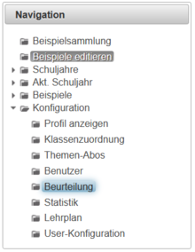
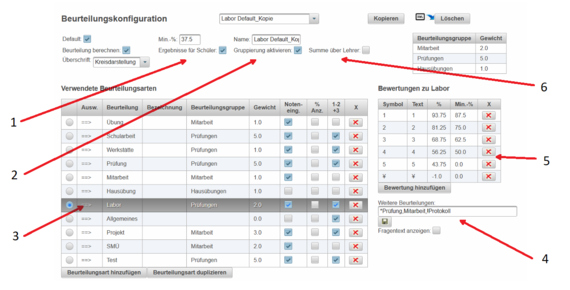
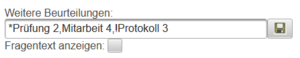
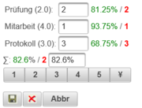
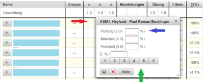

# Labor Benotung
**LeTTo** erlaubt Leistungen der SchülerInnen im Laborunterricht gesammelt zu verwalten. Das Beurteilungsschema für Laborunterricht ist bereits vordefiniert aber jederzeit "Lehrer-individuel" adaptierbar. Nach erfolgreicher Anmeldung am LeTTo-Server ist auf der linken Seite im Bereich Konfiguration und Navigation der Button **Beurteilung** anwählbar.

 

Im Bereich Beurteilungskonfiguration können die unterschiedlichsten Beurteilungsschemen ausgewählt werden. Wählt man das "Labor Default" - Schema ist es möglich die global gültige Vorlage für die Laborbeurteilung zu ändern. **VORSICHT**: Alle LehrerInnen bzw. deren Beurteilungen, welche dieses Schema verwenden (egal in welchen Gegenstand) sind dann davon betroffen.

Für ein individuelles Labor-Beurteilungsschema kopiert man das "Labor Default" durch Auswahl des Schemas "Labor Default" und Drücken des Buttons **Kopieren**. 

 

Eine Kopie wird angelegt. Diese Kopie kann wiederum adaptiert werden und bei anderen Gegenständen eingesetzt werden.

 

| Graphikverweis | Beschreibung                                          | Anmerkung                                                                                                                                                                                                                                                                                                                                                                                |
|----------------|-------------------------------------------------------|------------------------------------------------------------------------------------------------------------------------------------------------------------------------------------------------------------------------------------------------------------------------------------------------------------------------------------------------------------------------------------------|
| 1              | Ergebnisse (Notenstand) sind für Schüler einsehbar    |                                                                                                                                                                                                                                                                                                                                                                                          |
| 2              | Fügt im Notenkatalog eine Spalte Gruppe ein           | erleichtert die Gruppenverwaltung im Unterricht                                                                                                                                                                                                                                                                                                                                          |
| 3              | Auswahlmöglichkeit für gewähltes Beurteilungsschema   |                                                                                                                                                                                                                                                                                                                                                                                          |
| 4              | Definition der Einträge pro Laborübung                | in der Abb. darunter ist das Ergebnis sichtbar dargestellt. Das ***** vor dem Wort Prüfung erlaubt Online-Test in die Beurteilung aufzunehmen. Dabei wird die Note eines Online-Tests hier eingefügt - Ideal für Einstiegsprüfungen. Das **!** vor dem Protokoll färbt die Summennote ROT, solange keine Protokollnote eingetragen wurde - erhöht die Übersichtlichkeit im Notenkatalog. |
| 5              | Bewertungsdefinition - Notenintervall                 |                                                                                                                                                                                                                                                                                                                                                                                          |
| 6              | Soll die Summe über alle Lehrernoten gebildet werden? | Nur interessant im Team-Teaching - also mehr als ein Lehrer im Unterricht. Es wird nur mehr der Summen-Prozentwert der Lehrernote dargestellt (Werkstatt, Labor). Für die Brechnung des Summen-Prozentwertes sind die Einzelnoten der Leher individuell gewichtbar.                                                                                                                      |

Um die Gewichtung der Einzelleistungen der SchülerInnen zu verändern, schreibt man (wie folgend dargestellt) die gewünschten Gewichtungsfaktoren hinter die defnierten Einträge - siehe oben Beurteilungsschema mit Graphikverweis 4.

 
In diesem Beispiel würde die Prüfung mit 2, die Mitarbeit mit 4 sowie das Protokoll mit 3 gewichtet werden - daraus errechnet sich die Laborübungsnote für eine Übung zu 82.6% (-Gut).
 

###  Labornoten - Eintrag 
Um eine Laborübungsnote einzutragen klickt man auf die entsprechende Spalte der klassenweisen Beurteilung - siehe Abb. roter Pfeil.
 
Es öffnet sich die Noteneingabemaske. Diese enthält jene Einträge, welche im Laborbeurteilungsschema vordefiniert wurden. In diesem speziellen Beispiel die Default-Werte: Prüfung, Mitarbeit, Protokoll (beliebig adaptier- und erweiterbar -- siehe Beurteilungsschema).
Es besteht hier die Möglichkeit (blauer Pfeil) Teilnoten zu vergeben. In der letzten Zeile (grüner Pfeil) besteht die errechnete Note zu überschreiben bzw. eine Summennote zu definieren. **LeTTo** unterstützt auch im Laborbetrieb Online-Tests (Bsp. Einstiegstest). Das Ergebenis des Online-Tests wird automatisch übertragen.

###  Notenkatalog - Gewichtung der LehrerInnennoten bei Team-Teaching 
Die LehrerInnennoten können unteschiedlich gewichtet werden. Dann gehen die gesammelten Noten der unterschiedlichen LehrerInnen auch unterschiedlich stark in die Note ein - siehe [Video](https://youtu.be/qGjJTbg7-kw). Solange die Gewichtung nicht verändert wird, gewichtet LeTTo die LehrerInnennoten alle gleich.

