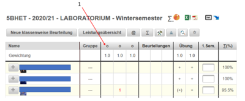
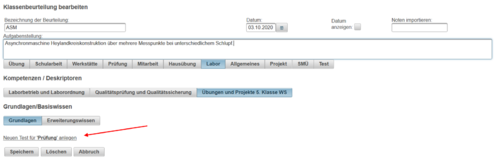
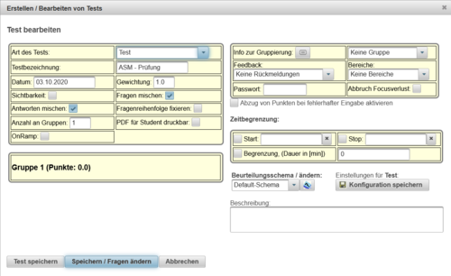
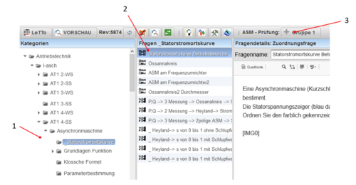

# Labor Übungstest
Für die Erstellung eines Labor Übungstests (oder Labor-Einstiegstests) ist für einen automatischne Noteneintrag direkt zur Laborübung im Beuteilungsschema an entsprechnder Stelle ein ***** vor dem Wort Prüfung zu setzten - siehe [Labor Benotung](../LaborBenotung/index.md) - Graphikverweis 4.
 
Klicken Sie wie in obiger Graphik dargestellt auf den Spaltenkopf der Laborübung, für welche Sie einen Online-Test anlegen möchten. Es öffnet sich der Dialog zur Editierung der Klassenbeurteilung. Klicken Sie auf den Link (roter Pfeil - Graphik unten) um einen Online-Test zu erstellen.
 
Es wird der Dialog zur Testerstellung geöffnet.
 

Editieren Sie den Test nach Ihren Vorstellungen. Für die Fragenauswahl benützen Sie den Button **Speichern / Fragen ändern**. Sie werden sofort in den Editiermodus von LeTTo zur Fragenauswahl geleitet. 
 
Wählen Sie aus dem Pool der bestehenden Fragen - siehe Graphik oben Hinweis 1 - die gewünschten Fragen - siehe Graphik oben Hinweis 2 - aus. Mit dem Button **+Gruppe 1** - siehe Graphik oben Hinweis 3 - werden die selektierten Fragen dem Labor-Test hinzugefügt.

